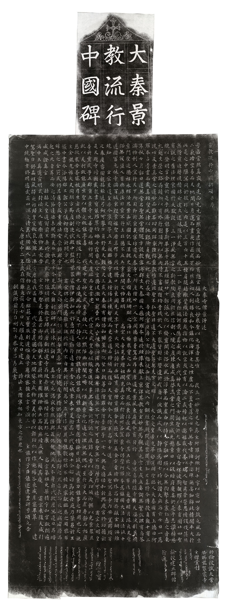

# 大秦景教流行中國碑頌

《大秦景教流行中國碑》刻於公元781年（唐建中二年），是一塊介紹唐代景教在中國流行過程的碑刻，碑文共有780字，記載了唐太宗時大秦（今意大利羅馬）景教士伊斯（Yazdhozid）從波斯（今伊朗）來到長安，立寺傳教的情況。《大秦景教流行中國碑》原豎立於長安大秦寺內，碑身高197厘米，下有龜座，全高279厘米，碑身上寬92.5厘米，下寬102厘米，碑額上部刻有吉祥雲環繞的十字架，是中國最早發現基督教派傳入記錄的文物。

大秦景教是指羅馬教會視為異端的「聶斯脫里派」（Nestorianism），創始人為聶斯脫里，由安都主教升為東羅馬首都君士坦丁大總管，當時君士坦丁堡的教士，對創教的耶穌持有各種不同的看法。聶斯脫里派重耶穌為人之道，亞歷山大派則重耶穌為神之道。最後，聶派被擯斥，被視為異端，為東羅馬皇帝放逐出國，並焚毀其著作。聶斯脫里偕其信徒逃到波斯，受波斯國王之禮遇和保護，並得在其國境傳佈發展。其後再傳播至中亞細亞。至六世紀末期，已流行於康居、突厥等地。

大秦景教的教義與羅馬教廷所主張的教義主要分別如下：

- 聖母所生者非聖子，聖母與聖母之子僅為倫理、友誼之結合而實質之同一；
- 聖母所生者為耶穌之人體，非耶穌之神性，故不拜聖母瑪利亞；
- 耶穌有二體：一為有形可見之人，一為無形不可見之聖者，所謂二位二體也，在世三十餘年，耶穌為立教聖人，為盛神之器，非即聖子；
- 僅留十字架，不設聖像。  

景教在中國演化時，大量參考佛教概念。其中較有趣是，四福音書的作者，均改以「法王」稱呼：馬太是明泰法王、路加是盧珈法王、馬可是摩距辭法王、約翰為瑜翰法王；教堂叫作「寺」；大主教叫「大法王」；教士自然叫作「僧」。上帝的稱呼則取敘利亞文Alaha音譯，叫作「皇父阿羅訶」，亦有按照道教規則，以「天尊」稱之。

因此當唐武宗滅佛時，也波及景教，大秦寺也遭廢棄，此碑被埋沒地下。直到明朝末年，石碑才在西安西郊出土。清朝末年，丹麥人阿爾謨企圖用3000兩白銀收購石碑，盜運國外，幸得當地政府和百姓阻止，才得以保存。此碑現存西安碑林。

碑文記載：唐太宗貞觀年間，有一個從古波斯來的傳教士叫阿羅本，歷經跋涉進入中國，沿著于闐等西域古國、經河西走廊來到京師長安。他拜謁了唐天子太宗，要求在中國傳播基督教。此後唐太宗降旨准許他們傳教，景教開始在長安等地傳播起來，也有景教經典《尊經》翻成中文的記載，並引用大量儒道佛經典和中國史書中的典故來闡述景教教義，講述人類的墮落、彌賽亞的降生、救世主的事跡等。

***

## 大秦景教流行中國碑頌  
大秦寺僧景淨述

粵若常然真寂，先先而无元；窅然靈虗，後後而妙有。惣玄摳而造化，妙衆聖以元尊者，其唯我三一妙身無元真主阿羅訶歟！判十字以㝎四方，皷元風而生二氣。暗空易而天地開，日月運而晝夜作。匠成厏物，然立初人。別賜良和，令鎮化海。渾元之性，虗而不盈。素蕩之心，夲無希嗜。洎乎娑殫施妄，鈿飾純精。閒平大扵此是之中，隟冥同於彼非之內。是以三百六十五種，肩隨結轍。𥪰織法羅，或𢫾物以託宗，或空有以淪二，或禱祀以邀福，或伐善以矯人。智慮營營，恩情役役。茫然無得，煎迫轉燒，積昧亡途，久迷休復。於是　　我三一分身㬌尊彌施訶戢隱真威，同人出代。神天宣慶，室女誕聖於大秦；㬌宿告祥，波斯覩耀以來貢。圓卄四聖有說之舊法，理家國扵大猷。設三一浄風無言之新教，陶良用於正信。制八境之度，鍊塵成真；啟三常之門，開生滅死。懸㬌日以破暗府，魔妄於是乎悉摧；棹慈航以登明宮，含靈扵是乎既濟。能事斯畢，亭午昇真。經留廿七部，張元化以發靈開。法浴水風，滌浮華而潔虗白；印持十字，融四照以合無抅。擊木震仁惠之音，東禮趣生榮之路。存鬚所以有外行，削頂所以無內情。不畜臧獲，均貴賤於人。不聚貨財，示罄遺於我。齋以伏識而成，戒以靜慎為固。七時禮讚，大庇存亡。七日一薦，洗心反素。真常之道，妙而難名，㓛用昭彰，強稱㬌教。惟道非聖不弘，聖非道不大。道聖符契，天下文明。　

太宗文皇帝，光華啓運，明聖臨人，大秦國有上徳曰阿羅本，占青雲而載真經，望風律以馳艱險。貞觀九祀，至扵長安。帝使宰臣房公玄齡，惣仗西郊，賔迎入內。翻𦀰書殿，問道禁闈。深知正真，特令傳授。貞觀十有二年秋七月，詔曰︰「道無常名，聖無常體，隨方設教，密濟群生。大秦國大德阿羅夲，逺將𦀰像，來獻上亰，詳其教旨，玄妙無為，觀其元宗，生成立要。詞無繁說，理有忘筌，濟物利人，宜行天下。」所司即於亰義寧坊造大秦寺一所，度僧廿一人。宗周德喪，青駕西昇。巨唐道光，㬌風東扇。旋令有司將　帝寫真轉摸寺壁。天姿汎彩，英朗㬌門。聖跡騰祥，永輝法界。案《西域圖記》及漢魏史策，大秦國南統珊瑚之海，北極衆寶之山；西望仙境花林，東接長風弱水；其土出火𦀸布、返䰟香、明月珠、夜光璧；俗無寇盜，人有樂康。法非㬌不行，主非德不立。土宇廣濶，文物昌明。髙宗大帝，克恭纘祖，潤色真宗；而扵諸州各置㬌寺，仍崇阿羅夲為鎮國大法主。法流十道，國冨元休；寺滿百城，家殷㬌福。聖曆年，釋子用壯，騰口於東周。先天末，下士大笑，訕謗於西鎬。有若僧首羅含，大德及烈，並金方貴緒，物外髙僧，共振玄網，俱維絶紐。　

玄宗至道皇帝，令寧國等五王，親臨福宇，建立壇場。法棟暫橈而更崇，道石時傾而復正。天寶初，令大將軍髙力士，送　　五聖寫真，寺內安置；賜絹百疋，奉慶睿圖。龍髯雖逺，弓劒可攀；日角舒光，天顏咫尺。三載，大秦國有僧佶和，瞻星向化，望日朝尊。詔僧羅含、僧普論等一七人，與大德佶和，於興慶宮修㓛德。於是天題寺牓，額戴龍書；寶裝璀翠，灼爍丹霞；睿扎宏空，騰淩激日。寵賚比南山峻極，沛澤與東海齊深。道無不可，所可可名；聖無不作，所作可述。肅宗文明皇帝，於靈武等五郡，重立㬌寺。元善資而福祚開，大慶臨而皇業建。　代宗文武皇帝，恢張聖運，從事無為。每於降誕之辰，錫天香以告成㓛，頒御饌以光㬌衆。且𠃵以美利，故能廣生。聖以體元，故能亭毒。　　我建中聖神文武皇帝，披八政以黜陟幽明，闡九疇以惟新㬌命。化通玄理，祝無愧心。至扵方大而虗，專靜而恕，廣慈救衆苦，善貸被羣生者，我修行之大猷，汲引之階漸也。若使風雨時，天下靜，人能理，物能清，存能昌，歿能樂，念生響應，情發目誠者，我㬌力能事之㓛用也。大施主金紫光祿大夫、同朔方節度副使、試殿中監、賜紫袈裟僧伊斯，和而好惠，聞道勤行。逺自王舍之城，聿來中夏，術髙三代，藝博十全。始効節於丹庭，乃策名於王帳。中書令汾陽郡王郭公子儀，初惣戎於朔方也，　肅宗俾之從邁。雖見親於臥內，不自異於行間。為公爪牙，作軍耳目。能散祿賜，不積於家。獻臨恩之頗黎，布辭憩之金罽。或仍其舊寺，或重廣法堂。崇飾廊宇，如翬斯飛。更効㬌門，依仁施利，每嵗集四寺僧徒，虔事精供，俻諸五旬。餧者來而飰之，寒者來而衣之，病者療而起之，死者葬而安之。清節達娑，未聞斯美。白衣㬌士，今見其人。願刻洪碑，以揚休烈。

詞曰︰

真主元元，湛寂常然。㩲輿匠化，起地立天。分身出代，救度無邊。日昇暗滅，咸證真玄。

赫赫文皇，道冠前王；乗時撥亂，𠃵廓坤張。明明㬌教，言歸我唐。翻經建寺，存歿舟航。百福偕作，萬邦之康。

髙宗纂祖，更築精宇。和宮敞朗，遍滿中土。真道宣明，式封法主。人有樂康，物無災苦。

玄宗啓聖，克修真正。御牓揚輝，天書蔚映。皇圖璀璨，率土髙敬。庶績咸熙，人賴其慶。

肅宗來復，天威引駕。聖日舒晶，祥風掃夜。祚歸皇室，祆氛永謝。止沸㝎塵，造我區夏。

代宗孝義，德合天地。開貸生成，物資美利。香以報㓛，仁以作施。暘谷來威，月窟畢萃。

建中統極，聿修明德。武肅四溟，文清萬域。燭臨人隱，鏡觀物色。六合昭蘇，百蠻取則。

道惟廣兮應惟宻，強名言兮演三一；　　主能作兮臣能述，建豊碑兮頌元吉。

大唐建中二年嵗在作噩太蔟月七日大耀森文日建立，時法主僧寧恕知東方之㬌衆也。ܒܝܘܡ̈ܝ ܐܒܐ ܕܐܒܗܬܐ ܡܪܝ ܚܢܢܝܫܘܥ ܩܛܘܠܝܩܐ ܦܛܪܝܪܟܝܣ‎

朝議郎前行台州司士參軍呂秀巖書

ܒܫܢܬ ܐܠܦ ܘܬܫܥܝܢ ܘܬܪܬܝܢ ܕܝܘ̈ܢܝܐ‎

ܡܪܝ ܝܙܕܒܘܙܝܕ ܩܫܝܫܐ ܘܟܘܪܐܦܝܣܩܦܐ ܕܟܘܡܕܐܢ ܡܕܝܢܬ ܡܠܟܘܬܐ‎

ܒܪ ܢܝܚ ܢܦܫܐ ܡܝܠܝܣ ܩܫܝܫܐ ܕܡܢ ܒܠܚ ܡܕܝܢܬܐ ܕܬܚܘܪܝܣܬܢ‎

ܐܩܝܡ ܠܘܚܐ ܗܢܐ ܕܟܐܦܐ ܕܟܬܝܒܢ ܒܗ ܡܕܒܪܢܘܬܗ ܕܦܪܘܩܢ‎

ܘܟܪܘܙܘܬܗܘܢ ܕܐܒ̈ܗܝܢ ܕܠܘܬ ܡܠܟܐ ܕܨܝܢܝܐ‎

僧霊寶

ܐܕܡ ܡܫܡܫܢܐ ܒܪ ܝܙܕܒܘܙܝܕ ܟܘܪܐܦܝܣܩܦܐ‎

ܡܪܝ ܣܪܓܝܣ ܩܫܝܫܐ ܘܟܘܪܐܦܝܣܩܦܐ‎

撿挍建立碑僧行通 ܣܒܪܝܫܘܥ ܩܫܝܫܐ‎

助撿挍試太常卿賜紫袈裟寺主僧業利 ܓܒܪܝܐܝܠ ܩܫܝܫܐ ܘܐܟܝܕܝܩܘܢ ܘܪܫ ܥܕܬܐ ܕܟܘܡܕܐܢ ܘܕܣܪܓ‎

左面第一行

大德曜輪

僧日進

僧遙越

僧廣徳

僧和吉

僧惠明

僧寶達

僧拂林

　
　
僧福壽

左面第二行

僧崇敬

僧延和

　
　
　
僧惠通

左面第三行

僧乾祐

僧元一

ܐܪܝܘܫ‎ 僧敬徳

ܠܘܩܐ‎ 僧利見

ܡܬܝ‎ 僧明泰

僧玄真

ܡܢܫܥ⁎ܡܖ‎ 僧仁惠

僧曜源

ܘܒܪܝܫܘܥ‎ 僧昭徳

ܝܫܥܕܕ‎ 僧文明

ܠܘܩܐ‎ 僧文貞

ܢܚ ܘܛ⁎ܠܝܚܘܣ‎ 僧居信

‎ 僧來威

左面第四行

ܐܝܙܕ⁎⁎⁎⁎⁎ܣܙ‎ 僧敬真

ܝܘܚܢܢ‎ 僧還淳

ܐܢܘܫ‎ 僧霊壽

ܡܪܣܪܥܣ‎ 僧霊徳

ܐܝܣܚܩ‎ 僧英徳

ܝܘܚܢܢ‎ 僧沖和

ܡܪܣ⁎⁎⁎‎ 僧凝虛

ܦܘܣ‌ܝ‎ 僧普濟

ܫܡܥܘܢ‎ 僧聞順

ܐܝܣ‌ܚܩ‎ 僧光濟

ܝܘܚܢܢ‎ 僧守一

後一千七十九年咸豐己未武林韓泰崋來觀，幸字畫完整，重造碑亭覆焉。惜故友吳子苾方伯不及同遊也，為悵然久之。

右面第一行

ܓܩܘܒ ܩܫܝܫܐ‎ 老宿耶俱摩

ܡܪܣܪܓܝܣ ܩܫܝܫܐ ܘܟܘܪܐܦܝܣܩܘܦܐ ܫܝܐܢܓܬܣ ܘܐ‎ 僧景通

ܥܝܓܘܝ ܩܫܝܫܐ ܘܐܪܟܕܝܩܘܢ ܕܟܘܡܕܐܢ ܘܐܩܖܝܢܐ‎ 僧玄覽

ܦܘܠܘܣ ܩܫܝܫܐ‎ 僧寶霊

ܫܡܫܘܢ ܩܫܝܫܐ‎ 僧審慎

ܐܕܡ ܩܫܝܫܐ‎ 僧法源

ܐܠܝܐ ܩܫܝܫܐ‎ 僧立夲

ܐܗܚܩܙ ܩܫܝܫܐ‎ 僧和明

ܘܚܢ ܩܫܝܫܐ‎ 僧光正

ܘܚܢ ܩܫܝܫܐ‎ 僧內澄

ܫܡܠܘܢ ܩܫܝܫܐ ܘܣܒܐ‎

右面第二行

ܥܩܘܒ ܩܫܝܫܐ‎ 僧崇徳

ܥܒܕܝܫܘܥ‎ 僧太和

ܝܫܘܥܕܕ‎ 僧景福

ܝܫܩܘܒ‎ 僧和光

ܝܘܚܠܢ‎ 僧至徳

ܫܘܒܩܚܐ ܠܡܪܢ‎ 僧奉真

ܡܪ⁎⁎⁎ܝܢܣ‎ 僧元宗

ܫܡܥܘܢ‎ 僧利用

ܐܦܪܡ‎ 僧玄德

ܙܦܪܚܐ‎ 僧義濟

ܩܘܪܝܩܘܣ‎ 僧志堅

ܒܟܘܣ‎ 僧保國

ܥܡܝܘܐܝܠ‎ 僧明一

右面第三行

ܓܒܪܐܥ‎ 僧廣徳

ܒܘܠ‎

ܫܝܫܪܝܘܢ‎ 僧去甚

ܐܝܣ‌ܚܩ‎

⁎⁎⁎ܥܠܢ‎ 僧徳建

右面第四行

民國六年二月，根源受命長陝，越月來遊，碑林獲觀，𡆬題。安化賀宗章、南康盧鑄、曲靖丁潤身、嘉定周承春、番禺許崇灝同觀。騰衝李根源題。
