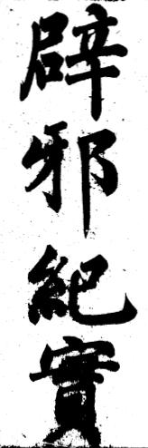

# 天下第一傷心人：《辟邪紀實》

1839至1842年鴉片戰爭後，基督教獲得在通商口岸傳教的權利，在法國堅持之下，終再准許國人信教。咸豐八年（1858年）及十年（1860年）分別簽訂《天津條約》及《北京條約》，明訂給予基督教在中國境內傳教的權利，並允許天主教能收回自禁教時期被政府沒收的教堂教產，而且可在任何地區買地或租地建立教堂。傳教士有恃無恐，橫行霸道，本土原有宗教和文化被大肆破壞。

在上述的背景下，《辟邪紀實》一書便因而誕生。該書寫成於咸豐十一年五月朔日（西曆1861年6月8日），為湖南省一位署名「天下第一傷心人」所編著，內容分為上卷的天主邪教集說、天主邪教入中國考略、辟邪論，中卷的雜引、批駁邪說、下卷的案證，附卷的辟邪歌、團防法、哥老會說，其中〈團防法〉是最先提出一套完整防制入境傳教機制，希望利用防衛地方的民團組織，以「團防」方式防止傳教者進入。除此之外，《辟邪紀實》對基督教教義有廣泛而深入的討論，內容一針見血，例如就耶穌被釘十字架就有以下駁斥：

> 「上帝子，何假人生？人既有罪，何為代贖？耶穌未生前，宇宙權果操自何人？既謂肉身升天，何更有墓而使人拜？荒謬之極，數語中便自相矛盾。」

《辟邪紀實》在當時廣泛流傳，掀起了士大夫、官紳以至民間的反教熱潮，歷數十年不衰。同期亦有流行於四川的《植綱扶紀－－討洋人檄文》、福建林昌彝著《闢邪教論》等等，皆為知識分子對基督教危機的一種醒覺。當時大部分知識分子都認為基督教與列強侵略息息相關，紛紛對大眾宣揚反教思想，至使民教衝突，「教案」此起彼落，大小合共達五百餘宗。

其實中國知識分子的反對基督教，並非始於晚清。明神宗萬曆四十四年（1616年），在耶穌會士利瑪竇死後六年，南京禮部侍郎沈榷便曾對在華的天主教發動一次猛烈的攻擊，曾三次上疏，並逮捕西洋及中國教士教民二十餘人，造成「南京教案」。隨後陸續有不滿天主教的言論，包括明代出版《破邪集》、清初《不得已》，直至雍正禁教後，反教言論趨向沉寂。

[PDF書籍下載](辟邪紀實.pdf)

***

「天下第一傷心人」原著  
東南各省士民 重刊

## 恭錄聖諭廣訓黜異端以崇正學

朕惟欲厚風俗先正人心，欲正人心先端學術。

夫人受天地之中以生，惟此倫常日用之道，為智愚之所共由。索隱行怪，聖賢不取。《易》言：「蒙以養正，聖功以之。」《書》言：「無偏，無陂，無反，無側，王道以之。」聖功王道，悉本正學。至於非聖之書，不經之典，驚世駭俗，紛紛藉藉起，而為民物之蠹者，皆為異端，所宜屏絕。凡爾兵民，願謹淳樸者固多，或迷於他岐，以無知而罹罪戾，朕甚憫之。

自古三教流傳，儒宗而外，厥有仙釋。朱子曰：「釋氏之教不管天地四方，只是理會一個心；老氏之教，只是要存得一個神。」此朱子持平之言，可知釋道之本旨矣。自游食無藉之輩，陰竊其名以壞其術，大率假災祥禍福之事，以售其誕幻無稽之談。始則誘取貲財以圖肥己，漸至男女混淆，聚處為燒香之會；農工廢業，相逢多語怪之人。又其甚者，奸回邪慝，竄伏其中，樹黨結盟，夜聚曉散；干名犯義，惑世誣民。及一旦發覺，懲捕株連，身陷圇圄，累及妻子。教主已為罪魁，福緣且為禍本。如白蓮、聞香等教，皆前車之鑒也。

又如西洋教，宗天主亦屬不經。因其人通曉歷數，故國家用之，爾等不可不知也。

夫左道惑眾，律所不宥；師巫邪術，邦有常刑。朝廷立法之意，無非禁民為非，導民為善，黜邪崇正，去危就安。爾兵民以父母之身，生太平無事之日，衣食有賴，俯仰無憂。而顧昧恆性，而即匪彝，犯王章而干國憲，不亦愚之甚哉！

我聖祖仁皇帝漸民以仁，摩民以義，藝極陳常，煌煌大訓，所以為世道人心計者至深遠矣。爾兵民等宜仰體聖心。祗遵，擯斥異端，直如盜賊水火。且水火盜賊，害止及身；異端之害，害及人心。心之本體，有正無邪；苟有主持，自然不惑。將見品行端方，諸邪不能勝正；家庭和順，遇難可以成祥。事親孝，事君忠，盡人事者，即足以集天休；不求非分，不作非為，敦本業者，即可以迓神慶。爾服，爾耕，爾講，爾武，安布帛菽粟之常，遵蕩平正直之化，則異端不待驅而自息矣。

## 前序

天下第一傷心人

耶穌教之邪，稍有人心者，必謂斷不可從。有從者，不過市井無賴徒耳。曾讀孔孟書，斷不至此。予亦何嘗不以為然。何也？每見大小試畢，多以佛老因果說為勸善舉，紛相投贈，罕受而信者，謂近虛荒。吾儒守四子五經，自有實在經濟，豈復為佛老所惑哉？夫佛老因果，猶為勸善而說，且知虛荒而不信。至耶穌教，則空以永福永禍為言，所行之虛荒，較甚於佛老萬萬倍。宜其勸之不信，即勒之不從，守四子五經之道，為確不可易也。

乃獨有不然者，當未與諸夷大和時，輒聞士宦有從其教者，究未目擊其實，未敢深信。自與諸夷大和後，則見不惑於佛老之因果者，竟惑於耶穌之永福永禍，而昭然為惡矣。至有大吏詞臣，亦置綱常名教於不顧，即求其入於佛老而不可得者，尚安望守四子五經之道，以著實在經濟哉？

嗚呼！流毒尚可言哉，尚得謂成人世哉！此予書不能已於作也。始為集說，歷數其教之邪也；次入中國考略，明邪教所自始也；次辟邪論，錄舊也。次雜引志事之一二見，及有互異處也；次案證，著邪教害人之實也。附辟邪歌，便淺者傳唱也；附團防法，使人同心以杜絕也。 附哥老會說，因亦足貽大害而並及也。合名曰《辟邪紀實》者，謂無誣枉之詞也。凡歷五晝夜而成書，精神亦大憊矣。速刊傳送，願受者有以鑒予苦心，皆不為邪教所惑，則幸甚矣。

時咸豐十一年（1861）辛酉五月盡日
天下第一傷心人自敘

## 後敘

天下第一傷心人

今夫天下之大，惟中土為聲明文物之邦，帝王師儒，皆出其中。有堯舜之心傳，孔孟之道統，為至正至平之教，人人可遵，歷萬世而無弊，更何有他教而爭勝負者哉？

自文藝取士以來，學士大夫，遂直以聖賢經傳為博科名之具，而於實際，曾不講求。即或有箋注之學，亦多虛盜匪譽，妄冀身後配祀聖廟。於天下實事，亦顧忌回護，不能本所學以行之。此佛老所以得行其說，而天主邪教亦得伺其隙也。

且相識有金、王諸徒，於邪教巧為爭辯，謂若以其教之原始為妄，則以盤古為開闢祖，而我之原始獨不妄乎？謂若以其教為可駭而不可從，則安見在彼教者，不以孔子教為可駭而亦不可從乎？不過各著其是，特少見而多怪耳。

噫！此昧本之言，索隱行怪之為也。不知孔子刪書斷自唐虞，未或一言盤古事，大聖賢果何在開後世以疑端哉？至以孔子教為可駭而亦不可從之喻，彼固忍心以言，而聞之能不心寒乎！可知中士聖賢之教，不害於無知之小民，深害於閎肆博辯之才士矣！

此予去歲《辟邪紀實》之作，為萬不得已，非好事之為也。茲復批駁邪說，得數十條，增雜引後，使人知邪教之言，固無在不使人以可攻者。

或疑予徒勞無補，邪教之從不從，存乎人之本衷。此則予亦知既從者，為牢不可破。甚冀未從者見之，有以激發天良，遵守至正至平之教，不使聲明文物之邦，盡為邪教所壞，亦天下萬世人心之大幸矣！

壬戌（1862）八月  
天下第一傷心人自敘

## 上卷
### 天主邪教集說

天下第一傷心人

天主教，始自耶穌，乃西洋諸國通行之教。習者妄謂耶穌本上帝化身，於漢哀帝時，為猶太國童女馬利亞所生，全智全能，通各國土音，創教勸人為善，後被國人釘體於十字架，刃刺以斃，三日復活，歷四十日以肉身升天。其徒遂號其教曰「天主」。以耶穌為先天教主，又曰聖子，又曰天兄。造書曰天經，又曰聖書。遍相引誘，自郡國至鄉里，皆建天主堂，供十字架。

師其教者，或手執十字架，與佩胸前不等。偶有輕褻，為逆上帝，重罰之。其教分目實繁，難悉舉。

以意大里為天主教之宗國，代有持世教皇，為代天宣化。凡西洋各國王即位，必得教皇冊封。有大事，必咨決請命。又令其大弟子數十人分掌各國教事，曰法王。小部落掌教者號神父，神父多在童時受教，割去腎子，曰彌塞。從其教者，與神父雞姦不忌，曰益慧。其餘隨地皆有牧師分掌之（牧師又名滿剌）。至天主堂一切供億，則皆國王大臣民庶轉輸不絕。

每七日一禮拜（以星房虛昴之辰為禮拜日），曰彌撒，又曰教會。此日百工悉罷，老幼男女，齊集天主堂。牧師上坐，讚美耶穌之德，謂耶穌為會之元首，信者為會之全身。群黨喃喃誦經畢，互姦以盡歡，曰大公，又曰仁會。

凡嫁娶不用媒妁，亦不論少長，必男女自願，惟拜耶穌祈上帝。新婦至，必先與牧師宿，曰聖揄羅福。且父可娶媳；子可娶母；亦可娶己女為婦；兄弟叔侄，可互娶其婦；胞姊妹亦可娶為婦。

又重女輕男。自國王至臣，庶皆聽命於婦。每有婦逐夫而再贅者，謂男子皆由女出。故其國多女王攝權，謂經水乃上帝所賜至寶，非此不能生人。婦女經至，則爭取飲之，故夷匪多腥穢難聞者。

與類相接，重則免冠，輕則以手加額，所以示敬。無跪拜禮，即見國王亦不拜，屈一膝，持其手嗅之，或撥額毛數莖投地，以為最敬之禮。惟跪拜上帝及耶穌。凡相見，問其婦，不及父母，謂父母為已往物。兄弟及戚友久不相見，見則互相姦狎，曰合初。

君臣父子，皆以兄弟相喚；母女姑媳，皆以姊妹相稱。謂世上止有天父（指上帝）、天母（指童女）、天兄（指耶穌），此外無所為尊卑者。

雖西洋習俗類然，而英法俄諸國為最。其類外和內猾，貌易欺人，群以海舶貿易為生。凡海口有利埠頭，肆行爭奪。先止欺凌鄰夷，不敢直逼中土。

宋元時，間有匪徒倡立清真祆神等寺，旋亦敕毀。迨明季，夷匪利瑪竇、王豐肅、陽馬諾、龐迪我等，先後混入中國，以善作奇技淫巧，兼稱能測天文，又有妖術燒煉金銀，人多惑之，海防遂廢。

國初又用其流，推演曆書。遂敢於京城及通都大邑，建天主堂，而各以夷匪掌其教。謂天地萬物，皆主於天主。且謂自無始以來，倘非天主操持，則天久傾頹，地久翻覆。一概正祀，均斥為邪。惟一心致敬天主，得升天堂，受永福；否則入地獄，受永苦。愚者聞之有所貪著，即能以符咒迷之，使欣然入教。其授教法，較自傳本國者不同。

然國初禁例森嚴，傳習者猶不敢畢露醜態。至道光末年，乃有匪徒楊秀清、洪秀全等，奉其教群起倡亂，竟至蔓延東南，迄周紀不得平息。逆夷偵知中國從教者眾，遂敢於戊午年直破廣東，庚申八月，竟犯都門。

上念切懷柔，俯允通商和議。該夷反敢逞其狂悖，至分其徒於各省、州、縣，遍傳天主教，誑惑愚頑。從者即等奴隸，任其馳驅，為害較前倍烈。

凡初入時，牧師以指取水微按其頂，曰領洗禮。並掰餅與食，繼令飲酒一杯，曰食聖餐（亦有與銀四兩、丸一枚者）。由是惛瞶，自毀祖先神主，惟以紅紙劃一長圈，中列十字架，並刀錐鉤槊等器，曰聖架，供門首，或置龕中（或牧師先為沐浴，曰淨體，借此行姦。以後惟其所悅而從者，迷而不知，反以為快）。

士大夫從者曰西儒，又曰西士。

從教家有女留一不嫁，為守符咒箱，司鎖鑰，別人不得擅開，曰開箱老女，又曰偵姑，又曰御仙姑。牧師至，即與伴宿，曰過氣比臍。

有病不得如常醫藥，必教中人來施針灸，婦人亦裸體受治。如不愈，死即剖藏腑頭顱，考驗病之所在，著書示後。

家有喪，牧師屏去死者親屬，扃門行殮。私取其睛，以膏藥掩之，曰封目歸西。並以紅布囊紉其項，曰衣胞。有不聽殮法者，為叛教。即率教黨至其家，凌辱百計，終且設毒害之。或明割死者四肢，曰上聖；斷其首頜，曰中聖；割其耳鼻，曰下聖。童子死，曰仙童；守箱女死，曰偵仙；孕婦死，曰帶子歸西。正國法死，曰穿紅袍上天。

其取睛之故，以中國鉛百斤，可煎銀八斤。其餘九十二斤，仍可賣還原價。惟其銀，必取中國人睛配藥點之，而西夷睛罔效，故彼國自死無取睛事。

點銀術，雖中國久從教者，皆不得傳。惟取生睛，並婦女經水胎丸配藥塗鏡面摭人形貌，借可獲利。此則中國專心奉教者，間得授之。其尤謬者，能咒水飛符攝生，人魂與姦宿，曰神合。又能取婦女髮爪置席底，令其自至。取童男女生辰，粘樹咒之，攝其魂為耳報。星家有師其術者，以搬運術，盜人藏金，曰還本。凡夷中男婦均諳采戰術，與從教者交，曰乞仙。以口吸成童精，與處女經水，曰開天孔，又曰人劑。與人交臂宿，即知人隱衷，乘機害之，曰測隱。甚或割女子子宮，男子辮髮，小兒腎子及以術取小兒腦髓心肝，散放瘟氣蠱毒等事，其名未備詳。

推其用心，直欲盡愚海內人民，假其教以斬絕之，繼將大有為於中國也，豈但通商傳教已哉？彼欲從教者，亦何惛而不察哉！

吾故廣搜往籍，及得之實見實聞，縷揭其弊以為當門一喝云。

第一傷心人曰：歷考西夷偽撰諸書，皆謂天本天主耶穌所造之一物，無足貴重。而妖書中，又有「勿犯天條」、「切勿怨天」、「代天宣化」、「豈非天道」等語。獨不曰「勿犯耶穌條」、「切勿怨耶穌」、「代耶穌宣化」、「豈非耶穌道」，乃復用「天」字何也？且妖書中，動引經書中之「於昭於天」、「獲罪於天」、「樂天」、「畏天」、「順天」、「逆天」、「事天」等語，證實聖賢為指上帝而言，則更何也？

有謂耶穌即上帝者，有謂耶穌為上帝屈己降世者，有謂耶穌為上帝子，號神子，又號聖子，又號天兄。上帝號神父，又號聖父，又號天父，又號耶和華者。

有謂上帝、耶穌、聖神三位一體者，有謂耶穌死無後者，有謂耶穌死有遺腹子名耶穌太子者，有謂耶穌以肉身升天，而妻被惡人奪者，有謂耶穌生於漢元始元年者，有謂生於漢元壽二年及元壽十四年者，種種皆自相乖舛。

至近日所訂和約內，稱天主教、耶穌教為二，愈見夷情詭黠，矯為區分。使知天主教不可入者，則曰：「我本耶穌教，無非勸人為善，非天主教可比。」知耶穌教不可入者，則曰：「我本天主教，無非勸人為善，非耶穌教可比。」由是以術誘之，愚者雖顯受其害而不覺矣。（附記）

天主教之說，散紀他書者甚夥，閱者猝難畢悉。吾友博覽群籍，並參以實聞實見，輯為是篇。其事情朗如犀照，卒讀一過，令人髮指心寒。即闒茸嚚悍之夫，亦當聞而知懼。因促付剞劂，棒喝人寰，俾海內士民，見而切齒，雖不獲操斧鉞之罰，亦能嚴口舌之誅。由是公憤頓伸，群邪立破，近可為斯人端嚮往，遠可為吾道壯干城。其有裨於天下萬世者，豈淺鮮哉？

子輿氏曰：「能言距楊墨者，聖人之徒也。」吾子是書，其庶幾乎！

時咸豐十一年（1861）辛酉夏五  
學聾居士跋

### 天主邪教入國考略

天下第一傷心人

歷考天主邪教諸書，謂其教自漢以來，已入中國。證之史鑒，皆無明文。

惟考雜記，載猶太國烏合利之黨，於宋隆興元年，貢五色棉、五色布，借此勾結匪徒，插足中國。佯以勸善為名，襲後稷誕生事，謂伊教祖耶穌為其國童女馬利亞所生，教人崇奉天主為事。且能代人贖罪致福，有求必應，以此惑人。遂得私建清真祆神等寺於河南開封府，名其教曰「天竺」（因烏合利初從北天竺來），後改名挑筋（妖書云：耶和華擊傷雅各髀後，猶太人食肉必挑去髀筋，因以名教）。旋跡敗露，寺亦毀。

元至元十六年，夷匪五思達等，復貢西洋布西洋鏡等物，混入中國，重建清真寺於開封府。

明永樂十九年，夷匪俺誠以醫術入中國，寄居其寺，得以妖言惑定王，傳令賜香其寺重修。二十一年，復賄當道奏聞有功，賜氏為趙，授錦衣都指揮，升浙江指揮。

正統十年，匪徒李榮等重建前殿。

天順三年匪徒高鑒趙應承、趙瑛、石斌、張暄等伙造妖書三部，置清真寺，五年河水淹沒，匪徒艾敬、李榮等，復出資重修。

成化元年，匪徒高鑒等，增修後殿，仍安置妖書。

弘治二年，匪徒趙瑛、金鐘、趙俊、俺都剌、曹左、傅儒等，又增造妖書，廣買地基，建造妖寺，分黨於陝之西安、浙之寧波等處，遍傳邪教。且偽造大秦景教流行中國碑序，載大秦國阿羅本載真經至長安。

貞觀十二年，太宗詔所司於義寧坊造大秦寺，並及高宗、元宗、肅宗、代宗、德宗皆崇尊其教，廣建祠宇。首載寺僧景淨述，末載建中二年立，朝議郎呂秀嚴書云云。埋西安府城外，佯掘之以證其教由來之久。

至天啟崇禎時，則海防盡弛，要地任其出入。匪徒利瑪竇、徐光啟、龍民華、湯若望等，得相繼以奇技淫巧，炫惑當時。繼致有宮中扶亂，列祖列宗降壇，指用人材，妄極不經之舉。所指用則皆從教之流，借此廣傳其教。此明綱所以不振也！

而我朝復寬大為懷，加當事諸人辦理不善，惟貪一時苟全，不計後來實禍。雖康熙時，碣石鎮總兵陳昂具奏，極言夷患當防，而儒臣群議，不以為然，卒釀今日之事。

嗚呼！以數萬里語言不通之夷匪，入中國而任其縱橫自如。如是者，亙古未之前聞也。

按《後漢書》、《新唐書》有及其教者，殊不足據，皆後人附會詞。孟子所謂「盡信書，則不如無書」者是也。

### 辟邪論上篇

楊光先

曆官李祖白，天主教之門人也，著《天學傳概》一卷。其言曰：「天主上帝，開闢乾坤而生初人，男女各一。初人子孫，聚居如德亞國，此外東西南北，並無人居。是時，事一主，奉一教，紛岐邪說，無自而生。其後生齒日繁，散走遐逖，而大東大西有人之始，其時略同。

考之史冊，推以曆年，在中國為伏羲氏。即非伏羲，亦必先伏羲不遠，為中國有人之始。此中國之初人，實如德亞之苗裔。自西徂東，天學固其所懷來也。生長子孫，家傳戶習，此時此學之在中夏，必倍昌明於今之世矣。

延至唐虞三代，君臣告誡於朝，聖賢垂訓於後，往往呼天稱帝以相警勵。其見之《書》曰『受上帝，天其申命用休』；《詩》曰『文王在上，於昭於天』；《魯論》曰『獲罪於天，無所禱也』；《中庸》曰『郊社之禮，所以祀上帝也』；《孟子》曰『樂天，畏天，事天』；何莫非天學之微言法語乎？審是，則中國之教，無先天學者。」

噫，小人而無忌憚，亦至此哉！不思今日之天下，即三皇五帝之天下也。祖白謂歷代之聖君聖臣，是邪教之苗裔；六經四書，是邪教之微言，將何以分別我大清君臣，而不為邪教之苗裔乎？

而弁其端者曰：「康熙三年柱下史，毘陵許之漸敬題」。噫吁，異哉！以史臣，以諫官，而亦為此言耶？雖前明之季，學士大夫，如徐光啟、李之藻、李天經、馮應京、樊良樞者，多為天主教作敘，然或敘其曆法，或敘其儀品，或敘其算數。至進《天主書像圖說》，則罔有敘之者，湯若望自敘之。可見徐、李諸人，猶不敢公然得罪名教也。

若望之為書也，曰男女各一，以為人類之初祖，未敢斥言覆載之內，盡是其教之子孫也。祖白之為書也，則盡我中國而如德亞之矣；盡我中國古先帝聖師，而邪教苗裔之矣；盡我歷代之聖經賢傳，而邪教緒餘之矣，豈止妄而已哉！

天主教不許供君親牌位，不許祀祖先父母，真率天下而無君父者也。而許侍御敘之曰：「二氏終其身於君臣父子，而莫識其所為天，即儒者或不能無弊。」噫！是何言也。二氏寺觀，供奉龍牌，是尚識君臣。佛言供養千辟支佛，不如孝堂上二親，是尚識父子。吾儒以天秩、天敘、天倫、天性立教乎。惟天主耶穌以犯其國法釘死，是莫識君臣；耶穌之母名瑪利亞，有夫名若瑟，而曰耶穌不由父生，及皈依彼教人，不得供奉祖先神主，是莫識父子。許氏顛倒之甚。

至謂「儒者言天有弊」，是先聖乎，先賢乎？不妨明指其人，與眾攻之。如無其人，不宜作此非聖之文，自毀周孔之教也。

楊墨之害道也，不過曰 「為我」「兼愛」，而孟子極拒之曰：「楊墨之道不息，孔子之道不著。」《傅概》之害道也，苗裔我君臣，學徒我周孔。

祖白之意若曰：孔子之道不息，天主之教不著。孟子之拒，恐人至於無父無君；祖白之著，恐人至於有父有君。而許氏為祖白作敘，是拒孔孟矣，遵祖白矣！儒者不能無弊，許氏自道之也！

邪教開堂於京師宣武門之內、東華門之東、阜城門之西；山東之濟南；江南之淮安、揚州、鎮江、江寧、蘇州、常熟、上海；浙之杭州、金華、蘭溪；閩之福州、建寧、延平、汀州；江右之南昌、建昌、贛州；東粵之廣州；西粵之桂林；蜀之重慶、保寧；楚之武昌；秦之西安；晉之太原、絳州；豫之開封。凡三十窟穴。而廣東之香山嶴盈萬人，盤踞其間，成一大都會，以暗地送往迎來。

若望借曆法以藏身金門，而棋布邪教之黨羽，於大清十三省要害之地，其意欲何為乎？明綱之所以不紐者，由廢祖宗之法，弛通海洩漏之律。徐光啟以曆法薦利瑪竇於朝，以數萬里不朝貢之人，來而弗稽其所從來，去而弗究其所從去，行不監押之，止不關防之。十三直省之山川形勢，兵馬錢糧，靡不收歸圖籍而弗之禁。古今有此玩待外國人之政否？大清因明之待西洋如此，習以為常，不察伏戎於莽，萬一竊發，百餘年後，將有知予言之不得已者。

### 辟邪論下篇

楊光先

天主教所祀之像，名曰耶穌，手執一圓像。

問：「為何物？」

則曰：「天」。

問：「天何以執於耶穌之手？」

則曰：「天不能自成其為天，如萬有之不能自成其為萬有，必有造之者而後成。天主為萬有之初有，其有無元而為萬有元，超形與聲，不落見聞，乃從實無造成實有，不需材料、器具、時日。先造無量數天神無形之體，次及造人。其造人也，必先造天地品彙諸物，以為覆載安養之需。故先造天造地，造飛走、鱗介、種植等類，乃始造人，男女各一。男名亞當，女名厄襪，以為人類之初祖。天為有始，天主為無始，有始生於無始，故稱天主焉。

次造天堂，以福事天主者之靈魂；造地獄，以苦不事天主者之靈魂。人有罪，應入地獄者，哀悔於耶穌之前，並祈耶穌之母，以轉達於天主，即赦其人之罪，靈魂亦得升於天堂。惟諸佛為魔鬼，在地獄中，永不得出。」

問：「耶穌為誰？」

曰：「即天主。」

問：「天主，主宰天地萬物者也，何為下生人世？」

曰：「天主憫亞當造罪，禍延世世苗裔，許躬自降生，救贖於五千年中。或遣天神下告，或托前知之口，代傳降生在世事跡，預題其端，載之國史。降生期至，天神報童女瑪利亞胎孕天主，瑪利亞怡然允從，遂生子名曰耶穌，故瑪利亞為天主之母，童身尚猶未壞。」

問：「耶穌生於何代何時？」

曰：「生於漢哀帝元壽二年庚申。」

噫！荒唐怪誕，亦至此哉！

夫天，二氣之所結而成，非有所造而成者也。設天果有天主，則覆載內四海萬國，無一而非天主之所宰制，必無獨主如德亞一國之理。獨主一國，豈得稱天主哉？

既稱天主，則天上地下，四海萬國，物類甚多，皆待天主宰制。天主下生三十三年，誰代主宰其事？天地既無主宰，則天亦不運行，地亦不長養，人亦不生死，物亦不蕃茂，而萬類不幾息乎？

天主欲救亞當，胡不下生於造天之初，乃生於漢之元壽庚申？天主造人，當造盛德至善之人，以為人類之初祖，猶恐後人之不善繼述，何造一驕傲為惡之亞當，致子孫世世受禍？且其子孫中，又有聖有賢，有智有仁，不盡肖亞當所為，又何人造之哉？

天主下生救之，宜過化存神，型仁講讓以登一世於皞熙，其或庶幾。乃不識其大，而好行小惠，惟以瘳人之疾，生人之死，履海幻食，天堂地獄為事，又安能救一世之雲礽，去惡而遷善，以還造化之固有哉？

釋氏銷罪，必令懺悔。彼教則但崇事耶穌母子者，即升之天堂；不奉之者，即下之地獄。使奉者皆善人，不奉者皆惡人，猶可言也；苟奉者皆惡人，不奉者皆善人，不皆顛倒賞罰乎？

謂佛墮地獄中，永不得出，誰則見之？而耶穌生釘十字架，則現身劍樹苦海，豈有主宰天地萬物之人，而不能自主其一身之性命者乎？以造化世界之上帝，而世人能戕之戮之者乎？

剽竊釋氏天堂地獄之唾餘，而反唇謗佛，則雖道教方士之剽佛謗佛，不如是甚也。

且又援儒而謗儒，歷引六經之「上帝」，而斷章以證其為天主。曰：「蒼蒼之天，乃上帝所役使，或東或西，無頭無腹，無手無足，未可為尊；況於下地，乃眾足所踐，污穢所歸，安有可尊之勢？」夫不尊天地而尊上帝，猶可言也；尊耶穌為上帝，則不可言也。耶穌而果全天德之聖人也，則必一言而為後世法，一事而澤披四海。若伏羲文王之明易象，堯舜之致時雍，大禹之平水土，周公之制禮樂，孔子之明道德，斯萬世之功也，耶穌有一於是乎？如以瘳人之病、起人之死為功，此華陀良醫，祝由幻術之事。非大聖人之事也。更非主宰天地萬物者之事也，苟以此為功，則何如不令人病，不令人死之功更大也？以上帝之聖神廣運，一一待其遇病瘳之，遇死起之，則已不勝其勞。遇耶穌者一二，不遇耶穌者無量無邊，其救世之功安在也？

且利瑪竇之書，止載耶穌救世功畢，復升歸天，而諱其死於國法。至湯若望黠不若利瑪竇，乃並其釘死受罪圖寫而直布之，其去黃巾五斗米之張道鄰幾何？而世尚或以其製器之精奇而喜之，或以其不婚不宦而重之。不知其儀器精者，兵械亦精，適足為我隱患也；不婚宦者，其志不在小，乃在誘吾民而去之。如圖日本取呂宋之已事可鑒也。

詩曰：「相彼雨雪，先集為霰。」又曰：「鷹化為鳩，君子猶惡其眼。」今者海氛未靖，稽察當嚴，揖盜開門，後患宜毖，寧使今日詈予為妒口，毋使異日神予為前知，斯則中國之厚幸也夫。

天下第一傷心人曰：「近之論洋夷者，多謂『彼地物產極窮不能生息，入中國，不過通商取財，並無他志，何足患載。』不知若僅以通商之故，何不憚數萬里程，窮年遠涉，屢動干戈乎？彼地果無生息，何歷代未與通商，而其黨未盡絕留為今日害乎？況財乃為國之本，養民之資，即謂通商取財，已屬危舉。夫彼以不甚需之物，紛布其黨，巧取我財，久之有不受其敝者乎？獨不問彼國固皆奉天教，而通商和約，稱為勸人為善；且教中諸書， 皆以人之肉身苦樂為無憑，必以死後靈魂所受之苦樂為有定，又何必苦欲通商，以貪此財？即欲通商，何不臣貢善道以求，而以干戈入國，為大不善之舉乎？茲觀楊君二諭，可謂痛快以陳。惜當日皆不以為然，欲使其言之奇中，斯則可為當道諸公一痛哭矣！」

## 中卷  

### 雜引

「猶大國以耶穌為上帝之子，於漢平帝元始元年生於其國，住世三十三年，布教於民，因贖人之罪，代受酷刑而死。復活肉身升天，操萬世宇宙之權。教散於四方，而信者以其地為重，往往詣耶穌墓而拜之。」（《密雲齋隨筆及萬國全圖集》）

天下第一傷心人曰：「上帝子，何假人生？人既有罪，何為代贖？耶穌未生前，宇宙權果操自何人？既謂肉身升天，何更有墓而使人拜？荒謬之極，數語中便數自矛盾。」

「西洋意大里諸國，率行天主教。凡有病，無論男女，使與教酋伴宿，不愈謂之無福。人死俱葬廟中，有後來者則掘先葬屍棄廟隅，而補葬其處。生死皆告於廟僧而記其世系，然閱三世後，亦多不知其祖矣。」（《西洋志略》）

天下第一傷心人曰：「有病與教酋伴宿，宜其必愈，何不愈即托詞無福？是直借伴宿行淫耳！人死則葬，安其屍也，何有後來者則掘棄先屍？且世系止告之廟僧，閱三世而皆忘，何不情若是耶？耶穌之始末，又誰實記之而獨不忘耶！」

「耶穌生東漢哀帝元壽二年，為紀年始，以三百六十五日為一年，今咸豐十一年，伊稱一千八百六十一年。」（《澳門聞見錄及各種妖書》）

天下第一傷心人曰：「以耶穌生之年為紀年始，豈耶穌未生前，即不紀年乎？以三百六十五日為一年，不置閏、寒、暑、朔、望，不無定候乎？且耶穌既生彼國，不記生時在彼國為何時，而獨記在漢哀帝時耶？」

「天主教亦有雜以『由斯教』及『馬哈墨教』者，禁食豕肉，謂豕為天主萬億化身。兒生週歲，割去勢皮曰『益局』；女子則橫劃下陰，長大有毛，則薙去，曰『還原』。」（《夷教紀源》）

天下第一傷心人曰：「彼教既崇奉天主，而復謂豕為天主萬億化身，是直以豕為天主矣，從教者固已豕之不若矣！至『益局』、『還原』之說，尤見乖謬。按予近見天主教匪，無不食豕肉者，惟回族則不食耳。」

「如德亞國，謂其國之聖人辣雜琭，當時已死四日，蒙耶穌恩造命復活。」（《西夷雜述》）

天下第一傷心人曰：「耶穌果有活命之術，何彼教流傳已久，為所活者，僅聞一辣雜璐，且不曾實見其人耶？」

「阿戈爾國，常殺人祭耶穌祈福，並殺人祭墓。酋長死，輒殺千人以祭，擄外國過境商船之人，不足遍擄行人，故入市不敢獨行，恐被擄也。娶婦以多為貴，酋長例有三千，每年傳集番女，挑選一次。」（《異域聞見錄及醉月軒稿》）

天下第一傷心人曰：「耶穌果為福於人，何忍人之殺人以致祭耶？如謂耶穌為不知，則耶穌之明何在？更安望其能福人耶？」

「牟尼教惟知修一己清淨，使人無夫婦以絕人倫，且未曾入過天堂地獄，而徒以天堂地獄之說誑人。若耶穌教，從者則竟入天堂受永福，不從者則竟入地獄受永苦，實確而可據者矣。」（《明聖要旨》）

天下第一傷心人曰：「彼教攻牟尼使人無夫婦以絕人倫，彼教父子聚麀，兄弟共牝，人倫獨未絕耶？攻牟尼不曾入過天堂地獄，而徒以其說誑人。若從彼教則竟入天堂受永福，否則入地獄受永苦，且終其說曰『實確而可據』，試問彼教確而可據之天堂地獄，果誰實入而見之耶？」

「洋夷通習天主教，皆棄絕人紀，下同禽獸。其尤誕者，曰『額利教』，天主教之分名也，俄羅斯英吉利諸國率行之。人初生三月，無論男女均以小空管塞糞門，夜則取出，謂之『留元』。使糞門廣大，以為長大便於雞姦。每春夏之交，男子取婦人經水塗面，入天主堂禮拜，謂之『潔面朝聖』，以為祀天主最敬之禮。父子兄弟，互相姦淫，謂之『連氣』，且謂不如是者，則父子兄弟之情疏矣。諸如此類，未能盡述。不知我中國人亦有從其教者，不誠禽獸之不如哉？」《風土廣聞》

天下第一傷心人曰：「雞姦已絕人理，況於初生，即為長大雞姦計，尤屬可怪。經水本極穢物，以之塗面祀天主，反為潔敬之禮，義更何在？父子兄弟，互相姦淫，倫理喪盡，偏美其名曰『連氣』。如此種種之惡，真禽獸所不為，殊堪詫絕！」（按「夜則取去」「夜」字疑「晝」字之誤。《玩荔室叢談》「晨起拔出」之詞便見下卷案證內）。

「艾正心，西夷人，烝其母，並烝其祖母，均有孕，生子一為艾儒述，為艾儒略。」（《倦遊集》）

天下第一傷心人曰：「艾正心烝其母，並烝其祖母，人理斬絕。而所著天學新編諸書，無知匪徒為所惑，無足深怪。惟明季金聲之徒，稍讀聖賢書，亦被所惑，為之讚揚西學，而自附西儒，則可為痛哭！」

「耶穌一作『爾息』，一作『爾撤』。回回《幹爾塞經》云：『爾撤聖人者，即阿丹聖人之後，立教敬天為主，傳徒繁盛，戰勝攻克。或通其妻，托求異術。爾撤告妻，畏人縛髮，妻於是夜暗繫其髮，仇至遭擒，便被殺害。其徒憤恨天不垂佑，乃奉天主，不復事天。」（《遠見集》）

天下第一傷心人曰：「既稱耶穌為聖人，又曰『或通其妻』，豈有妻被人通者，得稱聖人耶？既稱耶穌『戰勝攻克』，又曰『畏人縛髮』，其妻即暗繫其髮而使仇害，豈一縛髮之易，獨不能解去？且不能防其妻之害，已得戰勝攻克者耶？既謂耶穌敬天而天不垂佑，使遭殺害，其徒遂恨天，不復事天，乃奉天主，又安見天主之定能垂佑耶？此自相嘲罵，與說法家自讚其法之靈曰：『吾法不是非凡之法』，同一笑話，且言阿丹後，與諸言童女事不符。」

「回回尊敬造化之主，以拜天為禮，每城設禮拜寺。始生教主曰天主，再世曰『派噶木巴爾』。每日對之誦經五次，每七日赴禮拜寺誦經一次，其經名《哈提密爾蘇爾經》。」（《西域圖志》）

天下第一傷心人曰：「按此以天為造化之主，則與以天主為造化之主有異；以始生教主曰天主，則與以耶穌為始生教主有異；且天主再世曰『派噶木巴爾』，則與『耶穌死無後』，及與『耶穌死有遺腹子，名耶穌太子』者有異。荒謬處，彼匪族已不能各相印證。」

「亞非哩加有穆罕默德，生於成宣帝大建元年，為回回開基之祖。反耶穌之教，立新教。言已奉上帝之命，教化天下，上帝獨一位，而穆乃其聖差，眾人信服。戒食犬豕酒醴；不崇祖先，但拜天地之主；各人進教，宣割元陽之皮為號，謂欲享天樂，必須洗身清潔。從其教者，久遂尊為聖人。以威逼鄰夷，遠近皆敬之如神。日增倨傲，繼且奪繼子之妻，託言奉天之命，辯駁者立較示儆，臨死勸其黨羽固執其教無改。」（《每月統紀傳》）

天下第一傷心人曰：「穆罕默德，既反耶穌之教立新教，宜去耶穌之惡，以著己之善也。而言己奉上帝之命教化天下，試問上帝果何由見之耶？則同一荒謬矣！既曰奉上帝之命教化天下，宜稍有片善可紀猶可耳。而其教在不崇祖先，進教必割元陽之皮，從者久遂尊為聖人，繼至威逼鄰夷，且奪繼子妻而不使辯駁。試問奉上帝教化天下之聖人，而竟為此無本不經惡極之舉乎？」

「如德亞國，謂其國之聖人耶穌，為天主教祖。耶穌二字，譯言救世主。創教使人皆知崇奉天主以受永福，不可事天，且不可祀立祖先木主，及拜偶像，為此大得罪天主之事，致干天怒，而受永苦。孔子云：『獲罪於天，無所禱也。』也可不知所祗懼乎。」（《浮海雜誌及廣福編》）

天下第一傷心人曰：「按此謂耶穌為如德亞國之聖人，則與諸言生於猶太國者不符。至謂創教使人崇天主不可事天，且不可祀祖先及拜偶像，而又謂為此大得罪天主之事致干天怒；且引孔子獲罪於天無所禱之詞以實之，獨不謂為此大得罪天主之事，致干天主怒耶？若孔子則亦止言獲罪於天，實未言獲罪於天主，何妄引聖言為彼邪說之證而自相支離耶？ 論語有『祭如在，祭神如神在』，『入太廟』，『在宗廟』，『未能事人，焉能事鬼』，諸明文既知引孔子之言，亦曾見孔子有不祀祖先，不祀諸神之說耶？所謂救世主者，姑無論果否有功於世，其義解不明，不已極乎！」

「亞細亞洲最西，有名邦曰『如德亞』，其國史書載上古事跡極詳。自初生人類，至今六千餘年，世代相傳，及分散時候，萬事萬物，造作原始，悉記無訛。因造物主降生是邦，故人稱為聖主。春秋時有二聖王，父達味德，子撒喇滿，造一天主堂，皆金玉砌成，飾以珍寶，窮極美麗，費以三十萬萬。王德盛智高，聲聞最遠，中國謂西方有聖人，疑即指此。」（《坤輿圖說》）

天下第一傷心人曰：「按邪教諸書，既群以耶穌生於漢哀帝時，始行天主教。此書又係夷匪南懷仁所著，忽謂春秋時，有二聖王造天主堂，豈人未生而堂先造耶？謂造堂費以三十萬萬，窮極美麗，又謂王德盛智高，豈有德盛智高者，而為窮極美麗之舉耶？且謂中國謂西方有聖人，疑即指此，不尤妄耶？」

「澳中凡廟所奉天主，有誕生圖、被難圖、飛昇圖，其說以耶穌行教至一國，國人裸而縛之十字木架上，釘其首及四肢；三日甦，復還本國；更越四十日而上升，年三十有三。故奉教者，必奉十字架，每七日一禮拜，至期男女分投諸寺，長跪聽僧演說。歲中天主出遊，三巴則以十月，板樟以三月、九月，支糧以三月，大廟則二月、五月、六月，凡三出遊，率先夕詣龍松廟迎像至本寺，然燈達旦。澳眾畢集，黑奴舁被難像前行，番童誦咒。隨之，又以番童象天神披髮而翼，來往騰躍，諸僧手香燭步其後。又用老僧抱一耶穌像，上張錦棚，隨從如前儀。歲三月十五日，為天主難日，寺僧皆喑。越十七日復鳴，諸番徹酒肉三日，雖果餌，啖不至飽。番僧不一類，三巴寺僧，削髮披青冠斗帽，司教者曰『法王』，由大西洋來。澳酋無與敵體者，有大事疑獄，兵頭番目不能決，則請命，命出奉之惟謹。其出入張蓋，樹幡幢，僧雛擁衛之，男女見者，輒前跪捧足，俟過然後起。法王或摩其頂，以為大幸，婦女尤信向之。龍松廟僧亦削髮，蒙氈，內衣白而長，外覆以青。板樟廟僧不冠，曳長衣，外黑內白，復以白布覆其兩肩。噶斯蘭僧，服粗布衣，帶率草履，不冠不襪，出入持蓋。是二廟僧，有盡削其髮者，有但去其頂髮者。他如大廟、風信、花王、支糧諸廟，則係本澳自行焚香，禿頂而圓，被長青衣，無妻室。而左右列侍番女，於廟於家惟所便。蓋大凡衲子之流，其通曉天文。曾遊京師者，皆留髭鬚，解華語，分住各廟中。諸僧往來番人家，其人他出，逕入室見其婦，以所攜籐或雨傘，置諸戶外，其人歸，見而避之。惟三巴戒律極嚴，番婦入寺者，為之持咒禳解；寺僧不苟出入，即出入必以人伴之，書其名於版，以為志。尼曰聖母，其敬奉尤甚於法王。一女為尼，其家人罹重辟，得女尼片紙立宥之。然必捐千金致諸公，故入寺者鮮，寺中尼凡四十有奇。三巴寺在澳東北，依山為之，高數尋，屋側啟門，制狹長，石作雕縷，金碧照躍，上如覆幔，旁綺疏瑰麗。所奉曰天母，名瑪利亞，貌如少女，抱一嬰兒，曰天主耶穌。衣非縫製，自頂被體，皆采飾平畫障以琉璃，望之如塑。旁貌方論說狀，鬚眉豎者如怒，揚者如喜，耳重輪，鼻隆準，三十許人。左手執渾天儀，右義指若動，目若矚，口若聲。」（《澳門紀略》）

「俄羅斯國崇奉天主教，嫁娶擇配，皆女自主之。如男女有成議，及期會其黨入巴底行廟，男女皆跪神前，僧為誦經，問男問女願否。皆以願對，則與二燭，各執其一，男授女，女授男，而吹熄之，復聽誦經畢而歸。」（《異見新聞錄並復山瑣錄》）

「佛蘭西國所宗教主曰葛尼，其神名『巴底行』，距今一千又四十七年。神有鬚髮，一為立而合掌仰天之像，一為跪而合掌仰天之像，在家人奉之。亦有佛像曰『巴底利』，出家僧供之。以三月九日祭先，無木主。」《醒齋筆記》

「末尼教不茹葷酒，夜集淫穢。畫魔王踞坐，佛為洗足，雲佛乃上大乘，我乃上上乘，蓋末尼為白雲、白蓮之流，即天主教之分名。」《錢氏景教考及洋海雜誌》

天下第一傷心人曰：「按此四說皆有祀神像之事，則與不拜偶像之說異；以三月九日祭先，則與不祀祖先之說異。想其徒或亦殊方各尚耳，總之怪誕不經，如女自主嫁。雖祭先而仍無木主，則年久誰溯？及僧入室淫婦、夜集穢淫諸事，皆有心世道人，所恥聞而痛惡者也。」

「英吉利夷人，能以小玻璃筒收毒氣，乘人不覺散之，觸其氣即病瘟疫。宜以雄黃、細辛、白芷、艾葉，袋盛佩胸前，可免觸受。又能飛翦，割人之髮以攝其魂。如被割者，速自加翦，庶可免害。」（《醫方輯驗》）

「英吉利國，能以紙翦人馬，焚符誦咒，化成真形，借此以懼大敵。惟鳴鑼發巨砲擊之，即散，以水噴之亦散。」（《西洋鑒》）

「春藥采戰之術，俱傳自西洋，好淫者習其術，無不自戕其生。愚者不知，反為得計，可為浩歎。」（《管見錄》）

「佛蘭西國人，專習天主邪教，又能以妖術變幻人為禽獸，使見者莫辨。常至海口等處，攝華人歸國為奴僕。滇粵匪流，多師其術」。（《廣見錄》）

西洋人能以木髹漆，作尺許人，內藏機紐，以鑰開之，可自行數十步，但不能轉曲耳。又能以藥塗鏡面，照一切人物山水，即留影於上，無不酷肖其真，此與作鐘錶為尤奇也。後僑寓香山，與客談及藥塗鏡之事，始知其藥，係以術取婦人胎，與處女紅丸，（即未破子宮，非紅鈴也）交藥草，將處女經水浸之，鏡罩置露下，四十餘日，去胎丸藥草，取其水，置洋豆於中，去腥氣用之。藥草曾詢其名，不敢注載，恐無知者仿行也。」（《倦遊錄》，按唐時有劉允明以法取電光灼硫磺成水能攝人影入鏡，藝術家亦有師其法者。）

「余向遊貴州，聞其俗，有放蠱之說，流寓未久，亦未實見其事，不之深信。及至廣西柳州府，一日與太守張君同席，則忽聞坐間如竹爆一聲，眾皆驚駭，張君曰：『此殆有人放蠱耳』。急覓之，不得。恐蠱入饌，皆罷席。繼張君沐，取帽置幾，見帽花上，微有黑點，令洗之，不去。張君曰：『蠱在是矣，幸未著身。但不識誰放，繼思昨因事遣退某僕，尚未去，或以此銜恨。令喚之。覆云，罷席時，已遁去矣。因究蠱之為害，曰蠱毒傳自西洋，有數種，有聲者名『響蠱』，最毒，此地操其術者多。放時藏毒指甲，誦咒彈之，著肉即發，入飲食吞之亦發。發則兩目漸藍，無神光，面黃腹脹，任放蠱者刻期而死。如被放時，不識受否，急取雞子煮熟，插銀釵，銜口中，片時取出，銀釵雞子俱黑，則已受毒，隨用藥治之，可救。當錄其方，今失之。昨偶偕友至澳門一行所，晤米利堅夷人巴里利，能作漢音，與之語半晌。繼見案頭小几上，有玻璃瓶，內貯綠子數十枚，小如粟，自為升降。問：『為何物？』巴佯若未聞。再三詰之，始曰：『此蠱也，乃英吉利、佛蘭西諸國所造，此間有得其放法者，故留得一瓶耳。』問：『何自動？』曰：『毒氣衝蕩耳。』問：『彼國亦有能造者否？』曰：『有之，但毒性稍緩。』問其造法，及解毒之法，皆答不知，殆知之恐人得其傳，不肯明告也。嗟乎！造物亦何假人以殺人之術耶？」（《粵中紀事》）

「鴉片煙產自西洋，氣香而味頗佳，初食能瘳病。西洋無自食者，誘中國人重價購食之，久之形枯精灼，漸成廢疾，多至夭折」。（《雲水堂集》）

「西洋顏色，多取人目及心肝、經水、屍水之類，交鏹水鍛煉而成，有極紅極藍極綠之名。其色粘手則多不易脫，入口則死，以鏹水皆毒物造成也。且以其色染布，亦易朽壞。」（《辯志齋雜紀》，按木商有以屍水印記者，入水經年猶見，則其色粘手多不易脫為有屍水尤確。）

「英咭利、佛蘭西諸夷，常至海口，以布袋掠取行人為引海參之用。以綆繫腰，垂於海中，海參見人，群起嚙之，片時提出，可得海參數千枚，每一人可引數萬枚。近則廣東居民，亦有掠外來客民，賣與諸夷引海參者，每人可賣錢二三千」。（《腐公日記》）

「白蓮教始自西洋，蜀之匪徒，多習其教。能以妖術翦紙及糊面捻成雞、鼠、貓、犬各物，幻變真形，入人家密藏盜其財寶。且能隱攝婦女之魂，與之姦宿。此與天主教攝小兒魂為耳報，同一怪誕兇惡。不知天獨縱之，而不殄滅其類者何也？」（《退思軒隨筆》）

「育嬰堂之設，原恐人之生子多者，輒行自溺，故好善者出資建堂為收養計，誠義舉也，但近日亦不無流弊，未數歲即聽人領受。致有廣匪領去，私取其腦髓心肝，賣與西洋為三仙丹，此不可不密審查究」。（《回心寶鑒》）

天下第一傷心人曰：「洋夷妄盡惡極事本難悉數，姑就其層出疊見、專指天主教而言者，歸入集說；其事之一二見，及有互異處者，歸入雜引；而雜引亦不過略舉數十事以概其餘。 即所引如後各說，可見一切害人妖術，罔不傳自洋夷，此誠稍有人心者，皆當切齒恨之，斷不容久居中土。而士大夫中，竟有忘不共戴天之仇，因其暫通聲氣，夤緣富貴，忍捨身從教，妻子與之姦合，甚至以女許配互相往來，恬不為怪。亦曾清夜自思，平昔讀聖賢書，果何在乎？尚得謂之人乎？」

### 批駁邪說

天主邪教諸書，予所見不下百種，皆無一事一言不可批駁者，即批之亦無暇盡批。今晨偶閱教匪新刻妖書數種，隨手批駁數十條，增雜引後。有與雜引內語意相同，已曾批駁者不錄。

壬戌八月五日  
天下第一傷心人自記

#### 閱《天路指明》（係英夷楊格非著）

「上帝為誰」條內謂人誤認佛為上帝，及菩薩外別無上帝；或認玉皇為上帝；聯邦或認天地為上帝；或指上帝止是一條理。試問於中國聖經賢傳，見其說耶？

謂牟尼不顧天倫之樂，出家為師，其為師之意，與孔子同。陰間事未見未聞，不曾上過天堂，落過地獄；一心設想，便以訓人，試問牟尼為師之意，果何在見與孔子同耶？牟尼不會上過天堂，落過地獄，以之訓人，固屬荒謬。而彼教之動言天堂地獄者，果何見何聞，上過天堂落過地獄，而為人親切言之耶？

謂道教祀張儀為玉皇，受封為玉皇上帝，駁其受人之封為上帝，是人較上帝為更大。試問彼教之呼天主為上帝，獨非人加之封，而天主自稱為上帝耶？況道教並無祀張儀為玉皇之事乎？

謂上帝為造化之主，天地為受造之物，譬屋宇為工師所造者然。又謂天地有形像，上帝無形像。試問上帝既無形像，果誰實見其造有形像之天地耶？若工師實共見其造屋宇，無不見其形像者也。

謂朱子解經傳中「天」字，有說蒼蒼者，有說主宰者，有單訓理時，一無定論為未聞真道所誤。試問必以「天」字專指上浮之天，則呼一日二日為一天二天者，亦指上浮之天耶？

謂觀所造人物，知必有肇造之者，即全能之上帝，是上帝尚在意想中也。又謂日比地球大，約二百三十萬，相距二億七千餘萬里，更有大星，較日尤大尤遠。試問：日星之里數能窮究若此，獨不能直達上帝所而與之一晤耶？

「上帝有幾」條內，謂人當認一為主，有求必禱，禱上帝；有得必謝，謝上帝。且見萬有之榮光，必恭敬而頌美上帝。廟宇中木石金土雕塑及紙繪之偽像，盡宜廢棄。覺己有罪，求上帝赦；己心邪曲，求上帝正；憂愁求上帝慰解；身荏弱不足以為善，求上帝加我力量；在苦難中，求上帝救護；望天堂永福，求上帝導我以路。試問：為善為惡，及一切瑣事皆不能自主，必求上帝即得遂意，然則姦盜謀劫者，不皆可求上帝赦耶？且予見彼教事事邪曲，何上帝不一正之耶？從彼教者仍不免憂愁苦難，何上帝不一解之救之耶？天堂之路，果從何處入耶？至雕塑及紙繪之像，雖無益於人，亦何礙於上帝，而必盡廢為快耶？

「上帝稱呼」條內，謂上帝之稱不一，有稱耶和華、天父、上帝天主者。試問「上帝為誰」條內，謂人不可加上帝之封，而此稱呼獨上帝之自命耶？

謂上帝為大父，生身之父為世父。上帝愛民如子，其恩大於世父萬萬倍。又謂無論何國之君，其權位皆上帝所與。試問上帝既愛民如子，其恩且大於世父萬萬倍，何古來不無暴虐之君，而上帝權位之與不盡與明聖以自保其子耶？

「上帝之體」條內，謂上帝三位一體，為父、子、聖神。父萬物之本；子代人贖罪，救人靈魂；聖神之功用，即感化人心，故聖教友於讚頌時俱宜讚美此三位。或問：「此三位雖曰三，殆即一。」答：「不然，父是父，子是子，聖神是聖神。」又問：「三位皆上帝？」曰：「是也，各有上帝之性，其性一，其體亦一，父在一體中，故聖父是上帝，聖子，聖神，俱在一體中，故俱是上帝。」試問父子聖神，既謂為三，復謂為一，咬身妄辯，自為顛倒。且子指耶穌，為上帝屈己降世，已極荒謬，而聖神更是何物？此等創說，何明示人以不足信之事耶！

「上帝降生」條內，謂生人之理，有夫婦始有父子。上帝降生不用此法，以夫婦之道從欲而生。故耶穌降生乃上帝大顯其妙化之功，感童女馬利亞有娠而生焉。試問上帝既如此大費周旋，何必另自降生，而不現身說法，使大家共見共聞猶為便捷耶？既夫婦之道，從欲而生，何從彼教者，亦復娶婦，且姦淫事不一而足？而守箱不嫁之貞姑，必伴教師宿，非從欲耶？

「降生之憑」條內，辟邪論駁之詳矣，不贅錄。

「降生之故」條內，謂天下人，不分中外，自君相以至士庶，皆為犯法之人。試問中國歷來不少聖君賢相，正士端人，亦皆在犯法之列耶？

又謂人有淫竊邪念，上帝即知。試問從彼教者，所為何一非淫盜之事，何時不起邪念以害人耶？特不過假詞粉飾耳！

謂有事相助，有善相勸，有喜相慶，有尤相憐，有不足相資給，此自然之理，不得為功。試問英佛諸夷，固皆天主教之流，亦曾能此自然之理耶？所謂有事相助者，殆資粵賊以軍械糧米也；有善相勸者，殆勒人從彼邪教而大肆姦淫也；有喜相慶者，殆在戮拂彼之正人以盡絕之為快也；有尤相憐者，殆助從彼邪教之當道免禍而得福也；有不足相資給者，殆伙粵閩浙諸匪徒巧取中國之財，惟恐羅不盡，而自富其國也。

謂耶穌來救罪人，代死而流寶血，以滌除人罪，及捨此寶軀以贖世罪。且謂罪惡滔天，罪比邱山，皆可藉耶穌天高、地厚、海深之功而抵免，使離暗府而升明宮。試問罪非猶物，血何以滌？世罪亦眾，一身何能盡贖？且罪大惡極，皆可藉耶穌之功以抵免，若耶穌而求之果應，不將縱天下之人皆為惡，但藉耶穌以抵之耶？至寶血寶軀之稱，尤為可笑！

謂觀音二字，有其名，無其人。基督降生，歷歷可考。上帝無形，耶穌即其形。試問耶穌今日果在何處，予謂祀觀音者固妄，而從耶穌者，豈但妄而已哉！

「歷四十日昇天」條內，謂救主耶穌釘死復生，後歷四十日集其徒於橄欖山，以上帝國之道訓之。言畢升天，眾觀有雲蔽主，漸不見。繼謂於氣絕之時，呼曰：「事畢矣。」便升天。試問言畢升天，非以肉身升天耶？氣絕之時升天，非以靈魂升天耶？一條之中，何先後差異若是耶？

謂耶穌升天後，遣三位一體中，第三位聖神臨世，感化人心。試問：耶穌既能苦心救世代人贖罪，釘死復活，何不長在人世救人，而必遣人代之耶？且所遣之聖神，誰實見之耶？

謂耶穌本上帝之身，降生救人。忽謂世之罪人，不能徑禱於上帝前，恐妄禱更獲愆，必賴耶穌轉禱。且謂教中人稱耶穌為有兄在天。試問耶穌既本上帝降生，何一身而寬嚴各別耶？教中人稱耶穌為有兄在天，何稱謂之奇亦至此耶？

「上帝審判人」條內，謂審判有二，曰私審，曰公審。私即世人死後，其靈魂即到耶穌台前，耶穌要審判其人生前行事，合天堂，則靈魂入天堂，合地獄，則靈魂入地獄；公審即天地末日，天下人肉身復生，各與靈魂相合共至主前，受其審判，無數人聽審，在廣眾之下，彼此證明生前所行之善惡，毫無隱匿。此公審之日，大有威榮，從始造天地以至末日，僅有此一日也。試問一日內普天下不知死幾千萬萬人，一一要過耶穌之審，已荒謬至盡！況公審在天地末日，天下人肉身復生，又僅此一日過審，彼教匪徒，果誰過私審公審，並見有久死復生者耶？且耶穌能贖生人罪，而死當入地獄者，獨不能贖之耶？

「復生道理」條內，謂至末日受公審，各人之肉身俱自塚中出，復生與各人之靈魂再合，受其生前所行之報。試問：亦有屍骸拋散未葬，及煎割揚灰者，其肉身又從何處出耶？

謂耶穌倘救人靈，不救人身，是半救半不救也。主不若是也，故必使人之肉身復生。試問耶穌既救其靈，復救其身，何過審之日，當入地獄受苦者，不救入天堂受福之為全救耶？

謂復生之身，乃神靈，有榮光，且強壯不朽。試問不能入天堂者，不直以神靈不朽之身入地獄耶？如以神靈不朽之身入地獄，則入地獄者，亦非苦矣。且人死必待天地末日復生，何耶穌復生不待天地末日，並不聞有同日復生之人耶？

「上帝感化人心」條內，謂昔者孔子抱道不行，有莫知之歎。且謂必上帝之神，感化人心，此心始可得而正。無論何國大聖大賢，以格物等法正人心，有名無實。試問彼教何事不得罪孔子，而反援孔子以自證耶？人心待上帝感化而始正，何若盡生正人，不待感化之猶愈耶？大聖大賢之正人心有名無實，果何所見？而彼教之絕無人心者，反為有名有實耶？

「信而稱義」條內，謂聖子耶穌在天堂，哀憐世人，甘願降為人身。據此則與上帝降生之說不符。

且謂耶穌畢世，全守帝誡無絲毫違犯。試問耶穌既為上帝分身，上帝能者，耶穌亦能，更何俟上帝之誡耶？

謂上帝刑賞，猶國君之法，有犯者即罰之。又謂世人皆陷罪惡之中，難免沉淪永苦，非立一贖罪法，斷不獲救。幸有三位一體中，第二位聖子耶穌，自天降生，代受吾人應受之苦，上帝視其功而赦人罪。試問上帝刑賞，既猶國君之法，而陷罪惡者得耶穌之代受其苦，復得赦其罪。今設有千百叛逆之徒，撫之不馴，在國法之所不宥，忽有一大功臣出奏曰請罪臣一人，勿治千百叛逆之罪。謂其功之足以相抵也，有是理耶？且所謂第二位聖子耶穌，則第一位聖子果為誰耶？若謂第一位即上帝，則聖父更何在耶？

「上帝國邇」條內，謂世之列國，以真理而論，止分為兩國。一曰上帝國，一曰魔鬼國。敬服上帝者，即上帝之民；惑魔而從魔，即魔鬼之民。且實之曰耶穌聖教會，可名為上帝國。試問從古聖賢帝王，不從耶穌教者不皆魔鬼耶？不且並我大清君臣而直罵耶？粵賊奉其教群起倡亂，而塗毒生靈者，是欲為上帝民耶？且彼意既謂聖賢皆不免為魔鬼，彼教妖書，何復援引中國聖賢語耶？

「前上帝無形像」條內，謂但心在像，便犯罪取禍，此復謂如設帝座於心內，事事當聽其命而行。試問設帝座於心內者，非心在像耶，獨不犯罪取禍耶？

謂有日諸邪教滅亡，各惡事淨盡，寰海變成新世界，無人不恭敬上帝，且愛人如己，此必成功之事也。試問諸邪教滅亡者，孔孟之教耶？佛老之教耶？孔孟之教，固昭如日星。佛老之不軌於正，豈若彼教之耶？窮凶極惡耶，無人不恭敬上帝者，殆必如彼教以經水塗面祀上帝，為潔面朝聖也；愛人如自己者，殆勒人以從彼邪教耶；至謂此必成功之事，而粵賊之倡亂，殆欲如彼所謂成功矣！

「身前之福」條內，謂人死之日，分文不能帶赴陰司。與「上帝審判人」條內，謂冥府閻王皆人心設想之物。兩議合證，豈陰司獨非冥府耶？謂無冥府即不應謂有陰司也？

「不信主者受永苦」條內，謂死後靈魂至上帝前，受審判，第一就問信與不信，信，上帝看耶穌之功，接至天堂；不信，罰至地獄。試問世之不信者，何妨於審判時漫應為信，不亦得升天堂耶？上帝審判，何若是疏忽耶？姑無論信者之皆為惡人也！

謂近有耶穌教士來爾中土，宣聖道，頒聖書，已歷五十餘年之久。舉國人民，俱應悔改信主，究之信者少，不信者多，此亦顯為人心邪壞之憑。故爾華人，按上帝律法，實皆有罪。試問人心邪壞之憑，華人之罪，在有綱常名教耶。幸信者少，不信者多，向使驅中國而盡妖族之，則予亦無插身之地矣。

謂地獄永苦，其苦難名。耶穌譬以硫黃火，魂置地獄，猶身置火坑。不曾到過地獄，未知其苦如何，故耶穌以已見之火取喻地獄之苦。試問地獄之苦，耶穌能為人親切言之，亦曾受過其苦而來耶？

「上帝教中聖規」條內，謂主未降生時，上帝於聖教中，設有祭法，即以牛、羊、鴿等，殺而祭之。此何義？指點耶穌要來贖人罪，救普天下人，而代人流血，耶穌即祭獻天父一大祭物。前有祭禮，乃示聖教中人，知後有救主，獻身為祭，代贖人愆，非前賴所祭之物，即可贖罪。且示人知世皆有罪，欲救必贖，自不得贖；蓋不流血，則不得贖也。夫牛、羊、鴿等，為物甚微，遠不及人身之貴，豈賴之即贖人罪乎？上帝立此祭法誨人，是欲人日望救主降生也。今上帝聖教中，祭法悉除，因耶穌已來成此大祭，何敢以物之命，加諸救主上，而冀上帝來歆也？試問上帝自設祭法，非自貪血食耶？且誰見上帝而設此法耶？上帝指點耶穌要來贖人罪，要贖競贖，何又遲及期耶？前謂耶穌為上帝降生，茲又祭獻上帝，非自祭自耶？至以耶穌為祭物，在予固謂耶穌即牛羊之不若，而在彼崇信其教者，以捨身代贖之人，擬之祭物，不亦不敬之甚耶！

「聖禮」條內，有領洗禮、食聖餐二事，謂領洗禮，主諭徒云：「天地諸權，已與我矣，爾往招萬民為徒，以父、子、聖神之名施洗，教之守我所命者。」故入教者，牧師即以指取淨水，微按其頂曰：「奉父、子、聖神之名而行此洗禮。」止入教之始，領洗一次，人始知其信主之道，而為其徒也。倘有人自雲信道，但不願入教，此人亦斷不可為吾主之徒。總之，上帝教以領洗為入道之門。謂食聖餐，耶穌當見賣之夜，與其徒坐，主取餅擘而祝曰：「取食之，斯乃我身為而擘者，行此以憶我。」食後，取杯亦然，曰：「此杯乃新約，為我血而立者，爾飲之以憶我。」爾食此餅，飲此杯，以明主死。至於臨日，凡食此餅，飲此杯，不合其宜者，是負主身主血者也。人先必自審，然後可食其餅，飲其杯。不識主體而飲食不合其宜者，是自取罪戾也。故為其徒者，世畢固守之。或一月一舉行，或數月一舉行。即牧師取餅，擘若干小塊，偕會中兄弟，各食一塊；又倒葡萄酒於一大杯中，偕會中兄弟，各飲少許。且謂領洗所以潔其心。食餅記主為我等捐命，魂之賴主，猶身之賴餅；飲酒，記主代流寶血以洗贖世人之罪。試問領洗果能潔心耶？即能潔心，何妨自取水塗耶？未從彼教者，亦食餅，亦飲酒，不亦即食耶穌肉，飲耶穌血耶？又何必定假牧師手耶？且既從彼教，而復謂食其血肉，忍心害理，更有加於此耶？總之，我中國聖賢正大光明之道，斷無不經之舉。按此入教而必領洗食餐者，無非置迷藥於水餅酒中使人因此昏昧而任彼所為也！為彼所惑者，何不思之甚耶？

「主禱告文」云：「我父在天，惟願爾名成聖，爾國即臨，爾旨得成於地，如在天焉。我所應用之糧，今日賜我，我免人債負，求爾亦免我債負，又勿使我陷於迷惑，要拯救我出於兇惡。蓋國度、權柄、榮耀，皆屬於爾天父，至世世無窮焉。亞孟。」（此二字譯即「心願」也）試問 「爾」字既指天父而言，而曰「惟願爾名成聖」者，則是天父尚未成聖，又何事輒稱「聖父」耶？每日應用之糧，皆祝天賜，然則游惰無聊者，但從彼教，開口向天，即有糧從天外飛來耶？負人之債而免之，不猶之掣騙耶？勿陷於迷惑者，必當外於綱常名教耶，拯出兇惡者，必當入於姦淫謀害之林耶！以子所見彼教之徒，真迷惑至盡，兇惡無復加也！

#### 閱《甲乙二友論述》

第四章內，謂「耶穌降世，特救罪人。」試問耶穌既特救罪人，然從則彼教者，不必須罪人耶？

第五章內，謂人死復生之身，不病、不老、不死、不壞；且謂惡者之身，精力必強，蓋上帝將堅其體以多難。試問人既不病不老，不死不壞，精力必強，更何為難耶？

第八章內謂「默念青蒼之上，星宿之外，去日月遙遠，有滿福之所，是上帝之宮。萬善同居，福祿無窮，信可樂也。」試問此等默念，非夢癲耶？

#### 閱《耶穌教略》（係新改，較舊本不符）

謂太初之時，上帝創造天地。曰：「宜有光。」即有光。明晦以分，晝夜以定，是為首日。上帝造天之月日星辰，地之山川禽獸，萬物具備，然後造人，男女各一，男曰「亞當」，女曰「夏娃」，其性本善，其心甚樂，居於福囿，以治理栽培為事。上帝曰：「園中果實，任意可食，惟中一樹勿食，食之必死。」爰有蛇焉，即所謂魔鬼是也，迷惑二人。言「食此果，亦未必死，可致目明，能辨善惡，彷彿上帝。」婦從其詞，取果食之，以奉厥夫。於是上帝逐二人出囿，定其死罪，使男栽植汗流浹面，使女懷妊劬勞，產育維艱，迨終天年，而反其本。維設一詞，預許之曰：「婦將生子，必傷蛇首，為蛇傷踵。」其意即謂滅鬼權，拯人魂也。其言婦所生之子者，即指耶穌四千年後，為處女馬利亞所生。試問天地萬物，皆為上帝所造，何既造其性本善之亞當、夏娃，而復造此迷惑之魔鬼與不可食之果耶？既謂食之必死之果，何竟如鬼言而食之不死耶？既謂二人為魔鬼所迷惑，上帝即逐出囿，定其死罪，而二人食果，並非為惡，應得死罪處果何在耶？使男栽植，使女懷妊、即得謂死罪耶？初非使女懷妊，造人時，何必男女各一耶？既謂二人被迷惑，何必留其種害後世，而不即滅耶？既可使終天年而返其本，何若不迨終天年使返其本耶？既謂婦將生子，必傷蛇首，為蛇傷踵，何後文並無其事耶？即滅鬼權，拯人魂，與傷首傷踵事，果何涉耶？既謂婦所生之子，而復謂指耶穌四千年後，為處女馬利亞所生者，更何意耶？且一切告誡預許之詞，果誰實見上帝而親切聞之耶？

謂耶穌被賣於背教之徒，見害於有司之手，死以苦刑，復生升天坐上帝右。試問耶穌即為上帝使生，何被賣見害而獨不知耶？升天坐上帝右誰見之耶？

謂耶穌以五餅二魚飼五千人。試問以飼五千人之五餅，誰得而團之，豈亦從天而降耶？

謂上帝大施矜憫，特發仁慈，使獨生子耶穌誕降塵寰，死於十字架，以贖人罪。試問既大施矜憫，特發仁慈，何不寬人罪而直赦之，必生一代罪人，多此一番舉動耶？

謂耶穌自謂：「吾乃善牧，為群羊捐命，且捨生為眾贖罪」；「吾乃天降之餅，食之者必得永生」；「信我者雖死亦生，生而信我者，恆久不死」；「就我者決不饑，信我者永不渴」。試問既為眾贖罪，則甘心自死，而前文之謂為被賣見害何耶？被賣見害，是人制之使死，而在己有不甘之意矣！既謂信而就其教者，雖死亦生，恆久不死，不饑不渴，何我所見信而就其教者，無一如是耶？且觀「生而信我者恆久不死」之詞，則信我者雖死亦生，是死後始信也。然則不從彼教者，至死後畏入地獄而始信之，不亦升天堂耶？

謂耶穌門人證其復生之事於世，其後大半受刑罹禍，為耶穌竭忠而死，雖死而猶口誦耶穌不輟。試問耶穌既能救人，獨不能救門人之受刑罹禍耶？彼粵賊從其教而遭官兵撲殺者 ，亦為耶穌竭忠而死耶？且死後口誦耶穌，鬼語誰實聞之耶？

《重建清真寺碑記》有云：「本教與儒教，雖大同小異，然其立心，亦不過敬天尊祖、忠君孝親、五倫五常、三綱而已矣。人徒知清真禮拜，敬天拜空，殊不知道之大原出於天，古今相傳，不可誣也。」而署其後曰：「開封府增廣生員金鐘撰，祥符縣癢生曹左書，開封府廩生傅儒篆。」試問彼邪教與儒教，其大同者，果何謂耶？彼所謂敬天尊祖者，非儒所謂逆天忘本者乎？彼所謂忠君孝親者，非儒所謂無父無君者乎？彼所謂五倫、五常、三綱者，非儒所謂以斁倫亂紀者乎？彼邪教固舉天下是非而悉反之，果何事而與儒同，敢妄引聖經「道之大原出於天」以為證耶？且彼教既以天為天主所造物，無足重，此又言敬天，道之大原出於天者，不更自相乖舛耶？所尤可切齒痛恨者，彼金鐘、曹左、傅儒之徒，曾讀孔孟之書，忝列膠癢，不能得其萬一，而忍從邪教，至為作記，且中間偽注考證，以實其教之由來，末復引聖經以為妄證，何膽大妄極如是耶！

嗚呼！漢唐以來，身心性命之學失講。即有一二明儒出而任道者，又各存門戶之見，彼此成家，致不能昌明聖學，卒以文藝取人材，此人心所由日壞，而流弊至於此極也。予憶幼時讀書，即潛求義解，輒參注於旁，俟長以自明得失，未嘗不慨然於聖學將湮，思有以自任也。而同學之士，多以為誤用聰明於無用地，不究心於應試之文，淺言為迂，甚言為妄。由今觀之，然則金鐘之徒，為正用其聰明耶？昔之以予為迂且妄者，不將去金鐘之徒為不遠乎？嗚呼！今日者，恨不得皆如予迂且妄之輩，起為我大清蕩此妖氛，以同復不共戴天之仇，豈非聖學之幸，天下蒼生之幸哉！

#### 閱《訓子問答》（教匪沈子星著）

二條內，謂問：「上帝創造天地人物，幾天成功？」答：「六天。」問：「上帝第七天做何事？」答：「安息，而以是日為聖日。」試問上帝果神靈莫測，則創造天地人物，何須六天？一注念而即成矣。如必需以時日，則天地人物，為數甚繁，即六天亦未免太促。且六天成功，七天安息，誰實見之耶？

九條內，謂問：「開路先鋒是誰？」答：「是行洗禮的約翰。」問：「耶穌受彼之洗禮否？」答：「受的。」十二條內謂問：「耶穌至愛的門生是誰？」答：「約翰。」試問耶穌即為救世主，而復受約翰洗禮，則約翰之功，不大於耶穌耶？又謂約翰為耶穌至愛之門生，不且以師受門生之洗禮耶？

第十三條內，謂問：「祭祖宗可行否？」答：「不可」。問：「為何？」答：「祭原是敬上帝之禮，而且不是上帝要吃祭物，乃指點耶穌獻身為祭之意。而世人不明此意，祭天地，祭神佛，錯了。又祭祖宗，大錯之錯，真是無用。」據此妖說，姑勿論其滅祖廢親。試問上帝指點耶穌獻身為祭之意，其意果何謂耶？孟子曰：「無父無君，是禽獸也。」指楊墨之教而言也。予則曰：「從耶穌之教者，且禽獸之不如矣！」

天下第一傷心人曰：「外此如郭保祿等《掃雲記》，『不宜敬惜字紙』說，『雷非神而雷有神』諸說，及一切新刻妖書單片，尤極荒謬，更不值一辯矣！」

## 下卷  

### 案證

天啟時，天主教匪西洋龐迪我者，工異術。能取男子腎子、婦女子宮，與彼族服之，可通華語。或配藥使人服之即迷，或配創藥可合支解之屍。又能飛翦割雞鴨翅以試妖術，凡雞鴨翅三被割者，食之多中毒。又能幻巨鬼散毒物於飲食，使人服之輒啞。江西南豐吳某師其術以誑人，人多呼為「吳神仙」云云。（《摘錄懷仁堂雜著》）

黎伯春自西安歸，言彼地士民，多被西洋曆士陽瑪諾等以迷藥誘入天主教。其教男女混亂，上下不分，大致以宣淫采戰為主，一入其教則生死無異。記其最為可哂可怪者數事：

凡婦女經至，以金管吸之，貯於瓷瓶。男子用以塗面，祀其教中之神，為表虔敬。亦常服食，謂可延年。烹魚鱉及燒雞鴨，以經水配合者為至品。

凡生子，至三月後，每臥時，以小竹管貫入榖道，晨起拔出，約十歲許則止，不識何故。

凡從教之家，必置一女不嫁，值傳教者至，即與伴宿。且立簿冊，隨時登記，有「謹領聖體一次」、「謹領聖體二次」等語。

凡從教之家有喪，必求傳教者扃門獨殮，殮後兩目及胸次，俱以膏藥貼之。繼從教某家喪，有戚屬某疑私殮有弊。俟殮後，啟其膏藥，則兩目珠皆失，胸次有刀孔，察之則心已剜去。因此大嘩。傳教者遂遁，而從者亦漸少矣。聞剜取心目，為影照人物山水之用，未審是否。似此邪教，不知彼地士民果何樂而從之？（《荔室叢談》）

崇禎初年，徐光啟、龍華民、湯若望倡行天主教。凡皈依者，先問其家有魔鬼否，魔鬼謂佛像也。有則取至天主殿前石幢撞碎，擲石池中。俟積多，遂邀同黨架爐舉火，將諸佛像盡行熔化，率以為常。某年六月初一日，復建此會。方日正中，碧空無纖雲，適當舉火，眾共聳視，忽大雷一聲，將池中佛像，及諸爐炭盡行攝去。池中若掃，不留微塵。眾皆汗流浹背。逾日死者半，自是遂絕此會。（《究心集及烈皇小識》）

昔西人有行教於安南者，舉國惑之。王患之，逐其人，立二幟於郊，下令曰：「從吾者立赤幟下，宥之；否則立白幟下，立殺之。」竟無一立赤幟下者。王怒然，砲殺之盡。至今不與西洋通市，西人亦卒不敢往。倭亦然。（《澳門紀略》）

噶羅巴馬頭，鑿十字架於路口，武士露刃夾路立，商其國者，必踐十字路，否則加刃，雖西人亦不敢違。又埋耶穌石像於城閾，以踏踐之。蓋從教者以踐十字架為反教，術遂不靈，故無敢踐者。（《澳門紀略及果園詩集注》）

曩京師有醫某者，歲終貧困，思惟入天主教可救貧，而邪教又不可入。乃先煎洩藥升許，與妻子議言：「俟我歸，如惛迷者，急取藥灌我。」於是至天主堂，西洋人授以丸，如小酥餅，使吞之。予以金。歸家則手擲神主，口中喃喃。妻子急如前言灌藥，良久暴洩而醒。見廁中有物蠕動，洗視則女形寸許，眉目如生，乃蓋之藥瓶中。黎明教師至，手執利刃，索還原物。醫言：「必告我何物，乃相還。」教師曰：「此天主聖母也，入教稍久，則手抱人心，終身信向不改矣。」乃還之去。（《愚溪文稿及海國圖志》）

常州有金坤者，一妻二妾，年四十無後。有誘以從天主教可得子者，坤惑，竟從之。逾年忽失兩腎子。問之師，師曰：「此天機不可洩，勿以告人，君將上為天聖，天下後世人，皆君之子矣，何患焉。」未幾以從天主教事發，陷大辟。（《紅豆齋雜記》）

萬曆中，西洋巴達里入浙。誘人以天主教，人多惑之。有武生王文沐者，豪士也，聞從其教者，人死必騙取眼睛，欲試其術，乃佯入教中。數日不食，報其師至，果持小刀近前，將取睛。王奮起擊之，隨追至其家，刃其首，並毀其耶穌像。其事聞之京城，上厚獎之。（《西樵漫筆》）

明解達讓，順天人，美丰姿，工文章，十六入泮。次年食餼，人多以詞翰相許。性好淫而不善勾引，時天主教有精房術者，解往師之，不三年，七孔流血而死。妻旋通其屠戶盧大之子，逾年攜一女改嫁於盧，一家消滅。（《省齋記事》）

明季京中爭習天主教，惟吳漸逵拾遺不為所惑。司教者以升天之術誑之，吳曰：「我必親歷始信。」一夕教主邀吳遊月宮，吳從之。甫出門，若凌空而步。俄頃至一所，樓閣森列，錯雜管弦，誠人間未有之境。良久教主促歸，吳不允。忽聞空中呼曰：「爾亦欲入魔道耶。」視之，即其亡父，遂驚仆，身臥樹端如夢初覺，教主已不知何往矣。吳知其幻，因作《破邪篇》並紀其事。（《夷情述略並天主教考》）

廣西桂林陳原益，性最貪，聞入天主教可獲重利，遂入之。後以盜庫金事發，磔於市。（《廣見錄》）

崇貞初京師天主教大行，有貢生張學伊者，貧不聊生，舉室入天主教，獲重利，家小康。有丐踵門，飢寒交迫。與之餐，並勸從天主教，可救貧。丐曰：「棄人類而為禽獸，雖餓死不忍也！」張曰：「何言之甚耶？」丐曰：「非言之甚，君姑聽我言。」張曰：「試言之。」丐曰：「夫所謂天主教者，即耶穌也。耶穌自犯國法，磔死於十字架上，是無君臣；耶穌之母馬利亞，有夫名若瑟，而曰耶穌不由父生，是無夫婦；且從其教者，不得奉祖父神主，是無父子。人無君臣、父子、夫婦，非禽獸而何？」張怒逐之，丐不顧而去。不數年，張產蕩盡以惡疾終。（《京都雜識》）

魯監國航海時，其臣阮進欲乞師日本。遣使賫《補陀藏經》以往。有僧湛微者，前自日本來，因與同舟，抵日本，其國初聞有藏經往，喜甚。及聞湛微名，大驚曰：「此僧復來，則速死耳。」因不受敕，護經而歸。叩其故，則以湛微曾習天主教，因逐出，今逃回也。先是西洋人以天主教誘其國，人各授以秘術，民間閨閫多為所亂。一入其教死生不易，主教者遂肆奸術，結眾怙亂，其國大發兵撲滅之。自是痛絕西人，以銅板鏤天主形置通衢，凡各國人往者，必使踐踏而過。衣囊有攜得西洋一物者，搜出，一船皆誅。（《蓴鄉贅筆》）

福建馬庶常某，酷好天主教，年五十餘，致仕歸家，豐而無子，心甚憂之。一夜夢其祖某公曰：「汝官應至侍郎，壽應逾八十，應得四子俱貴。因棄正入邪，文帝按籍削減，汝不肖竟至此耶！」馬醒悔之無及，不一年，抑鬱而卒。（《果報錄》）

山陰徐永福，以貧不能為生。聞西洋利瑪竇能以藥塗鏡照人形影，可獲利，往師之。利瑪竇曰：「不敬從吾教者不得傳。」徐遂從其教，而師其照影之術。利瑪竇因通徐母及徐妹而並娶焉。繼以人之為徐照影者多病折，皆知其術能傷元氣，以傳習異端訟之官，竟杖死。（《果報錄》）

江西廣信府陳姓婦，方有孕，夫外出，身旁止一九齡幼女。一日幼女出街買藥，方轉，適見有二人向其門揖，即自開。二人入，幼女隨之。二人即手摩幼女頂遂啞。但見二人仍扃門，復向其母揖，其母即登床。再揖其母，衣服皆自褪，二人乃與輪姦。姦畢，撫其胸，見有腸從陰戶出。二人方取刀欲割，忽其夫歸，二人聞叩門聲，即沿牆遁。幼女與其母皆癡不能動。夫疑婦有私，碎門，入見婦已昏不能言，子宮亦出，恐小產。詢之幼女亦啞。百計解之，幼女得活，具言所見，其婦則死矣。於床頭搜得小竹筒一，內貯青水半筒；小布包一，有天主讚及朱符、刀剪諸物。此康熙三年事。（《養吾雜記》）

何大海，福建人，有才無品。英吉利有巴利達者，知曆數。大海與之學，遂被惑，從其天主教，得采戰術，烝其母。未期年，被雷擊死。（《糊塗集》並《崇正錄》）

布商吳某，寓沔陽某客店。見隔房有某者，揮霍自如，不知所出，但輒聞長夜不寐，似喃喃有聲者，竊怪之。一夜從壁隙窺，某以青布鋪案頭，中設紅紙畫十字架，燒條香一枚供之。繼用糊面撮成鼠形，約二寸許，十餘隻，置布上，大碗覆之，黃紙書符數十張，口中誦咒不輟。約二時許，忽見群鼠銜物置布上。某袖出小紅旗向案頭搖之，鼠遂隱。見布上忽有銀十餘錠，某取納懷中。復開碗，仍撮面鼠其為一團，撤去諸物，始就臥。翌日，某邀吳飲，飲後，吳曲意詰之。某曰：「為此者，皆伊前生所負之債，為還本耳，非我盜也。」吳佯欲師其術，某曰：「此甚不易，爾但勿發我事，今夜當引美婦與爾神合。」吳不信。至夜三更許，寓中人盡臥，某忽邀吳至房，果見引婦至。某強吳與姦，吳驚駭，莫知所措。曰：「爾所囑吾斷不忘，但此則吾不從也。」某見吳卻之堅，遂以口向婦吹之，乃隱不見。吳後詰之店主，知其曾入天主教，然終不敢輕為人發其事，恐致禍也。此吳表弟楊某為予言其事甚悉。（《銷暑閒談》）

郭有德者，西安府長安縣人，以訓蒙為生，家口頗繁，計俸所入，不能償出，而不見其或窘。傳聞有從天主教教師與銀給家事，初未窺其實，不敢信。繼余移家與之鄰居，忽一日火起，郭宅被焚，救火者於伊宅拾符咒一本。余取觀之，未竟，仍為郭奪去。內有數條，猶能記憶。如《御守箱貞姑贊詞》云：「聖差貞姑，接引聖母。過氣化臍，惟爾與我。我主耶穌，降身護我。真精與我，天壽給我。亞孟。」《吸引紅丸贊詞》云：「先天人劑，天主之賜。我取服之，萬壽如意。亞孟。」《臨伴新婦贊詞》云：「我奉主差，引開先路。萬事從源，聖揄羅福。亞孟。」贊後皆有符文，但每符皆滴血跡，不甚瞭然。其尤誕者，如以豬血擦儒教各聖賢墓碑，誦咒提其靈魂以供役使。及以婦人產後餘流，和天地飛蜈蚣等藥，使人食之即迷等事。種種之為，皆堪髮指。因為人言及將控之官，或疑余得之耳聞，恐難獲實據，受誣控累，事遂中止無何。郭一家皆以疫終，此亦足見從邪者之必不克善終也。（《復道齋筆記》）

嘉慶十二年，有大班喇佛者，天主教之掌率也。約孟刺甲兵頭，以兵船十艘，窺伺安南，為安南所燼。（《粵中紀事》）

畫師劉大明者，有特識。親友入天主教者夥，皆百計誘之從。劉畫十字架於地曰：「勸我從教者，宜履此，便相從，否則邪教誓不從也。」皆怒詈曰：「爾不從可耳，何大辱我聖教若此耶？」卒無敢履者。（《粵中紀事》）

李竹溪廣文，幼時曾讀書某寺中。同寺有二客，不識何為，每晨起外出，午後始歸，歸即臥；二更時復起，輒引外客至，閉門絮語，不甚辨悉。適一日李如廁，聞隔屋微有聲，就隙窺之。見二人偕外客數人，在隔屋牆下互相雞姦，不覺失笑。二人聞之驚曰：「我多年兄弟未會，在此合初，何物魔鬼來窺探耶？」李懼事，潛至書房。二人過問，李佯若不知，二人亦不深究。但常為李言天國之樂，勸李瞞父母從之學，李佯諾之謂：「俟師解館時，當即從也。」未幾李有堂兄某之喪，尚未就殮。二人謂李曰：「人死我善殮，以膏藥貼之，可使封目歸西，子歸盍言之，我可為殮也。」李知其邪，即以其事具告家中人，將縛送官。因機不密，二人知事已發，遂早遁。按此即天主教之流。李廣文親為余言，甚憤切，悔當時之未早下手也。（《芸窗餘話》）

據張世欽供稱：「小的是山東歷城縣人，父母早故，並無兄弟，二十一歲，在廣州跟官，從黃老坤學得天主教。他教示小的畫符在手上，到街市隨意向小娃兒們頭上一拍，小娃兒們便迷著了，只見前面一線有光，三面都是黑暗，即隨了我走。引到僻靜地方，剜了眼睛、心肝、腎子，把屍身掩埋滅跡，留下眼睛心肝腎子，賣於洋人做藥，用法就不曉得。小的曾迷了七人，昨曾家娃兒是第八個了。小的並無同事夥計，黃老坤師傅已死七八年。所供是實，不敢妄扳。」云云。又供：「常在各廟中，抄得人家小娃兒們寄名的八字，賣與洋人捉魂做『耳報神』。要四十九個八字，才做得一個『耳報神』。洋人拿著小娃兒們八字，半夜唸咒捉魂，見有白光出，就是生人的，方出價錢買了。所有新傳小娃兒們有過家症，頭髮稀少，身體退瘦，便是洋人捉了魂去。不是祖宗有靈，十有九死。小的們或裝做算八字的，也能騙得小娃兒們的八字賣錢。其餘都不曉得了。」（《摘錄供詞一段》）

沔陽州城外三十里猷拔地方，原名牛八。有一李姓，年三十許，天門人，在該處搭台講書說因果，寓杜姓糧行。後因與杜往來最密，杜氏女不知何時拜李為師，每夜即由屋後往李處聽講，繼率姑姊妹六七人，均北面為弟子。杜以為善事，不之禁也。杜有至好充快差者。一日至其家，覺主人忽加白眼，心異之。迨晚間聞有從教之一說，潛至屋後窺之。則見李姓高坐，群女子相向而立，李口中喃喃，不知作何語。燈忽大放光明，忽如爆竹一聲，則群女子之衣服皆褪，而李亦褪。李手出一竹筒，長六寸許，置臍上，群女子次第以臍迎合。合畢互相環抱，共臥一大被中焉。次日快差以告，杜疑且怒。快差曰：「勿怒，今夜盍往觀乎！」是夜杜往窺。適值合臍之候，杜大怒，排闥直入。搜出宮裝衣及黃帽，內注「某為正宮」，「某為偏宮」字樣。鄰右聞鬧畢至。復搜出天主聖教會簿一本，內載多人姓名，有二三著名正經人，亦在其內。蓋欲牽制以為自佔地步也。群欲送官。內一人因簿上有名，恐受累不肯。遂只痛打一番遣之。此咸豐十年十一月初五日事也。（此予見《章廣文寄丁廣文信》內有此一事）

近日海口有天主教堂、福音會堂、廣音會堂各夷人，常以扇向人一搧，無老幼男女，即與隨行。聞夷人掠去，割取目珠、腎子、子宮等物，用鏹水鍛煉顏色，影照洋畫。被搧之人，間或遇人追轉，而舌根已爛，數日亦死。又有以藥物迷人，使下部作癢欲求雞姦者。地方官吏，並未嚴拿，將來不知作何究竟，甚為可患。（劉某《家信》中有此一段）

湘鄉某，貧無賴，投漢口洋行操賤役。有女在家，時若顛迷者。輒忽不見，雲隨天主至漢口，親見其父。一日云：「父居失火，幸天主救免。」查之果然。且常為父帶銀錢衣服歸家。或問：「天主來此何為？」云：「天主謂有夙緣，令與伴宿，即可得道。」問：「湘鄉至漢口不下千里，何來去之速。」云：「天主雙臂有翼，每挾之飛行，如風霧中，頃刻即至」云云。後此女竟失所在。湘潭曾某劉某皆為予言如此。

黃某者，廣東人，以書符咒水，專醫婦女之病，並云能使婦女受孕。游於長妙、湘陰各鄉，多惑之者。凡有召，必以夜至。令婦女獨臥室中，僅留一門，餘皆閉之。其它婦女幼孩。俱令避去，自立室隅書符咒水，繼令家中一切男丁，各持紙錢出外燒之。謂宜漸燒漸遠，不妨燒至里許以外，則病者速痊，望子者速孕。究之事皆不驗，且婦女多致黃瘦，黃某則云是為「換體」，正取驗耳。適鄭某家召醫。鄭之甥某疑之，私於隱處以伺。見各人俱出燒錢，黃遂至病婦床前一揖，帳門自開；再揖，婦衣服自褪。黃將逼淫，因大呼捕賊，燒錢者去未遠，皆聞而共擒之。搜出《耶穌神妙全函》一部，大青銅錢數十，「周」、「鄭」等戶寄名八字數十紙，余國煥、僧嗣昌投師字二紙。擬即送官究治，復恐供出穢事，共引笑聲，相與痛撻遣之。此事為予言者甚夥。

天主教匪吳某父子，浙江寧波府人，寄居漢口之後街。其鄰某，偶於壁隙窺伊父子互相雞姦，姦畢以大布共蒙其頭，相抱而臥。其父年約六十內外，子年約二十內外。此事粟都戎為予言之，甚為憤切。

洋夷有香酒，無論男女飲之，下部奇癢難耐，必縱淫始適。穀商朱某等六七人，誤飲此酒，曾受其害。內三人遂得痔症。此木商陳某為予言。聞之江夏李某謂作癢之藥，即天主教之合歡丹，無論入何項食品之內，皆令食之者下部作癢。

曾某清泉人，患目疾十餘年。客遊香山，聞天主堂教主英夷瑪格利精醫術，遂往就醫，頓覺舒爽。不十日，竟成雙瞽。此曾之表兄段某為予言。

某編修亦天主教之掌率也，賃居某宅。遷去後，宅主於廢字簍拾一信，係教匪龔修理所寄。首稱「某某掌堂學兄大人足下，恭惟宏才敷布，大道昌明」云云。內有「沈兄何日入燕，以便料理答包，末有敬請齊安」種種不經字樣。並附閱送劉兄某往衡宣教七律一首，有「一枝玉管朝運氣，兩片雲鬟夜比臍」之句，語意尤為穢褻。作者恬不為怪，亦迷之甚也。楊某為予言之，深相慨絕。

皂隸子董倫光者，甚無賴，為洋夷誘入天主教。既入，轉誘其妻，妻不允。再三強之，乃往天主堂與教師倚臂坐，教師反手授以丸者三，皆未食。教師忽怒曰：「爾心不誠謹，不可傳，此後非淨體不可。」逐出之。越日，教師怒董曰：「爾妻既不安心受教，胡使來此？」董歸，因問妻何故。曰：「伊與三丸皆未食，故逐之。」董曰：「爾何不食？」曰：「恐有毒。」董曰：「吾食之無毒，試嘗之。」妻取一丸，食初下，即解褌奔街市求淫焉。母家知之，力與洩藥，醒愧忿，遂自縊。所謂淨體者，乃教師迷以符水，先為沐浴，借此行其姦污耳。此咸豐十年十二月事。

某邑有曹某者，舉室入天主教。其鄰人偶從壁隙窺之，見某妻與教主均赤體，以臀對擦良久，即與姦合。即畢，以口吸陰精，其妻欣然，若甚快適。此陳某為予言。

夷匪楊格非之門生左宗德，至江南買難民女子十數人，置一大房。每夜三更時，左偕二人燃燈中立誦咒，群女子環立。俄頃，左等口中有青煙出，燈光忽大，群女子衣服皆自褪，左等一一立與輪姦。復以口呵群女子陰，遂攜手環繞數匝，皆臥。繼屋主微聞其事，即遣去之。後於壁隙尋得塗壞咒詞一紙，詞云：「始祖亞當，始婦夏娃，行無奇異，不爾祈禱。聖子耶穌，真命教祖，天國之事，全知全能。弟子祈禱，皆獲如意，弟子乞仙，求為護佑。」末注「弟子左宗德、羅向榮、陳珍。」並朱書「亞孟」二大字。此尹某流寓湖北，與之鄰居，從後園塘邊窗下窺見，為予言此。

湘潭某，被西洋沈噯唔瑟嗶呵誘入天主教。謂其妻曰：「教主為我淨體，通身舒爽，覺未入教時，不知其樂，今如此教，有使人不可不入者。」強妻與媳皆入，媳不從。強之再三，媳曰：「俟姑入後，當再入也。」教主遂取水一盆，置臥室，拉其姑同入，扃門。其媳從樓隙窺：姑與教主對坐，似有羞容。教主含水向空噴之，遂解衣赤體臥地，教主亦赤體，以水噴其陰戶，手揉其胸。頃有腸自陰戶出，教主割置小瓶中，復散藥入陰戶揉之。隨對面攜手繞水盆數十匝，忽倚臂反手攜繞數十匝。其姑似困憊，教主置臥地，又以水噴之。忽躍然起仍攜繞如前，凡三次，即與姦合。姦後拉坐水盆，為遍浴畢。復含水噴之，其姑始如夢初覺者。乃與教主同著衣出，亦謂「通身舒爽，此教真不可不入。」苦以勸媳，媳曰：「寧至死，不敢遵命。」姑曰：「我初未知亦不信，今知故勸汝也。」媳即述樓隙窺取腸姦合事，姑絕不信，怒曰：「有此事，我豈不知，而甘受其污，復任之取腸耶？此汝不願從，為此誣詞耳！」蓋其姑迷不自知，媳亦不再辯，乃歸母家居。此事友人傅某為予言之最詳。

江夏某教匪郭保祿之徒也，有子四。長、二、三皆有婦，惟四未娶。一日長子死，家人議將長婦轉房配四子。忽有同教者曰：「此宜決之教師。」因往叩郭，郭曰：「以長婦與第四子，則年齒太遠，此宜以長婦配次子；次婦改配三子；三婦改配四子，豈不年齒相若乎！」某遂從之。此彭某目見為予言。

教匪羅某，本水賊，近為夷匪派充江西傳教官。教匪方某，本江南無賴子，以逆案改名逃入夷夥，近為夷匪派充湖廣傳教官。該匪等聞湖南、江西之民，多不信其教，遂布黨於湖南、江西等處，開設藥攤。掛「保和」、「保生」、「德生」、「智生」、「廣生」、「安生」、「利生」、「好生」、「樂生」等堂名，多用白布鑲黑邊，中書「某某堂包治一切氣痛咳嗽」等字樣，亦有用木牌朱漆金字者。其藥使人買食即迷。且該匪族逢人談及天主教，多偽斥其妄，惟語中必暗神其教之靈。及托為醫卜星相，照像諸色，迷惑愚民。並造散妖言，使人先堅其信，以為後來傳教安身之地。此劉某、王某佯為訪教，與匪等往來最密，偵知其實，為予言。且予亦再三察實如此。

漢鎮一日有裁縫匠三人，攜筐同行。遇一夷匪招縫衣，三人私幸可獲利，偕登舟。即入內，則數十夷婦爭淫不釋，凡三日始得出，皆極困憊，無生氣。內二人方出二日即死。其一歸鄉求治，不知愈否。此梁某目見為予言。

紅巾賊洪秀全黨，與夷匪通。擄男女小兒獻夷匪，換取槍炮火藥等物。夷匪得婦女，爭相採戰。繼以藥塗臍上揉之，子宮即自陰戶出，遂割之。又有用手拍肩，子宮即出者。小兒則割取腎子、心肝。下游被擄害者，以千萬計。酒商韓某自江南歸，為予言目擊如此。

友人某自湘潭歸，言寓湘濡潭城外，鄰右某篾店，有教匪龔修禮主其家。某每從壁隙窺見龔坐床上說法，篾店夫婦散髮坐踏板聽法。說畢，授伊夫婦各一丸，吞之，同登床，落帳，三人□（口+悉）啐良久始出。夜則三人同眠，其淫亂與否不得知，大概可想見也。

黃陂整容子潘某，被夷婦擄脅求淫，並令以舌舐陰戶，歷一晝夜不少息，困極，乘間逃出。後夷婦追得，以計殺之。此福建張某為予言。

長沙羅某忝列庠，為天主教匪某之嬖人，得其抅引邪術。道旁見有美女，能於前數十步畫地誦咒，使美女自至，與之姦合。此事羅同窗某及胡某、柳某為予言均如是。

教匪沈道南，原名昌世，本浙江紹興人，因烝其母，並通父妾攜逃廣東。近渾入夷族，改名傳教，遍賂顯要，所至之地，不及防閒，多被蠱惑，遭其害實夥。有方、來遠、楊化、周白、受采，皆罪犯改名，此周孝廉某、楊編修某為予言均如是。

蕭某自河南歸，言在祥符縣，與天主教匪曹某鄰居。聞其教甚邪，輒就禮拜所竊觀。每禮拜誦經後，男女互姦始散。無何曹以其教勸之從，因明詰姦淫之故。曹曰：「人之肉身，皆不是真，惟靈魂則真耳。禮拜後交合者，此大公會，為日後靈魂相合之故。儒家拘泥，誤將肉身認真，乃以大公為姦淫，不自昧真理乎？真可歎可笑！」又問：「從教者必留一女不嫁伴教師宿，何故？」曹曰：「此為過氣比臍，養息聖真，亦非姦淫也！」又問：「從教者不祀祖先，何故？」曹曰：「祖先皆是故物，還要歸天主賞罰，不能福人。凡有心願，但求天主足矣，何必再祀祖先？」歷數其事，無不荒妄，遂斥絕之。恐為銜恨謀害，越日即束裝歸。

某職某，北地人，年二十餘，貌甚美。夷匪以利誘與雞姦，居夷船二日，始得出，糞門腫痛，不能舉步，繼下血三日死。安徽整容子黃某，亦被此害。此李廣文為予言。

江西文人吳某，小有才，嗜利無厭。夷匪以利誘通其妻，遂舉室入夷教，藉以射利。繼家轉貧，愈無賴，士林知者多鄙之。此江西鄧某、長沙陳某為予言，並見其人。

澧州近有匪徒，能匿形影，以妖術割取男子辮髮、婦女乳頭、小兒腎子，被割者皆不省人事，或以犬血灌之始醒。問之，或云「見一僧胸佩十字架，打之落地即暈，任其所為」，或云「忽有狂風過，即割去，絕無形影」。凡婦女小兒被割，醒即痛苦異常，不逾日輒死。此長沙馮某、善化楊某均在澧州目見，恐被害遂歸。為予言甚悉，且言被害者不可數計。按十字架乃天主教之實據，此輩為夷匪類無疑。又按犬血能解邪法。

衡州亦有妖匪，割取辮髮、乳頭、腎子。友人史某流寓衡州，一日鄰右有婦洗袴。適見旋風擾起地灰，直近前，順手將袴撲之，落地有聲，視之翦也，其夫婦秘之匣中。即夜，門外有人喚曰：「速還我翦，否則焚爾屋！」其夫懼，取翦從窗隙遞出，忽被割一指，呼痛數日未癒。此史某目見。以上十五條，皆今年所聞。今年者，咸豐十一年辛酉也。

予己未年客撫州，有友曹某者，賃居某宅。予往訪，見壁間貼有刻字紙條，首載天主降生一千八百五十九年，中注齋期。有「失去十字架」、「尋獲十字架」、「望耶穌復活」、「耶穌升天」等詞。詢係宅主貼。予即揭下，宅內有老嫗出曰：「此要物，慎勿揭去。」問：「何用？」曰：「此天主聖教齋期也。」問：「天主何物？」曰：「天下眾人之父，皇帝亦為其子。」問：「耶穌何物？」曰：「天主聖號也，不可亂呼！」問：「從之有何佳處？」曰：「死登天堂極樂國。」問：「誰登過天堂？」曰：「相傳如此，自不虛也。」問：「從教向有禁例，拿獲正法，得為樂乎？」曰：「此正修到穿紅袍上天耳。」問：「彼處從教幾許家？」曰：「從者十之三四，每年於刻字店買此齋期照行。而官亦知為善事，未嘗或禁」云云。嗚呼！似此執迷不悟，實失於優容養奸者多矣！

善化某某亦曾讀孔孟書，年二十餘，入營充書記，保職縣丞。酷好淫，遂從天主教，烝其母，並通其妹。妹有孕，以藥墮之。此予實知其事，不注姓名，隱其家族之醜也。載其事，以為世人鑒戒也。至當道從教者，知有數十人，皆不便注載，恐釀立言之禍也。

有貨古玩劉某者，從天主教已數世。一日至同行某店家，有素識孫某者，亦在坐。孫某戲以扇向門空畫十字樣，謂劉曰：「君家供此為何？」劉未答，繼出不由門，乃從櫃檯躍出。越日，約黨至其店，百端辱詈，欲得孫某以甘心焉。後孫某央人再三認錯，乃止。

予聞從天主教者，履十字架即為反教，術遂不靈。深夜遣人於從教者門外，以石灰散地，作十字形。清晨遣人俟之，見其開門，若忿怒狀，即以帚掃去。跪伏唸咒良久，仍轉入內。右二事，皆目見，其不履十字架，此其明驗。而近亦不盡然，在英夷傳者，則十字架為斷不可履；在佛夷傳者，雖履之亦不甚禁。

## 附卷  

### 辟邪歌

天下第一傷心人

自古中國最稱盛，教宗聖賢道至正。異端邪說辟最深，到底行事順天心。  
惟有西洋絕人理，妖物耶穌把教起。教中行事實難容，勸人禍福誘人從。  
紛紛夷黨多被惑，名為行善實為惡。後被仇人通他妻，大眾謀殺心最齊。  
將他釘在十字架，撥皮抽骨都稱快。他的徒弟把天仇，說天何不佑耶穌。  
他是天主來降下，生身童女馬利亞。且說天地不足尊，惟有天主當感恩。  
天地都是天主造，以後即名天主教。說他全智又全能，聖子天兄一併稱。  
先天教主是外號，書名聖書更荒謬。聖書又名為天經，遍相引誘害非輕。  
可憐郡國與鄉里，天主妖堂起不已。都把十字架來供，從教邪流執手中。  
或配胸前也不定，偶有輕褻要他命。

意大里國為教宗，每代有個教皇公。說是代天來宣化，西洋各國都害怕。  
國王即位求冊封，大事必求他折衷。可恨教皇姦淫賊，他要害人不可測。  
又使徒弟走四方，分掌教事為法王。神父專管小部落，割去腎子受教約。  
徒弟姦他他歡喜，且將益慧把名安。其餘隨地都有制，各有牧師掌教事。  
天主堂費是誰儲，國王臣庶爭轉輸。

每到七日一禮拜，名為彌撒又教會。百工悉罷來紛忙，老幼男女集一堂。  
牧師上讚耶穌德，下面都把經來說。說後姦淫任意撞，大公仁會有名雙。  
嫁娶都不用媒妁，必須男女私自諾。少長也不論他年，止要齊心結教緣。  
先拜耶穌祈上帝，引開先路牧師替。牧師先伴新婦眠，聖揄羅福把名編。  
父可娶媳子娶母，己女亦可娶為婦。兄弟叔侄無專房，同胞姊妹更無妨。  
風俗輕男每重女，國王臣庶婦作主。婦多逐夫再贅新，說是男子女生身。  
經水說是上帝寶，婦女經至爭飲了。所以夷匪身穢腥，總因經水走脾經。

此事聽求已可笑，更有怪事人不料。凡是初生三月間，無分男女有一關。  
每到夜時方就睡，小空管塞糞門內。要使廣大好雞姦，留元二字巧名班。  

每到春夏相交際，說起男子尤有趣，婦女經水當清齋，塗在臉上都不揩。  
走入堂中把神敬，名為潔面來朝聖。父子兄弟互姦淫，連氣為名不若禽。  
相逢但問婦安否，父母說是不足數。兄弟戚友會面疏，見即同姦為合初。  
君臣父子稱兄弟，母女姑媳稱姊妹。天父天母與天兄，妄說此外無比衡。

西洋習俗都相類，英佛諸國為尤最。看他內猾外又和，春風滿面即干戈。  
群靠海泊為生競，有利埠頭他必至。先止逞勢逼鄰夷，中土由來不敢欺。  
宋元間有匪徒人，暗把妖神等寺立。旋跡敗露不敢行，禍根伏腳是前明。  
利瑪竇與王豐肅，先後中國來插足。會作巧藝講天文，又有妖術煉金銀。  
可歎明朝被他誘，聖朝又用推曆數。遂敢重地及通衢，妖堂遍立把人愚。  
各使夷匪把教掌，多多聯絡奸邪黨。正神一概罵為邪，吩附徒弟要滅他。  
從的天堂受永福，不從逐他入地獄。愚蠢聞說多被迷，敬從邪教不敢違。  
國初例法尚嚴禁，傳習醜態猶未甚。道光末年禍漸萌，洪秀全與楊秀清。  
奉行邪教同倡亂，蔓延東南成大患。十許年來不得平，逆夷探知中國情。  
曉得邪教匪徒信，戊午竟入廣東境。庚申八月犯都門，皇上懷柔念獨存。  
俯允和議不盡滅，該夷反敢肆倡獗。分黨各省州縣場，遍傳邪教太顛狂。  
從教好比他奴隸，聽他馳驅中他計。為害較前十倍加，說起人人當歎嗟。  
入教牧師水按頂，名叫入門把洗領。食餅一塊酒一杯，取名聖餐實禍胎。  
從此舉動便昏聵，祖先神主先打碎。但用紅紙畫長圈，刀錐鉤槊畫齊全。  
十字架向中間畫，名為聖架真笑話。或供門首或入龕，閤家迷倒把教談。  
士夫從教實無恥，稱做西儒又西士。有女留一不要嫁，開箱老女名可訝。  
又名貞姑御仙姑，牧師常做夜來夫。牧師止顧姦淫樂，過氣比臍把名托。  
有病不請外人醫，牧師來把針灸施。婦女也要脫衣褲，赤身露體全不顧。  
不愈便剖臟腑看，考驗病狀著書刊。有喪必求牧師殮，獨自入房把門掩。  
眼睛取去膏藥蒙，封目歸西名不通。復加紅布包了項，叫名衣胞不許闞。  
從教家中或不依，教匪個個來逞威。更有一事怪到極，死有三等聖名色。  
人死或明割四肢，取名上聖名真奇。斷下首領中聖就，下聖莫將耳鼻救。  
童子死有仙童名，守箱女死貞仙成。帶子歸西名何指，是為從教孕婦死。  
若犯國法把命捐，名穿紅袍上了天。再表取睛有緣故，多把中國鉛賣去。  
人睛配入藥來薰，百斤可煎銀八斤。薰成造出洋錢用，用入中國假珍重。  
餘下九十二斤鉛，仍可賣還原價錢。西夷眼睛難入藥，彼國死睛不自割。  
且止夷匪秘自煎，中國從教皆不傳。惟取生睛配藥草，經水胎丸共和搗。  
塗入鏡面可照人，眉目絲毫盡肖真。借此也可把利獲，堅從教的間得學。  
尤能攝姦生人魂，名教神合豈忍言。婦女髮爪置席底，可使親自來房裡。  
或取童子好生辰，咒攝魂為耳報神。盜人錢銀為還本，不怕人家藏的緊。  
夷中男女與人交，都會採戰不相饒。名為祈仙實姦合，真精都被他消納。  
或吸童精學永年，或從處女吸紅泉。名聞天孔又人劑，如此害人真不細。  
與人交臂宿一床，知人隱衷不及防。乘機謀害為測隱，本來惡念心中蘊。  
男子辮髮女子宮，割去真如一口風。小兒腎子也割取，並要心肝與腦髓。  
或散瘟蠱使遭殃，種種惡事述難詳。

推他用心真切齒，中原大害從此始。借傳邪教斬絕之，將在中國大有為。  
世人從教何不察，曉得夷情都喊殺。大家齊心立起團，團總齊心匪膽寒。  
莫把和約誤認實，扶持聖教要人出。教匪怕履十字形，說是履了教不靈。  
近來雖不盡如此，也有大半不肯履。不妨城市與鄉村，雇工都鑿十字痕。  
家家門前都要鑿，不鑿人家莫放過。龕中必供天地牌，祖先神主要安排。  
無論官民都過驗，切莫顧忌怕人怨。馬頭城閾鑿縱橫，更招挑夫充勇丁。  
初六廿一把名點，曉說大義宜淺顯。平時月給三百元，有事日給錢半千。  
一切可疑外來客，醫卜星相查明白。教匪即時送他終，不是也不許停蹤。  
東南素著富強勢，莫到此時偏喪志。貧家出力富出資，剿滅須知莫失時。  
聽得風聲又不好，鳴鑼軍器挪起跑。殺了鬼子發洋財，一聲喊起大家來。  
此時若不伸公憤，將來流害不可問。當了忘八罔稱雄，富貴貧賤一般同。  
要知邪教真痛癢，各自捫心想一想。想到傷心淚自流，我非無故過多憂。  
聖道原來須繼接，莫使今此遭奇劫。紳民合志共擔承，大家指日慶中興。

### 國防法

天下第一傷心人擬

一、每縣城內，設一防邪總局。東西南北四鄉，各設一總局。其餘每都每里，設立分局。其局就近地祠廟，不必另造。

一、各團之團總、團佐，不必論職分高卑，必須地方有血性公正男子輪充，有事則齊心會議，貴能任勞任怨，同伸公憤為是。

一、團中費用，不在多取，但各按本團最殷實戶，照田派捐若干，造利用軍器若干件，外約餘錢一二百貫，生息以備急需。如有要故用動，急即注簿存查，免有侵蝕錯誤，致生物議。軍器即存局中，令向在住之人代管。

一、無論官紳士庶人家，堂中必設神龕，供「天、地、君、親、師」五字牌，及祖先神主。團總每季會同團眾，挨戶查驗，有未設者，商眾處治，不得稍有因循，稍存顧忌。蓋此邪教惑人最深，每有從而不覺者，總賴有心世道人防微杜漸，免滋後患。

一、凡城閾，宜鑿耶穌釘死十字架形。按其形：無須赤身散髮，兩手橫布，左足加右足上，首右偏。馬頭及各要隘，均鑿其形。至街市鄉村地面，及挨家門閾，必鑿十字架形。不願者，以邪教論。團總雇石工令挨家鑿之，每家不過給工錢七八個。坪中以小石砌成十字架形亦可。

一、挨家必立五家互結牌，各具保結。如查出一家有從邪教者，五家聯坐。五家中或有知情先行聲揚者免坐，並不究前誤結之事。

一、凡外來醫卜星相，及一切形跡可疑人，無論何人遇見，速即捉送團總，處嚴行究詰。如身間搜出有邪教符咒等事，即憑眾治死。即未搜出確據，亦嚴逐出境，不許暫留。遇見捉送之人，憑眾酬錢一貫，注簿存查。如私行賣放，及誣陷者，即將賣放誣陷之人治死。

一、客棧飯店遇有客至，飛報團總查驗。如私留一切形跡可疑人，查出果係教匪，即將教匪與店主憑眾並置死地。無確據而形跡終屬可疑者，亦一併逐出。

一、無論何色人家，外客投宿，必報明團總。如有隱秘查出有可疑情節者，亦照客棧飯店處治。

一、鄰境團總，每年必互查二三次，免各團或有疏虞。且必詳察鄰團團總，屬實公正與否。若陽奉陰違，即會議將該團總如何處治，另舉公正者承充。

一、每族必設族團。如本族有從邪教者，查出即將縛至宗堂處死，更為便捷。

一、每家必派一人充勇丁，食力者自充。不能食力者，即派家中雇工，或另雇者聽便。局中立一名冊，以便輪流派喚。勇丁亦係各保身家，平時無事，不給口糧。

一、每月初六、二十一兩日，晨起，團總即會同團眾至局，較閱勇丁技藝。勇丁亦不得藉故推諉不至。如有萬不得已事，亦必先期往團總家投明，查實無異方可。團總較閱技藝畢，當眾以忠義之道，激發公憤，歷數邪教害人之事，並宣講《聖諭廣訓》。且必說明天主教，向有禁例，犯者處死；前此之和，實皇上格外寬恩，亦未料其教至如此害人之切；今日我等舉動，真所以報大清二百餘年食毛踐土之恩，同復不共戴天之仇，救萬世之人心，綿祖宗之血食。要在使人人皆知切齒深恨，則正道昌明，而邪教自息矣。

一、河岸碼頭，有必設立水卡防邪總局，擇高要處建立炮台。即召沿河挑夫，充當勇丁，令謀生之暇，操習武藝。平時每月每名給錢三百，有變出力，則每日每名給錢五百。常令兼巡水面船隻，有可疑情節，即飛報團總查驗。如有邪教確據，將教匪治死外，酬飛報人錢一貫；賣放者，查出即將賣放人治死。亦每月初六、二十一兩日，點名訓練，並誠挑夫總首。如中有從邪教及隱瞞為夷匪挑運貨物，查出將總首與挑運者一併治死。所有水卡一切費用，皆由本處及外來船隻，照量大小派令捐錢，於船頭蓋一火印為據。如錢不便，一次未能歸齊者，即給收照，內注派捐若干。實收若干，下欠若干，俟下次驗照捐滿，再蓋火印。並令於船板每片鑿十字架形，不願者以從邪教論。

一、探聞夷匪逼近，凡團總人等，皆踴躍從事，不動顏色，預備擊殺之法，俟其來以盡滅之。惟水卡為尤要，深望眾志成城，為此快極之舉。

一、有私賣地基船隻與夷匪，及為夷匪造屋造船之黨，查處即將全家治死。

一、各廟或有供赤體童像，五六寸許，曰「耶穌太子」，諱其名，則「哪吒太子」，皆應一體查究。

一、團總及一切團中人等，若非是在剿匪之日，不得由局開銷酒食費用。平時較閱，每次茶錢不得過百。即給住局人代辦茶水，其錢必注簿存查。如團總自備酒食者聽便。

一、設團必長久無懈，不可因暫無事，或即廢撤，致匪黨乘虛而至，則悔已晚矣。

一、設團不獨防夷匪之害，亦可助官兵防紅巾賊之竄鼠，即地方竊賊亦當潛蹤矣。

天下第一傷心人曰：「予見天主邪教橫行，悖論逆理莫此為甚，深為世道人心害，心竊憂之。屢勸人齊心團練，樂從者固多，而因循顧忌者亦不少。不謂難以舉行，即謂不免違旨，在我弗從已耳，安慮他哉？噫！是何言歟？即一二人望，於此獨無卓識，其生平亦可概見。嘗思範文正當秀才，便以天下為己任。我德與才，固不能擬文正，當此邪說紛乘，猶不能為聖學一壯聲威，尚得謂人乎，不且不能以一家一身為己任乎？人之有心，誰不如我無如心之異用，知近而不知遠，將並近者而亦不知矣。設壇建醮，動費萬千，演戲祈神，少亦數貫，未見或吝也；一切飲食衣服居處資，稍有力者，未見不美且備也。冠昏喪祭，擅用非儀，服飾冠裳不無僭等，未見以為過也；一切賭博等事，未見以為犯禁也；凡此皆非有益身心性命，皆不患難舉，亦不患違旨。獨此防邪團練，不但有益天下 ，實先有益各人身家，為理直氣壯之事，偏難舉行而不免違旨哉？即各地方官，想皆讀過聖賢書，雖不便為倡率，豈我輩能伸公憤，而復為抗拒，甘為邪教苗裔受其侮狎哉？予因此見防邪團練之必宜舉行也，故不憚一一條列而詳言之，深冀世人之能盡聽也。」

### 哥老會說

天下第一傷心人

哥老會，亦曰「哥弟會」，盜黨名目也。多於四川，而貴州次之；雲南、廣西又次之。湖南之衡州、寶慶；湖北之荊州、漢陽等處亦往往而有其黨。每於山隘及江湖港邊泊船所在謀劫。客商多遭慘害，故行旅相戒，伴孤則不敢出。自紅巾賊倡亂，其黨多附去者，於是行旅稍稱安謐，乃近日此害有更不可言者。緣四川、貴州兵多入其會，調至各省防剿與各新募勇丁暗相聯絡，致勇丁入會者亦十之三四。在營為官軍，出營即為盜賊，或告假，或遣發而出，即十百成群，於各處伺探過客，以至山隘，早晚經行及江湖泊船稍不備者即遭害。且其黨亦著營中號衣，亦有軍器，無從辨別真偽，遭害者不可數計，鳴官亦不能究。予遭此害者二，一為所劫，幾於命之不保；一為所竊，路費俱空（竊者之名潘得勝、張洪盛，某帥護軍營勇丁）。其相值日亦多，皆以附從人眾，防預不失，否亦不免遭害也。

至會中口號，曾究其略，爰次舉之。其結會或數十人數百人不等，共飲雄雞血酒立誓，誓中有「自結拜之後再念及生身父母、同胞兄弟，必天誅地滅」等詞，以後稱會首為「老冒」，會末為「老么」，並有「冒壳子大爺」、「聖賢二爺」、「當家三爺」、「紅旗五爺」之稱；其餘為八牌上的，有上四牌下四牌之分，並各帶小兒，曰「少姪」，又曰「太保」。與雞姦者曰「黃龍」，否者曰「青龍」，雞姦曰「畜驢」。窺其舉動，能相比為惡，即升入會中為哥老大。大凡見會黨及一切人，年與己尊者，稱為「兄弟」，自稱「弟兄」；年與己卑者，稱為「弟兄」，自稱兄弟。遞茶遞煙，皆以右手中指、十指、無名指伸出，大小指按下；使禮則手拱耳旁，亦伸三指；飯罷左手執碗，右手伸三指執箸向碗中一挑，復向碗底橫繞，然後放下，皆為出指不離三。邀飲食為「打平夥」，薙頭為「楸草」。辮髮絲線，多用至二三斤，斜盤頂上垂其尾，亦有不用絲線者。因事致謝為「負累你哥子」，稱人有才為「桅桿上掛剪刀，哥子高才」。會黨有事，未與老冒商量者，老冒即揮拳擊之，為「不與我打過交代，要飛帖子打你的上符」。罵人父母為「造黎山」。會黨有相角及行事稍與會中不合者，及投明老冒，邀入茶館批斷，為「講皮判」。老冒上坐，群黨旁坐，聽判者下跪。判畢，茶錢無論數十人、數百人，皆判輸者獨償。若或辯駁，即驅至野處憑眾吩示。重則殺之，為「毛拋水中」，為「丟灰」；輕則以刀向身隨刺，三對穿孔為「三刀六眼」；以巨炮子打之為「吃湯丸子」；及割鼻、割耳、割足筋不等，統為「草場打坐」。而殺人又有「青草坪割片」之名。予曾見會黨有割足筋者，受割者呼痛曰：「哥老何不加我一刀？」老冒即令斷其頭。

某營官亦會黨，駐軍江西某府，為老冒「講皮判」，淹死水中，後亦未究，時老冒尚在彼營充散丁，隨手以刀刺為挪簽子來簽。邀黨去劫客為「看生意」，見客過將劫之為「做買賣」，又為「叫么」。還或相識人懷銀錢不便自劫者，即探其當往某地過，遣會黨伺之，過而劫焉，為「放票」，又為「飛帖子」。強姦為「豎毛」；劫客致富為「起發」。於稠人中欲聚其黨，則手執辮尾向內拂；欲散則外拂……似此口號實繁，未能悉數。

總之，此黨在天理所不容，人心所共嫉。各團總首及保甲人等，不妨遍為傳知。凡遇此類異言異行者，即設法塗滅，且必各查各族以盡治之，或將昭著惡跡呈官究辦。即各營官亦宜嚴禁勇丁結會，出營不得攜帶號衣軍器，並派人嚴密查拿，無或稍縱，否則流毒無窮。遍為盜黨所出沒，將見紅巾賊之禍未平，而哥老會之禍繼起，顧後瞻前，噬臍何及，斯人尚有安居之日哉！

按紅黑會、天地會、上帝會 、南北會、大王會、仁義會、串子會、半邊錢，一切名目，皆哥老會之流，其流既多，其害即甚。及今不理，將來之禍，豈待智者而知哉！其禍又豈止如山陝之好些兒河南之捻子等會已哉！是親民之官，不可不細察奸宄之情以懲治之，而防患於未然也。又按會有川南貴、江廣福兩起。川南貴者，哥老會也，以其會多在四川、雲南、貴州、湖南、湖北，故名。江廣福者，千刀會也，以其會多在廣東、廣西、江西、浙江、江南、福建，故名。

## 辟邪紀實考證書目（集說所引之事俱見於此）

四庫全書提要  
西洋廣記  
荔室叢談  
教匪紀略  
四夷朝貢圖  
密雲齋隨筆  
簷曝雜紀  
腐公日記  
廣見錄  
辨志齋雜紀  
海國見聞  
舟車聞見錄  
廣東通志  
紅豆齋雜記  
海國紀略  
海外新編  
西洋記  
迪菴文集  
定海縣志  
廣金石萃編  
澳門聞見錄  
香港竹枝詞  
養吾雜紀  
澳門紀略  
復山瑣錄  
海外紀實  
酉陽雜俎  
浮海日紀  
海防要略  
醒齋筆記  
海錄  
英咭唎小記  
夷教紀源  
明史  
西洋志略  
知足齋文集  
西溪叢話  
新唐書  
西夷雜志  
冊府元龜  
島夷志略  
異域聞見錄  
辟異記  
澳門紀游  
芸窗餘話  
粵游紀程  
浮海雜志  
愛山詩集  
每月統紀傳  
懷真文集  
廣東竹枝詞  
西山餘草  
西域圖志  
海外新聞  
乘槎隨筆  
澳門紀俗  
銷暑閒談  
愚溪文稿  
潛研堂金石跋尾  
遠山堂稿  
徵信錄  
顯報錄  
異見新聞錄  
夷情論略  
浮海新聞  
見衷集  
紅毛通商記  
紀英咭唎  
求古書屋外集  
未齋金石考略  
復道齋筆記  
留雲閣遺稿  
粵海奇聞  
閩游草  
英咭唎地圖說  
西夷傳教說  
海防餘論  
知味齋文稿  
果亭文集  
海游紀事  
回心寶鑑  
粵中紀事  
究心集  
後漢書  
天主教考  
飄洋記  
遠見集  
退思軒隨筆  
平海心籌  
談鐸  
崇正錄  
海國聞見錄  
願安集  
烈皇小識  
果園詩集  
西游紀見  
瀛涯覽勝  
甲辰紀游集  
玉壇寄興集  
省齋記事  
懷仁堂雜著  
西樵漫筆  
西域志  
雲水堂集  
醫方輯驗  
綏寇紀略  
邊疆防範  
盛世芻蕘  
醉月軒稿  
防微要義  
西洋鑑  
洋防備覽  
糊塗集  
風土廣聞  
邊防事證  
安南紀游  
勞勞集  
果報錄  
倦游錄  
京都雜識  
海國圖志  
蓴卿贅筆  
浪跡叢談  
景教源流考  
錢氏景教考  
景教續考  
管見錄  
廣東勸民歌  
香山縣公稟  
各路鈔報  
供詞  
天學正辨新編  
福音奧旨  
廣福編  
坤輿圖說  
耶穌神妙全函  
空際格致  
外國地理備考  
職方外紀  
萬國全圖集  
寰有論  
萬物真源  
四典要會  
西學  
西方聖人論  
舊約創世記  
舊約全書  
新約全書  
口鐸  
聖言廣益全編  
格致全編  
求真自證  
天學傳概  
七克  
理符經  
上根都慈經  
約翰指程  
約翰新編  
曆學全書  
剎羅經  
天鑑  
聖教切要  
靈言蠡勺  
普救全編  
博物新編  
全體新論  
掃雲記  
天學初函  
天學續編  
天主實義  
亞孟福靈經  
耶穌教略  
天路歷程  
小學正宗  
天路指明  
甲乙二友論述  
聖教舉隅  
釋教正謬  
天學求師說  
指迷編  
交友論  
辯學遺牘  
明聖要旨  
西琴曲意  
畸人  
救世新編  
求真寶讚  
耶穌洗罪經  
哈提密爾蘇爾經  
英華書院課程  
彌爾蘇撒經  
儒學勘誤  
約翰外編  
永福編  
三字天書  
天書發秘  
天學尋源  
聖書發明  
羅福真詮  
仁會經  
天教正源  
各路新聞紙  

右考證諸書，如天學正辨新編及天教正源等書，皆洋夷艾正心、艾儒述、艾儒略、高一志、利瑪竇、南懷仁、溥汛、瑪吉士、龐迪我、白多瑪、俺誠、王豐肅、畢方濟、巴達里、合信等所撰，而中國從教徐光啟、焦勗、李鴻賓之流塗飾之。多誇大播美自贊邪教之詞，無不自相乖謬。此外，荒妄之書甚夥，如湯若望之火攻挈要，利瑪竇之幾何原本、同文算指、圜容較義、測量法義，合信之西醫略論、婦嬰新法、內科新說等書，未能悉數，實皆中國無賴匪徒自撰，妄託洋夷之名，新人耳目，其言陋劣者固多，而宏肆博辯、巧於附會、頗足動聽者亦不少。總之，言兵不精，言算無據，言醫滋害，無一言一事可為法者，所望有心世道者，悉舉而火之。

## 跋

右辟邪紀實四卷，壬戌刊成，至於他刻，猶未盡知，今諸君子醵貲又刻，無不樂從，可卜此書之刻，未有艾矣。昔廉希憲不拜國師，受戒元主問之，對曰受孔子戒。此書則尤受孔子戒之，第一要務也。人人受孔子戒，邪說息，正道昌矣。此書四卷，可弗寶諸。

長齋居士跋
