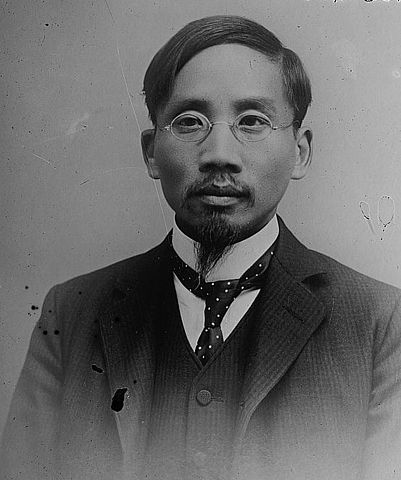

# （民）蔡元培：三篇有關把宗教獨立於教育的文章

蔡元培（1868 – 1940），字鶴卿，號孑民，浙江紹興人，清光緒進士，曾任翰林院編修。辛亥革命前進行革命宣傳，民國成立後先後任中華民國教育總長、北京大學校長、中央研究院院長等職。蔡元培對中國近代教育貢獻極大，堪稱「學界泰斗、人世楷模」。他曾提出過著名的「五育並舉」的教育方針，分別為軍國民教育、實利主義教育、公民道德教育、世界觀教育、美感教育，其中美感教育是蔡元培先生一個非常有特色的教育思想，尤其以「以美育代宗教」的口號聞名於世。蔡元培「以美育代宗教」的思想，在其《賴斐爾》、《對於教育方針之意見》、《教育獨立議》、《以美育代宗教》、《美育代宗教》等文章中都有體現，特別是1917 年他在北京神州學會的講演詞、後發表於《新青年》雜誌中的《以美育代宗教說》一文，最具代表性。

## 《以美育代宗教說》

*（1917年4月8日在北京神州學會說詞，原載於1917年8月《新青年》3卷6號）*

兄弟於學問界未曾為系統的研究，在學會中本無可以表示之意見。惟既承學會諸君子責以講演，則以無可如何中，擇一於我國有研究價值問題為到會諸君一言，即以美育代宗教之說是也。

夫宗教之為物，在彼歐西各國已為過去問題。蓋宗教之內容，現皆經學者以科學的研究解決之矣。吾人遊歷歐洲，雖見教堂棋布，一般人民亦多入堂禮拜，此則一種歷史上之習慣。譬如前清時代之袍褂，在民國本不適用，然因其存積甚多，毀之可惜，則定為乙種禮服而沿用之，未嘗不可。又如祝壽、會葬之儀，在學理上了無價值，然戚友中既以請帖、訃聞相的招，勢能不循例參加，借通情愫。歐人之沿習宗教儀式，亦猶是耳。所可怪者，我中國既無歐人此種特別之習慣，乃以彼邦過去之事寔作為新知，竟有多人提出討論。此則由於留學外國之學生，見彼國社會之進化，而誤聽教士之言，一切歸功於宗教，遂欲以基督教勸導國人。而一部分之沿習舊思想者，則承前說而稍變之，以孔子為我國之基督，遂欲組織孔教，奔走呼號，視為今日重要問題。

自兄弟觀之，宗教之原始，不外因吾人精神之作用構成。吾人精神上之作用，普通分為三種：一曰智識；二曰意志；三曰感情。最早之宗教，常兼此三作用而有之。蓋以吾人當未開化時代，腦力簡單，視吾人一身與世界萬物，均為一種不可思議之事。生自何來？死將何往？創造之者何人？管理之者何術？凡此種種皆當時之人所提出之問題，以求解答者也。於是有宗教家勉強解答之。如基督教推本於上帝，印度舊教則歸之梵天，我國神話則歸之盤古。其他各種現象，亦皆以神道為惟一之理由。此知識作用之附麗於宗教者也。且吾人生而有生存之慾望，由此慾望而發生一種利己之心。其初以為非損人不能利己，故恃強凌弱，掠奪攫取之事，所在多有。其後經驗稍多，知利人之不可少，於是有宗教家提倡利他主義。此意志作用之附麗於宗教者也。又如跳舞、唱歌，雖野蠻人亦皆樂此不疲。而對於居室、雕刻、圖畫等事，雖石器時代之遺跡，皆足以考見其受美之思想。此皆人情之常，而宗教家利用之以為誘人信仰之方法。於是未開化人之美術，無一不與宗教相關聯。此又情感作用之附麗於宗教者也。

天演之例，由渾而畫。當時精神作用至為渾沌，遂結合而為宗教。又並無他種學術與之對，故宗教在社會上遂結合而為宗教。又並無他種學術與之對，故宗教在社會上遂具有特別之勢力焉。迨後社會文化日漸進步，科學發達，學者遂舉古人所謂不可思議者，皆一一解釋之以科學。日星之現象，地球之緣起，動植物之分佈，人種之差別，皆得以理化、博物、人種、古物諸科學證明之。而宗教家所謂吾人為上帝所創造者，從生物進化論觀之，吾人最初之始祖實為一種極小之動物，後始日漸進化為人耳。此知識作用離宗教而獨立之證也。

宗教家對於人群之規則，以為神之所定，可以永遠不變。然希臘詭辯家，因巡遊各地之故，知各民族之所謂道德，往往互相牴觸，已懷疑於一成不變之原則。近世學者據生理學、心理學、社會學之公例，以應用於倫理，則知具體之道德不能不隨時隨地而變遷。而道德之原理則可由種種不同之具體者而歸納以得之。而宗教家之演繹法，全不適用。此意志作用離宗教而獨立之證也。

知識、意志兩作用，既皆脫離宗教以外，於是宗教所最有密切關係者，惟有情感作用，即所謂美感。凡宗教之建築，多擇山水最勝之處，吾國人所謂天下名山僧佔多，即其例也。其間恆有古木名花，傳播於詩人之筆，是皆利用自然之美以感人者。其建築也，恆有峻秀之塔，崇閎幽邃之殿堂，飾以精緻之造像，瑰麗之壁畫，構成黯淡之光線，佐以微妙之音樂。讚美者必有著名之歌詞，演說者必有雄辯之素養，凡此種種皆為美術作用，故能引人入勝。苟舉以上種種設施而屏棄之，恐無能為役矣。

然而美術之進化史，實亦有脫離宗教之趨勢。例如吾國南北朝著名之建築，則伽藍耳。其周雕刻，則造像耳。圖畫，則佛像及地獄變相之屬為多。文學之一部分，亦與佛教為緣。而唐以後詩文，遂多以風景人情世事為對象。宋元以後之圖畫，多寫山水花鳥等自然之美。周以前之鼎彝，皆用諸祭祀。漢唐之吉金，宋元以來之名瓷，則專供把玩。野蠻時代之跳舞，專以娛神，而今則以之自娛。歐洲中古時代留遺之建築，其最著者率為教堂。其雕刻圖畫之資料，多取諸新舊約。其音樂，則附麗於讚美歌。其演劇，亦排演耶穌故事，與我國舊劇「目蓮救母」相類。及文藝復興以後，各種美術漸離宗教而尚人文。至於今日，宏麗之建築多為學校、劇院、博物院。而新設之教堂，有美學上價值者，幾無可指數。其他美術，亦多取資於自然現象及社會狀態。

於是以美育論，已與宗教分合之兩派。以此兩派相較，美育之附麗於宗教者，常受宗教之累，失其陶養之作用，而轉以激刺感情。蓋無論何等宗教，無不有擴張已教、攻擊異教者殺之。基督教與回教衝突，而有十字軍之戰，幾及百年。基督教中又有新舊教之戰，亦亙數十年之久。至佛教之圓通，非他教所能及。而學佛者苟牽教義之成見，則崇拜舍利受持經懺之陋習，雖通人亦肯為之。甚至為護法起見，不惜於共和時代，附和帝制。宗教之為累，一至於此。皆激刺感情之作用為之地。

鑒激刺感情之弊，而專尚陶養感情之術，則莫如捨宗教而易以純粹之美育。純粹之美育，所以陶養吾人之感情，使有高尚純潔之習慣，而使人我之見、利己損人之思念，以漸消沮者也。蓋以美為普遍性，決無人我差別之見能參入其中。食物之入我口者，不能兼果他人之腹；衣服之在我身者，不能兼供他人之溫，以其非普遍性也。美則不然。即如北京左近之西山，我遊之，人亦遊之；我無損於人，人亦無損於我也。隔千里兮共明月，我與人均不得而私之。中央公園之花石，農事試驗場之水木，人人得而賞之。埃及之金字塔、希臘之神祠、羅馬之劇場，瞻望賞歎者若干人，且歷若干年，而價值如故。各國之博物院，無不公開者，即私人收藏之珍品，亦時供同志之賞覽。各地方之音樂會、演劇場，均以容多數人為快。所謂獨樂樂不如人樂樂，與寡樂樂不如與眾樂樂，以齊宣王之惛，尚能承認之，美之為普遍性可知矣。且美之批評，雖間亦因人而異，然不曰是於我為美，而曰是為美，是亦以普遍性為標準之一證也。美以普遍性之故，不復有人我之關係，遂亦不能有利害之關係。馬牛，人之所利用者，而戴嵩所畫之牛，韓幹所畫之馬，決無對之而作服乘之想者。獅虎，人之所畏也，而蘆溝橋之石獅，神虎橋之石虎，決無對之而生搏噬之恐者。植物之花，所以成實也，而吾人賞花，決非作果實可食之想。善歌之鳥，恆非食品。燦爛之蛇，多含毒液。而以審美之觀念對之，其價值自若。美色，人之所好也，對希臘之裸像，決不敢作龍陽之想。對拉飛爾若魯濱司之裸體畫，決不敢有周昉秘戲圖之想。蓋美之超絕實際也如是。

且於普通之美以外，就特別之美而觀察之，則其義益顯。例如崇閎之美，有至大至剛兩種。至大者如吾人在大海中，惟見天水相連，茫無涯涘。又如夜中仰數恆星，知一星為一世界，而不能得其止境，頓覺吾身之小雖微塵不足以喻，而不知何者為所有，其至剛者，如疾風震霆、覆舟傾屋、洪水橫流、火山噴薄，雖拔山蓋世之氣力，亦無所施，而不知何者為好勝。夫所謂大也、剛也，皆對待之名也。今既自以為無大之可言，無剛之可恃，則且忽然超出乎對待之境，而與前所謂至大至剛者肸合而為一體，其愉快遂無限量。當斯時也，又豈尚有利害得喪之見能參入其間耶！

其他美育中如悲劇之美，以其能破除吾人貪戀幸福之思想。小雅之怨悱，屈子之離憂，均能特別感人。《西廂記》若終於崔張團圓，則平淡無奇，惟如原本之終於草橋一夢，始足發人深省。《石頭記》若如《紅樓後夢》等，必使寶黛成婚，則此書可以不作。原本之所以動人者，正以寶黛之結果一死一亡，與吾人之所謂幸福全然相反也。又如滑稽畫中之人物，則故使一部分特別長大或特別短小。作詩則故為為諧之聲調，用字則取資於同音異義者。方朔割肉以遺細君，不自責而反自誇。優旃諫漆城，不言其無益，而反謂漆城蕩蕩寇來不得上。皆與實際不相容，故令人失筆耳。

要之美學之中，其大別為都麗之美、崇閎之美(日本人譯言優美、壯美)。而附麗於崇閎之悲劇，附麗於都麗之滑稽，皆足以破人我之見，去利害得失之計較，則其所以陶養性靈，使之日進於高尚者，固已足矣。又何取乎侈言陰騭、攻擊異派之宗教，以激刺人心，而使之漸喪其純粹之美感為耶。

## 《教育獨立議》

*（《新教育》第4卷第3期，1922年3月）*

教育是幫助被教育的人，給他能發展自己的能力，完成他的人格，於人類文化上能盡一分子的責任；不是把被教育的人，造成一種特別器具，給抱有他種目的的人去應用的。所以，教育事業當完全交與教育家，保有獨立的資格，毫不受各派政黨或各派教會的影響。

教育是要個性與群性平均發達的。政黨是要制造一種特別的群性，抹殺個性。例如，鼓勵人民親善某國，仇視某國；或用甲民族的文化，去同化乙民族。今日的政黨，往往有此等政策，若參入教育，便是大害。教育是求遠效的；政黨的政策是求近功的。中國古書說：「一年之計樹谷；十年之計樹木；百年之計樹人。」可見教育的成效，不是一時能達到的。政黨不能常握政權，往往不出數年，便要更迭。若把教育權也交與政黨，兩黨更迭的時候，教育方針也要跟著改變，教育就沒有成效了。所以，教育事業不可不超然於各派政黨以外。

教育是進步的：凡有學術，總是後勝於前，因為後入憑著前人的成績，更加一番功夫，自然更進一步。教會是保守的：無論什麼樣尊重科學，一到《聖經》的成語，便絕對不許批評，便是加了一個限制。教育是公同的：英國的學生，可以讀阿拉伯人所作的文學，印度的學生，可以用德國入所造的儀器，都沒有什麼界限。教會是差別的：基督教與回教不同，回教又與佛教不同。不但這樣，基督教裡面，天主教與耶穌教又不同。不但這樣，耶穌教裡面，又有長老會、浸禮會、美以美會……等等派別的不同。彼此誰真誰偽，永遠沒有定論。止好讓成年的人自由選擇，所以各國憲法中，都有「信仰自由」一條。若是把教育權交與教會，便恐不能絕對自由。所以，教育事業不可不超然於各派教會以外。

但是，什麼樣可以實行超然的教育呢？鄙人擬一個辦法如下：

分全國為若幹大學區，每區立一大學；凡中等以上各種專門學術，都可以設在大學裡面，一區以內的中小學校教育，與學校以外的社會教育，如通信教授、演講團、體育會、圖書館、博物院、音樂、演劇、影戲……與其他成年教育、盲啞教育等等，都由大學辦理。

大學的事務，都由大學教授所組織的教育委員會主持。大學校長，也由委員會舉出。

由各大學校長，組織高等教育會議，辦理各大學區互相關系的事務。

教育部，專辦理高等教育會議所議決事務之有關系於中央政府者，及其他全國教育統計與報告等事，不得幹涉各大學區事務。教育總長必經高等教育會議承認，不受政黨內閣更迭的影響。

大學中不必設神學科，但於哲學科中設宗教史、比較宗教學等。

各學校中，均不得有宣傳教義的課程，不得舉行祈禱式。

以傳教為業的人，不必參與教育事業。

各區教育經費，都從本區中抽稅充用。較為貧乏的區，經高等教育會議議決後，得由中央政府撥國家稅補助。

分大學區與大學兼辦中小學校的事，用法國制。

大學可包括各種專門學術，不必如法、德等國別設高等專門學校，用美國制。

大學兼任社會教育，用美國制。

大學校長，由教授公舉，用德國制。

大學不設神學科，學校不得宣傳教義與教士不得參與教育，均用法國制。瑞士亦已提議。

抽教育稅，用美國制。

## 《非宗教運動》

*（1922年4月9日在北京非宗教大同盟講演大會的演說詞，原載於《覺悟》 1922年4月13日）*

我曾經把複雜的宗教分析過，求得他最後的原素，不過一種信仰心，就是各人對於一種哲學主義的信仰心。各人的哲學程度不同，信仰當然不一樣，一人的哲學思想有進步，信仰當然可以改變，這全是個人精神上的自由，斷不容受外界的干涉。我願意稱他為哲學的信仰，不願意叫作宗教的信仰。因為現今各種宗教，都是拘泥著陳腐主義，用詭誕的儀式，誇張的宣傳。引起無知識人盲從的信仰，來維持傳教人的生活。這完全是用外力侵入個人的精神界，可算是侵犯人權的。我所尤反對的，是那些教會的學校同青年會，用種種暗示，來誘惑未成年的學生，去信仰他們的基督教。

我的意見，曾屢次發表過了，最近作《教育獨立議》（有英文譯本，送檀香山太平洋教育會議編輯部，其中文原稿，已載《新教育》第4卷 第3期），很說教育事業，不可不超然於各派教會以外的理由，並說應規定下列三事：

（一）大學中不必設神學科，但於哲學科中設宗教史、比較宗教學等；

（二）各學校中，均不得有宣傳教義的課程，不得舉行祈禱式；

（三）以傳教為業的人，不必參與教育事業。

我的意思，是絕對的不願以宗教參入教育的。

今年忽然有一個世界基督教學生同盟，要在中國的清華學校開會。為什麼這些學生，願意帶上一個基督教的頭銜？為什麼清華學校願給一個宗教同盟作會場？真是大不可解。

凡事都是相對待的，有了引人喝酒的鋪子與廣告，就可以引出戒酒會；有了引人吸煙的公司與廣告，就可以引出不吸紙煙會；有了宗教同盟的運動，一定要引出非宗教同盟的運動，這是自然而然的。有人疑惑以為這種非宗教同盟的運動，是妨害「信仰自由」的，我不以為然。信教是自由，不信教也是自由，若是非宗教同盟的運動，是妨害「信仰自由」，他們宗教同盟的運動，倒不妨害「信仰自由」麼？我們既然有這「非宗教」的信仰，又遇著有這種「非宗教」運動的必要，我們就自由作我們的運動。用不著什麼顧忌呵！
