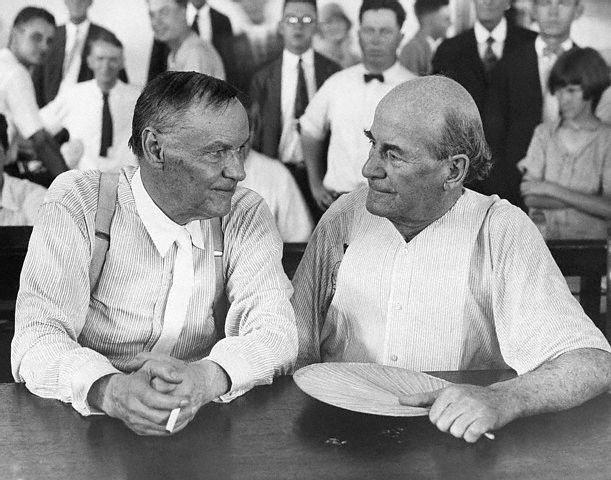

# 戴洛：為宗教和信仰自由一辯

*在猴子審判庭上。左：戴洛，右：布萊恩*

1920年代初，美國教會勢力領袖政客布萊恩（William Bryan）及馬丁（T. T. Martin）等，發動了一場反進化論運動，並推動各州進行許多相關立法。直至1925年，他們已成功爭取了15個州進行禁止在公立學校教授進化論的立法程序。

1925年3月21日，田納西州州長布特勒 (John Butler) 正式簽署法案，禁止任何公立學校教導任何否定聖經中「創造論」的理論，以及禁止教導「進化論」，此法被稱為《布特勒法》。1925年5月7日，田納西州政府向法院提出起訴，指控在德頓小鎮（Dayton）內一名年青高中生物老師斯科普斯（John Scopes）在課堂上講授進化論，違反該州法律，法院決定於7月10日開庭審理。

案件轟動整個美國，教會勢力前來小鎮聲援，教授、科學家等另一陣型也來支持，加上傳媒熱烈追訪，令人口只有千多人的小鎮頓時熱鬧起來。案件審訊全程由收音機廣播到全美國，布萊恩代表控方出庭，辯方律師由戴洛（Clarence Darrow）代表。審訊期間，兩人針鋒相對，漸漸成為一場進化論與創造論、科學與宗教、無神論與基督教的世紀大辯論。經過11天的激烈辯論後，7月21日，法院宣判斯科普斯有罪，但只輕判罰款 $100元。

布萊恩只能享受教會勢力短暫的讚譽，他於判決後6日就死於睡夢中。而戴洛則贏到了全國非教會公眾的熱烈掌聲。

此案成為全球最著名的審判之一，被稱為「猴子審判」（The Monkey Trial），是反現代宗教裁判的著名案例，是理性與愚昧、科學與宗教在法律領域內的一次重大較量，在法律史、思想史上都具有非凡的意義。「猴子審判」雖然未能阻止進化論與神創論之間無止境的辯論，卻是反進化論者的一大挫折。15個正進行立法的州份，最後只有2個州成功立法。直至1967年，田納西州取消了《布特勒法》；1968年，美國聯邦最高法院裁定所有類似的反進化論的立法違憲。

1955年，事件被改編成為著名話劇《承受清風》（*Inherit the Wind*），至今已被翻譯成三十多種文字，並數度拍成電影，於世界各地上演。

以下是戴洛在審判當中（1925年7月13日）其中一段辯詞。

***

這項立法及其他足以捏造人類罪名的法規是無效的，因為它抵觸了第十三節、第十二節和第三節。這是我必須特別聲明的。

閣下，第十二節提出：州方應扶植科學、文藝和學術。

閣下，我試著不對自己不相信的東西爭論不休，除非我被逼到了角落。我想總檢察官給它的解釋是正確的，而庭上這一點，使得你的解釋更正確。我不相信法規－－某些足以啟發並教育田納西青年的法規，會因為立法機關視其不應當通過，而被視為違法。

憲法下的州政府要從事於教育和學校事業，它必須要從事於教授工作。而基於此，它必須教授真理－－無論如何也應該－－要有很多人去做其他工作，它要教授文藝和科學。

我的朋友曾倡議文學和科學可能衝突。我看不出來，這是另一個問題。但是這已超出了田納西州的政策。

但是若用它來解釋這項憲法，那只能指出這純粹是州政府的表示，你不能稱它無效。而我要堅持說它是無效的，因為它抵觸了第三節。該節開頭寫著：「信仰自由的權力。」

閣下，世界上沒有一個法院，會光以文字就想要伸張法律的精神。我在哪裡讀過－－記不清在哪裡說－－文字會殺人，而精神給人生命。我想是來自於《和平王子》一書的話。我確實讀過,但不知在哪裡。

假如憲法這項保障宗教自由的條文，不能被精神支持的話，也決不可能光以文字就可以支持得了。

它是甚麼意思？甚麼意思？我知道兩個人只能像路上的夥伴一樣，保持某些距離而同行。他們只能同行幾條街，然後分道揚鑣。人類心靈亦是如此。當然他們必須是自由的。

正統派可能被局限住，所以不能有不同的想法，可能一點也不行。而兩個自由的心靈卻是會合而不同的。

世上沒有兩個人像機器般相同，或有完全一樣的經驗；而由其對經驗的解釋，乃導出他們的生命觀念和哲學。

在自由的世界上，不可能把一個人的意見強加在另一個人身上－－只有暴君能做到－－而他們所提出宗教自由的條款，卻也有意要走上這條險路。

我要再進一步說－－沒有別的東西，包括人類，我不知道是否敢說是進化的－－還好，這不是學校。既然人是出於塵土－－出自大地，就根本沒有東西能像宗教那樣引起不同的意見、苦痛、仇恨、戰爭和殘忍。當然，它也給千百萬人很多的慰藉。

這個世界上過去有多少教義和文化？無人能一一列舉。至少，我說有500種不同的基督教義，他們各自不相同。這些再把異議消到最小程度，直到各自聚集成派。

因為思想就是要不同，而有許多教義老於、或新於基督教義，而世界讓它們共存下去。

它門來來去去，它們各領風騷，然後如大江東去。有些仍然存在，有些可能會永存，但是由於人類的多樣性，它們也自然有多樣性，而田納西的憲法傳統是要把這些宗教問題，留給每個人和他所信仰的東西去處理，也就是要使他自由。

伊斯蘭教徒有權在此地傳教佈道嗎？中國人能把神像帶來此地膜拜嗎？有沒有人可以不論其來處，他所持的教義不管多悠久，或多虛假，田納西州立法院都可以禁止？不可能。

我就了解，田納西的憲法是和傑弗遜所寫的憲法是一致的。既清晰、又簡明，直接鼓勵宗教意識的自由。實際說來，沒有一項可以干涉宗教的自由。是耶，非耶？你說呢？它做了些甚麼？
