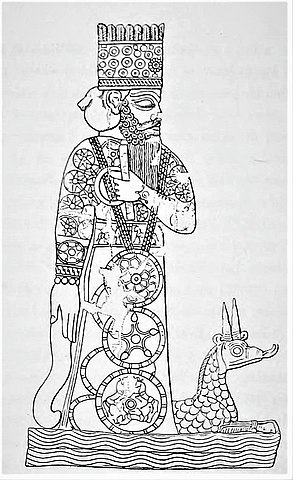

# 近東開闢史詩

  

《近東開闢史詩》（*Enuma Elis*）原文以楔形文字刻於七大塊泥板之上，是阿卡德人（Akkadian）關於開天闢地、人類由來的神話寶典，是世界最早的史詩之一，成書於公元前二十一至十六世紀，希伯來聖經的《創世記》即由此衍生而出。美索不達米亞的楔形文字，是世上最早的文字之一，中文版由饒宗頤教授以《詩經》體裁譯為中文。

《開闢史詩》全篇共分為七個部分，以起句 "*Enuma-Elis*"（When on high天之高兮）命名，通過阿卡德人（Akkadian）流傳的開天闢地的神話，記述在天地開闢的初期，諸神之間經常出現矛盾紛爭，甚至流血殺戮，最後經過了兩大勢力的一場大決戰，太陽神馬獨克（*Marduk*，右圖）脫穎而出，他徹底消滅了對方黑暗勢力的徹墨（*Tiamat*，象徵海水），成為眾神之王，興建巴比倫神廟，安處於宇宙間三位最高神明（安拏*Anu*、恩立*En-lil*及閼亞*Ea*）之前，並從充滿罪惡的反叛者身上抽取惡神之血來創造人類，斬下徹墨之頭顱做成山嶽、用其雙乳建起山峰、分解反叛者罪惡之軀以造河流湖泊、造出人間一切，在天上彰顯太陽神的神武無敵，在人間建起巴比倫的輝煌，使君權授命於天，為巴比倫王朝造勢，威懾大地眾生。

## 第一板

> 由混沌之初，從無到有逐步產生出諸神，置身於徹墨龐大的身軀內。隨著原始神明一個個的誕生，諸神間出現位置之爭，互相挑撥，喧嘩不息。由於眾神經常困擾著徹墨，潝虛（＊Apsu＊，象徵淡水）和漠母（＊Mummu＊，象徵醒覺）便密謀消滅諸神，並把這個計劃告知徹墨，但卻遭到徹墨的反對。徹墨將這計劃告知諸神中最強大的閼亞（＊Ea＊，或稱*Nudimmud*努知穆），閼亞先下手為強，唸符咒使潝虛、漠母入睡並殺死他們。閼亞取代潝虛成為神王，並與妻子萏潔娜（*Damkina*）誕下馬獨克（*Marduk*）。馬獨克從小威力非凡，具備四眼四耳，唇動出噴，比閼亞更強大，閼亞稱他為諸天的太陽。安拏為他帶來風作玩具，掀起巨浪，騷亂徹墨的地方。對此不滿的群神，以殺夫之仇挑動徹墨情緒，煽動她反擊復仇。於是徹墨製造出各種窮兇怪獸，在叛亂諸神中建立集團，並推舉＊Kingu＊（金固）為盟主，準備戰鬥。

**1. 混沌**  
天之高兮，既未有名。  
厚地之庳兮，亦未賦之以名。  
始有潝虛（*Apsu*），是其所出。  
漠母（*Mummu*）徹墨（*Tiamat*），皆由孳生。  
大浸一體，混然和同。  
無緯蕭以結廬，無沼澤之可睹。

**2. 神降**  
於時眾神，渺焉無形。  
名號不立，命運靡定。  
及乎神之降，乃與俱生。  
迨力牧（*Lahmu*）與力遐牧（*Lahamu*）之出，始肇錫以嘉名。  
先彼輩而長成，既累世而滋大。  
產安撒（*An-Sar*）與基撒（*ki-Sar*），凌架於眾人。  
載祀線延，歷有年所。  
安拏（*Annu*）繼嗣，堪匹其父母。  
伊安撒之長子安拏，與其父而無殊。  
及乎努知穆（*Nudimmud*）之生，一如安拏之軀。  
彼更肖其尊親，將為眾父之主。  
既廣識而濬哲，復多力而孔武。  
其強圉終邁厥祖安撒兮。  
於昆季之眾神中，誠為無敵者也！  

**3. 初擾**  
此諸神昆季，當結為一體。  
彼等困擾徹墨，洶湧於其前後。  
噫！彼輩攪亂徹墨（情緒），  
處於天宮，極嬉娛而煩瀆；  
潝虛既不能去其喧嘩，  
徹墨則無言而作態如故。  
彼等之行誠為可憎，  
其容誠為可厭。  
潝虛為諸巨神之自生者，  
狂呼對其貳漠母而言曰：  
「漠母！我之二兮，誰能悅予之心？  
汝盍來茲，共質之徹墨。」  
彼等往而坐於其前，  
長子（頭胎）詢謀於是。  
潝虛及張其口  
大聲以語徹墨：  
「彼輩誠使余不勝其擾，  
晝夜不寧。  
余哲將殲之，杜絕其方。  
庶幾安靜，俾余小休。」  
及徹墨聞其言，  
憤怒而斥其夫；  
肆意咆哮，責其欺凌，  
作狂態而悲吟：  
「胡為乎！余殆將毀棄我等之所建者？  
彼固煩瀆，惟余等當親切留意焉。」  
於是漠母慫恿潝虛，有所進陳－－  
……然漠母之言，頗為無禮：  
「嚴父乎！必絕此叛逆之路，  
而後濟於事，晝夜庶幾安寧。」  
潝虛聞之，面遽作色。  
蓋囿於其圖對抗諸神之惡魔也。  
漠母即趨其膝前，  
潝虛擁其頸而抱，坐下吻之。

**4. 閼亞（*Ea*）解紛**  
今者，兩人之間有何陰謀，  
皆傳至彼等初生之諸神。  
諸神聆言，頗為震愕；  
但保持緘默，處於無言。  
獨無所不知而睿智之閼亞（*Ea*），洞悉其情，  
因其智力凌駕一切為不可及也。  
彼想出一可施行之策，  
彼作巧妙符咒以對付之，  
諷誦之使其入於深沉之境。  
當彼擾其入睡，即佯作鼾聲。  
方潝虛俯伏漸入酣眠之際，  
其佐（漠母）已力攪動之矣；  
彼乃除其帶，裂其冠，  
移去其光暈，置於彼處，  
遂加桎梏於潝虛而弒之，  
復縛漠母而置諸枷鎖之後。

**5. 潝虛顯靈**  
於是乎潝虛乃建立其居所，  
遂執漠母繫之鼻繩。  
及至閼亞踐其仇敵並制服之，  
然後操勝算於既得，  
在其密室之中，始稍獲寧靜而休息焉。  
遂為潝虛安頓神龕，並名之曰「潝虛」，  
於其地置祭棚焉。  
閼亞與其妻萏潔娜（*Damkina*），居處輝煌，  
可謂宿命之宮，運會之館。  
乃另為創造一神，能幹非常，智慧駕於眾神之上，  
於是在潝虛之心中，馬獨克（*Marduk*）生焉。  
在神靈潝虛之心中，馬獨克生焉。  
生之者誰？是為閼亞，實其父也。  
育之者誰？是為萏潔娜，實其母也。  
彼啜乳於諸女神之胸；  
其乳母哺之，充滿震慄可怖（之象）；  
其體態充滿誘惑，其眼睛閃耀有光，  
其步履寬綽，其指撝老成。  
其生父閼亞見之，  
鼓舞歡騰，其心深為喜悅。  
既賜之以美備，授之以成雙之神首，  
盡力讚揚之超乎一切。  
其完滿之體軀出乎想像之外，  
奧乎莫可窺測，淵乎難以揣度；  
既具四眼，且具四耳，  
其唇動則有火噴出。  
其聽官巨大各有其四，  
眼之數亦如之，燭照萬物。  
彼為眾神中最崇高者，魁梧無匹，  
肢體龐大，極度高峻。  
「吾小兒乎！吾小兒乎！  
吾兒，太陽也，諸天之太陽也。」  
飾之以十神（日）之光弭，其威棱絕世，  
其光閃爍可怖，發為巨熱，布於全身。

**6. 再擾**  
安拏帶來生出四方風，  
畀付其威力，以成為造物之主。  
彼風行天下，以為扶搖驚飆之馭。  
彼遂掀起巨浸，以騷亂徹墨之所。  
至是，群神乃於驚飆中蒙受苦難，迄無休止矣。  
彼等乃於心中蓄懷不軌，  
語於其母徹墨曰：  
「當彼等弒汝夫君潝虛，  
汝未嘗拯救之，但靜觀其變而已。  
彼遂造此可怖之四方風，  
以削減汝之活力，而吾等亦難以獲得休息。  
讓汝夫潝虛（之精神）存於汝之心中，  
漠母既已被征服矣！汝亦已勢孤矣！  
……（使）汝之步伐，精神渙散，  
……汝不愛吾等，汝亦將無寧日，  
吾等目光凝注，  
……無有休止，讓吾等稍息！  
……（共）赴戰陣，汝其復仇乎！  
……今所用之報復彼等者，有如此風！」

**7. 徹墨備戰**  
徹墨聞言而喜。  
「……拜汝所賜、讓余等先造窮兇怪物；  
……諸神處於其中……  
……余等將佈陣，以待諸神……」  
彼等遂簇擁徹墨，  
咆哮、狂叫、準備攻戰，  
復組一議會以主軍事。  
母許芭（*Mother Huber*）更為調度一切。  
益以無敵之武器及怪獸雄虺之屬，  
與不可制約之獠牙，  
以毒為血，充滿其體，  
又有嗥吼巨龍，飾之以大恐怖，  
復冠暈珥於彼，使其如神，  
因此，凡注視彼等者，將遭毀滅，  
而彼等高舉其身，無再回復（原狀）。  
彼遂分佈毒虺、蛟龍與獅身人、  
巨獅、瘋犬、蠍子人、  
強有力之獅妖、飛龍、半人馬怪物，  
攜其絕不留情之武器，入陣不懼，  
其施令嚴，故彼等之服從性亦高。  
挈同此十一類邁進，  
於初生諸神中組成彼之集團。  
伊遂立金固（*Kingu*）為盟主，  
領導眾位，發號施令。  
慷慨執戈，以赴戰鬥。  
在戰陣中，彼為主帥－－  
彼已獲信任，一若其被位於議會之中：  
「余將為汝施發符咒，於眾神大會中升撥汝。  
告知所有之神，汝已獲予授以全權。  
其實汝已是至高無上者。汝即余之唯一夥伴。  
汝之發言，將勝於所有之亞拏娜奇（*Anunnaki*）。」  
伊乃賜之以「天命之銘」，懸之胸次：  
「汝其緊記之，汝之命令，將不容變更，以維持久遠。」  
旋金固被選入主安拏之位，  
為其子孫眾神計，［誕授厥］命：  
「汝言將致首次之平靖，  
汝必慎用權力，於掃蕩之功為首要！」

## 第二板

> 閼亞得知徹墨正與諸神的聯合作戰部署，於是向祖父安撒（*Anshat*）詳述對方陰謀，情況危急。安撒派兒子安拏前往陣前察看徹墨陣勢布置，安拏發覺自己並非對方敵手，沮喪而返。在諸神沉默無聲之際，安撒轉而提議讓馬獨克領軍出戰。閼亞召見馬獨克，馬獨克欣喜領命，並在與安撒見面時提出要求，要在戰勝後召開大會，立他為諸神之首。
>
> 當徹墨既如是以輸入品取代其手藝，作為獻禮，  
> 正準備與諸神作戰。  
> 為報復潝虛，徹墨（不惜）幹出罪惡。

**8. 諸神備戰失敗**  
其作戰部署，卻洩漏於閼亞。  
當閼亞聆及茲事，  
彼即轉入暖昧之寧靜，端坐如常（若無所聞），  
已而，經進一步之思考，其怒乃平息。  
彼因自行往視其（祖）父安撒。  
當彼至其祖父安撒之前，  
乃詳陳徹墨之陰謀，並覆述其言曰：  
余父乎！徹墨頻擾我等，憎恨我等，  
彼已成立議會，狂怒而將欲發難妄動矣。  
所有諸神已與其糾合同流，  
即汝向所提挈者亦趨向彼所矣。  
*【以下34行文字與第一版相同】*  
彼等遂簇擁徹墨，  
日夜籌謀，激怒不休，  
咆哮，狂叫，準備攻戰，  
復組一議會以主軍事。  
母許芭更為調度一切。  
益以無敵之武器及怪獸雄虺之屬，  
與不可約制之獠牙，  
以毒為血，充滿其體。  
又有嗥吼巨龍，飾之以大恐怖，  
復冠暈珥於彼，使其如神，  
因此，凡注視彼等者，將遭毀滅，  
而彼等高舉其身，無再回復（原狀）。  
彼遂分佈毒虺、蛟龍與獅身人，  
巨獅、瘋犬、蠍子人，  
強有力之獅妖、飛龍、半人馬怪物，  
攜其絕不留情之武器，入陣不懼，  
其施令嚴，故彼等之服從性亦高。  
挈同此十一類邁進，  
於初生諸神中組成彼之集團。  
伊遂立金固為盟主，  
領導眾位，發號施令，  
慷慨執戈，以赴戰鬥。  
在戰陣中，彼為主帥－－  
彼已獲信任，一若其被位於議會之中：  
「余將為汝施發符咒，於眾神大會中升撥汝。  
告知所有之神，汝已獲予授以全權。  
其實汝已是至高無上者。汝即余之唯一夥伴。  
汝之發言，將勝於所有亞拏娜奇。」  
伊乃賜之以「天命之銘」，懸之胸次：  
「汝其緊記之，汝之命令，將不容變更，以維持久遠。」  
旋金固被選入主安拏之位，  
為其子孫眾神計，〔誕授厥〕命：  
「汝言將致戰火之平靖，  
汝必慎用權力，於掃蕩之功為首要！」

**9. 諸神採防衛之策**  
安撒聆知徹墨已成大患，  
彼自撫其腰，自咬其唇，  
其心情沉鬱，其神態緊張。  
閉口抑制其號咷：  
「（吾等其相見於）戰陣乎？  
起！起！奮汝干戈！  
瞰之哉，漠母與潝虛，汝已弒之矣！  
今者必取忠於彼之金固。  
智哉創生之主（閼亞別名）。」  
諸神中之努知穆應之曰：  
*【下缺】*  
對於其子安拏，彼訓誡之曰：  
「……茲乃智力最盛之英雄也，  
其力超眾，足以捍禦強敵。  
往矣！汝力邁乎徹墨之上，  
安定彼之情緒，使其心坦蕩，  
彼若不聽汝言，  
可告知吾等之言，或即從之。」  
當聞其父安撒之命，  
彼即直趨陣前（往見徹墨。）  
惟當其向邇而見徹墨之佈置，  
彼亦不能抵抗之，遂轉身而返，  
歸見其父安撒，狀甚沮喪。  
因告之曰：  
「予手不足為汝征服之！」  
安撒於是乎俯首無言，  
其髮下垂，搖曳其首，以及閼亞。  
所有居諸天之亞拏娜奇，雲集於此，  
咸緘其口，默坐無聲。  
「果無一神可赴戰陣  
以討徹墨而讓其逃匿乎？」  
其主安撒，眾神之父也，肅然起立，  
沉思有頃，乃對諸天亞拏娜奇言：  
「彼其威力強大，信能復仇，  
其惟馬獨克，利於戰陣，其真英雄乎！」  
閼亞因召馬獨克至其私邸，  
授以機宜，告以胸中韜略。  
「咦！馬獨克乎！其熟思予之忠告，莫忘傾聽汝父之意，  
汝為吾子，當能忍乃父之心。  
往覲安撒，恍如臨於戰陣；  
屹立陳辭，彼見之則心安矣。」  
馬獨克聞言大悅，  
乃往覲安撒而親近之。  
當安撒見之，其心亦充滿愉悅，  
遂吻其唇，胸中鬱閟遂亦去除矣。  
「安撒！大啟汝口，毋再緘默，  
余將往矣，以遂汝心中之所冀求也。  
安撒！大啟汝口，毋再緘默，  
余將往矣，以遂汝心中之所冀求也。  
豈有壯士而敢鏖戰與爾為敵者哉？  
然僅此徹墨一婦人而已耳，乃能執戈而奔馳向汝乎！？  
噫嘻！余父，造物主也，宜乎歡喜愉悅。  
徹墨之項，終當為汝所踐踏矣！  
噫嘻！余父，造物主也，宜乎歡喜愉悅。  
徹墨之項，終當為汝所踐踏矣！」  
「吾兒！（汝之）智足以牢籠一切，  
且施汝之神咒使徹墨平靜，  
以暴風雨之戰車，疾馳以從彼所，  
彼等見汝已獲徹墨，必不敢抵禦，即可破之！」  
馬獨克聞其父之言，喜不自勝，  
其心雀躍，語其父曰：  
「創造諸神之神乎！諸巨神之命運乎！  
若余誠能為汝之復仇者，  
余將制服徹墨以拯汝等性命，  
且召開大會，以高揭吾命運之大纛。  
余當加入欲舒健拿（*Ubshukinna*），汝試莞爾坐下，  
讓余之昌言，代汝決定此一命運。  
不可改易而施行之吾之事功；  
此不能徹回，不可更動者是即余之訓令。」

## 第三板

> 馬獨克臨危受命，再次複述提醒勁敵當前。最後，諸神與馬獨克一起在出征前擁吻和飲宴，以壯行色。

**10. 諸神開始聯結一致**  
安撒乃開口，  
語其佐嘉加（*Gaga*）而言曰：  
嘉加，余佐乎！將（何以）悅予之心。  
余將遣汝往力牧及力遐牧處，  
汝其知所辨別，且善於辭令；  
天神汝父之生汝，實先於余！  
俾眾神至此，  
如朋盍簪，而聚會於斯，  
俾其宴樂，飧賓以美食與佳釀，  
為馬獨克，彼等之復仇者故頒定法令。  
往之哉嘉加，宜堅守汝位以待。  
復述余將告汝之言於彼：  
安撒乎汝子，命余臨此，  
托余寄聲以訓命其心。  
（乃言）：徹墨頻擾我等，憎恨我等，  
彼已成立議會，狂怒而將欲發難妄動矣。  
所有諸神已與其糾合同流，  
即汝向所提挈者亦趨向彼所矣。  
彼等遂簇擁徹墨，  
*【以下33行文字與第一版相同】*  
日夜籌謀，激怒不休，  
咆哮、狂叫、準備攻戰，  
復組一議會以主軍事。  
母許芭更為調度一切。  
益以無敵之武器及怪獸雄虺之屬，  
與不可約制之獠牙，  
以毒為血，充滿其體，  
又有嗥吼巨龍，飾之以大恐怖，  
復冠暈珥於彼，使其如神，  
因此，凡注視彼等者，將遭毀滅，  
而彼等高舉其身，無再回復（原狀）。  
彼遂分佈毒虺、蛟龍與獅身人、  
巨獅、瘋犬、蠍子人，  
強有力之獅妖、飛龍、半人馬怪物，  
攜其絕不留情之武器，入陣不懼，  
其施令嚴，故彼等之服從性亦高。  
挈同此十一類邁進，  
於初生諸神中組成彼之集團。  
伊遂立金固為盟主，  
領導眾位，發號施令。  
慷慨執戈，以赴戰鬥。  
在戰陣中，彼為主帥－－  
彼已獲信任，一若其被位於議會之中：  
「余將為汝施發符咒，於眾神大會中升撥汝。  
告知所有之神，汝已獲予授以全權。  
其實汝已是至高無上者。汝即余之唯一夥伴。  
汝之發言，將勝於亞拏娜奇之一切。」  
伊乃賜之以「天命之銘」，懸之胸次：  
「汝其緊記之，汝之命令，將不容變更，以維持久遠。」  
旋金固被選入主安拏之位，  
為其子孫眾神計，〔誕授厥〕命：  
「汝言將致戰火之平靖，  
汝必慎用權力，於掃蕩之功為首要！」  
余遣安拏上陣，彼不能面對（徹墨）；  
努知穆則因恐懼而歸退。  
馬獨克，其最聰慧者，亦汝之子也，乃進焉，  
蓋其心已促使彼安排一切以對付徹墨。  
彼啟其口而告余曰：  
「若余誠能為汝之復仇者，  
余將制服徹墨以救汝等性命；  
且召開大會，以高揭吾命運之大纛。  
余當加入欲舒健拿，汝試莞爾坐下，  
讓余之昌言，代汝決定此一命運。  
不可改易而施行之吾之事功，  
此不能徹回、不可更動者是即余之訓令。  
今者從速為彼頒定法令，  
使彼可前往對付汝等之勁敵矣！」  
嘉加乃啟程，踏足其途。  
於力牧及力遐牧之前，諸神皆其父輩，  
彼謹致敬禮，親吻彼等腳下之土地，  
起立然後磬折而致詞曰：  
安撒乎汝子，命余臨此，  
*【以下55行文句多重出】*  
托余寄聲以訓命其心。  
乃言：徹墨頻擾我等，憎恨我等，  
彼已成立議會，狂怒而將欲發難妄動矣。  
所有諸神已與其糾合同流，  
即汝向所提挈者亦趨向彼所矣。  
彼等遂簇擁徹墨，  
日夜籌謀，激怒不休，  
咆哮、狂叫，準備攻戰，  
復組一議會以主軍事。  
母許芭更為調度一切。  
益以無敵之武器及怪獸雄虺之屬，  
與不可約制之獠牙，  
以毒為血，充滿其體，  
又有嗥吼巨龍，飾之以大恐怖，  
復冠暈珥於彼，使其如神，  
因此，凡注視彼等者，將遭毀滅，  
而彼等高舉其身，無再回復（原狀）。  
彼遂分佈毒虺、蛟龍與獅身人，  
巨獅、瘋犬、蠍子人，  
強有力之獅妖、飛龍、半人馬怪物，  
攜其絕不留情之武器，入陣不懼，  
其施令嚴，故彼等之服從性亦高。  
挈同此十一類邁進，  
於初生諸神中組成彼之集團。  
伊遂立金固為盟主，  
領導眾位，發號施令。  
慷慨執戈，以赴戰鬥。  
在戰陣中，彼為主帥－－  
彼已獲信任，一若其被位於議會之中：  
「余將為汝施發符咒，於眾神大會中升撥汝。  
告知所有之神，汝已獲予授以全權。  
其實汝已是至高無上者。汝即余之唯一夥伴。  
汝之發言，將勝於亞拏娜奇之一切。」  
伊乃賜之以「天命之銘」，懸之胸次：  
「汝其緊記之，汝之命令，將不容變更，以維持久遠。」  
旋金固被選入主安拏之位，  
為其子孫眾神計，〔誕授厥〕命：  
「汝言將致戰火之平靖，  
汝必慎用權力，於掃蕩之功為首要！  
余遣安拏上陣，彼不能面對（徹墨）；  
努知穆則因恐懼而歸退。  
馬獨克，其最聰慧者，亦汝之子也，乃進焉，  
蓋其心已促使彼安排一切以對付徹墨。  
彼啟其口而告余曰：  
『若余誠能為汝之復仇者，  
余將制服徹墨以救汝等性命；  
且召開大會，以高揭吾命運之大纛。  
余當加入欲舒健拿，汝試莞爾坐下，  
讓余之昌言，代汝決定此一命運。  
不可改易而施行之吾之事功；  
此不能徹回、不可更動者是即余之訓令。』  
今者從速為彼頒定法令，  
使彼可前往對付汝等之勁敵矣！」  
力牧與力遐牧等聆言，莫不大聲嚎哭。  
諸天之義芝芝（*igigi*）悲痛而嗥曰：  
「是何奇詭也！彼輩竟作此決定！  
徹墨之用心，深不可測，實非余等所能揣度也。」  
所有諸大神之命運，已有定數矣；  
眾皆趨往安撒之前，集於欲舒健拿內，  
相互擁吻，  
會談就宴，  
歡愉進餐，注酒薦酌，  
沾濡舉斛，陶然而醉。  
旨酒既酣，狂飲無已，  
興致飛越而體倦不能興矣，  
惟為彼等之復仇者馬獨克頒布其政令焉。

## 第四板

> 描寫父輩諸神擁立馬獨克為統帥的壯觀場景，而馬獨克果然不負所托，準備好弓箭、閃電、火焰、巨網、各種巨風、洪水和戰車，與徹墨進行大決戰。馬獨克在陣前力陳徹墨罪行，激怒她單獨比鬥，徹墨不甘受辱，單獨出征，結果馬獨克一舉戰勝並殺死徹墨，更將其屍體踐踏。馬獨克俘虜敵方敗軍後，把徹墨的屍體分割為兩半，創造天地。

**11. 父輩諸神擁立馬獨克**  
彼等遂為其立一王子之寶座，  
俾面對其父，垂拱而主其事。  
「汝實為諸神中之最光榮者，  
汝之詔令屬於大宙，汝之命令即為安拏之令，  
馬獨克乎！汝實為諸神之最光榮者，  
汝之詔令屬於大宙，汝之言即為安拏之言，  
自茲日起，汝之宣示將為不可改易者。  
陟降之任，將全出於汝手。  
汝之發言將為事實，汝之宣詔將為無可非難者。  
諸神之中，毋有敢犯之令者。  
其諸神坐位需施裝飾者，  
願彼輩之神龕永處於汝之殿。  
噫嘻，馬獨克！汝誠為我等之復仇者，  
吾等願立汝為宇宙之王，  
於大會座中，汝之言將為最權威者，  
汝之兵器無敵，必將摧毀（我等之）仇人，  
噫，至尊！勿傷害倚畀汝者，  
至於作惡之神，則務請除去之。」  
既已樹立偶像於彼等之中間，  
彼等遂向其長子馬獨克言曰：  
「至尊，汝之詔令於諸神中實為首要者。  
汝之言，即可立致生與滅，  
啟汝金口，偶像將化為烏有，  
再言之，則偶像將復重現。」  
彼於是啟口，而偶像果化為烏有，  
及彼再言之，偶像果又重現也。  
其父輩諸神，親睹其言語之應驗，  
皆喜而致敬曰：「馬獨克，真乃王者也！」  
彼等遂授之以節杖、寶座與法服焉。  
又賜威力無比之兵器，以抵禦其敵：  
「去！去！殄徹墨之命！  
俾眾風得攫其血，置於不可知之地。」  
產自荊樹之甜果，彼之命運既已定矣，其父輩諸神，  
乃促使其踏足成功與收穫之道。

**12. 馬獨克準備作戰**  
彼爰造一弓，以為武器，  
繫之於前，張弦以固之。  
彼高舉權杖，以右手緊握之。  
弓與矢橐懸諸其側，  
佈閃電於其前，  
激以火焰，充乎其身。  
繼而張一巨網，將羅徹墨於其內，  
復設四風圍繞之，務使其無可遁逃：  
（四風也者）南風、北風、東風、西風（是也）。  
擎茲（神）網以近彼軀－－乃其父安拏所賜者；  
彼又發動魔風伊呼嚕（*Imhullu*），回旋風、暴風、  
四方風、七方風、旋風與無比之狂風；  
彼即驅策此等七位風神共趨陣前，  
為煽動徹墨內部，使其不穩，彼等遂皆起而隨之。  
少頃，至尊興作洪水滔滔，此尤其有力之武器。  
彼乃馳其無可抵抗而令人震慄之飆車，  
挽套車軛以臨之；其佐有四：  
戕者、殘惡者、蹂躪者、迅行者，  
皆裂唇而含毒齒，  
勇於毀壞而不倦。  
右佈進擊者，可撼敵於陣上，  
左陳格鬥者，下手毫不留情，  
彼乃扳一可怖之甲冑為外衣，  
以其震慴之光珥為頭飾。  
至尊乃依其計劃直趨陣前，  
嚴肅無畏，面對徹墨。  
雙唇啣以符咒，  
手中緊執一種植物，有毒放出。  
繼是，群神乃於其旁摩掌擦拳，眾甚囂咻，  
諸神，其父也，皆擾攘之，諸神皆擾攘之。

**13. 馬獨克與徹墨之戰**  
至尊乃依原定計劃趨前，視察徹墨之底蘊，  
然後及於其夥伴金固。  
當彼熟視之，反覺其部署未必可行，  
終致分心，步伐失次。  
而身旁諸神，皆彼之助拳者，  
睹茲驍勇英雄（之表現），咸感眩惑不解。  
徹墨首不回顧而疾呼之，  
口出棋蠻輕蔑之言曰：  
「汝何物也，竟敢妄欲與我方諸神之至尊一鬥哉！  
是彼等自集之（然後擁爾至此），抑爾召集之（然後率彼等至此）？」  
於是至尊祭起其有力之武器洪水，  
並為激怒徹墨計，乃對其言曰：  
「汝何故起僭越之念，傲慢不遜，  
汝既已立心挑起叛亂，  
……使子而拒其父，  
彼等實皆汝所生，而竟捐棄其愛乎！  
汝又立金固為汝之夥伴，  
授之以安拏之位，則更屬不當！  
以滔天之罪行，對抗諸神之王安撒，  
與及吾父輩諸神，汝之奸惡實不可或恕！  
汝其整軍旅，奮汝戈矛，  
起！起！爾我且單獨比鬥，以決一死戰也！」  
徹墨聞之，  
頓失理智，舉止若狂，  
勃然大怒，咆吼不已。  
又搖震雙足以抵地，  
復鼓其舌而作咒，  
而陣上諸神，亦皆磨戈植矛（準備搏鬥）。  
徹墨繼而與聰明神武之馬獨克，  
單獨比鬥，酣戰不休。  
至尊乃佈網以掩徹墨，  
魔風則尾隨之，伺機揚擊其面；  
當徹墨張口意欲吞噬（馬獨克）之際，  
彼乃鼓策魔風猛進，使其雙唇難閉，  
眾風群起而吹襲其腹，  
使其軀體膨脹而其口闊張，  
彼即以箭射其腹，  
洞穿五內，並裂其心。

**14. 馬獨克之勝利**  
彼既一戰而勝之，遂了結（徹墨）之生命。  
並暴其屍體（以為京觀），而踐踏之。  
徹墨既受戮，  
其眾星散，伍卒潰敗，  
咸恐懼震慄，俱背棄之，  
冀免一死，  
彼等既已遭圍困，無可逃遁，  
至尊乃俱俘虜之，毀其武器，  
置之羅網之中，然後彼等悟已遭誘陷，  
乃於牢籠中慟哭不已；  
至尊之盛怒未息，彼等遂皆下獄。  
至其所部形貌可怖之十一怪物，  
以及列於其右之諸妖魔，  
皆為至尊縛雙方而桎梏之。  
以彼等曾反抗故，遂蹂躪之於足下，  
就中金固為渠魁，  
及擊之而交付于烏基（*Uggae*）；  
從其身上撤去其「天命之銘」，以其非所宜有者，  
鈐以印信，即扣於胸前（用昭其罪）。  
既已制服其大憝，  
並削去其驕矜之仇敵，  
至是，安撒勘叛之役，終告凱旋。  
努知穆之願亦獲償矣；勇武之馬獨克  
加強控制諸降神，  
轉而顧其為彼所繫之徹墨。  
於是，至尊遂踐踏徹墨之足，  
以其執法嚴厲之權杖，敲碎其頭顱焉。  
彼既已切斷其動脈之血矣，  
北風乃吹拂之於冥漠之地。  
其父等睹此（勝利），喜極而歡呼；  
彼輩爭攜禮品以致賀之。  
惟至尊止步而視（徹墨之）殘骸  
思欲分割其體而有所創造焉。

**15. 造分天地**  
彼乃剖裂之若蚌蠣之甲，分為兩半，  
其一立之以為蒼穹，  
設閘遣戍卒堅守自固，  
復令毋許其因水而潛逃。  
彼遂跨越諸天而俯瞰餘域。  
當至尊丈量潝虛所擁土地之廣袤時，  
板復測度潝虛之舍及努知穆之所居。  
因其廣居，相其端倪，確定為（宇宙之宮）埃沙華（*Esharra*），  
以其廣居埃沙華，置之為蒼昊，  
而安拏、恩立（*Enlil*）與閼亞，各分佔其地。

## 第五板

> 詳述馬獨克安排星體位置次序，確定年月安排，日月交替，月亮盈缺，取用徹墨唾涎創造風雲雨霧，頭顱及雙乳分別造成山嶽和崇山，將其雙眼挖走造出幼發拉底（*Euphrates-歐霏域*）、底格里斯（*Tigris-泰姬維*）兩河。然後，馬獨克受封為天上地下百神之主。馬獨克表示將會建造宏偉的巴比倫神殿，以立威權，並繼而創造人類。

彼為巨神，置其躔次兮。  
列宿以陳，羅星象兮。  
歷離其閾，以成歲兮。  
依十二月，為三天兮。  
狀以天形，年日以敘。  
建之以泥畢烏（太歲）（*Nebiru*），以正晷度；  
毋或違之，或傾側之。  
分其畛域，恩立、閼亞。  
啟其天門，別以兩極；  
探扃為固，在其左右。  
於其臍中，以立天極。  
生月之輝，夜以寄焉。  
司夕之神，晝以形焉；  
「月作冠冕，罔有停息。  
因月而動，升地上兮；  
有光生角，指六之日兮；  
至於第七日，冠珥之半兮；  
值月之望，位反居月之半。  
迨日追及之兮，至於天之底下。  
減其暈珥，光乃後退；  
至於消失，因日之故。  
迄於卅日兮，乃復與日相對。」  
「樹以標幟，循其軌度。  
……近而斷之。」  
*【第25至44行殘缺。】*  
日辰既定，曜靈（*Shamash*）安所。  
有朝有宵，以定其疆。  
取其唾涎，原屬徹墨；  
馬獨克乃造……  
彼遂興雲，復敷之以水；  
風之拂兮，雨之與凄。  
襲之以煙霧，銷其荼毒。  
彼（馬獨克）皆用之，為己之所取資。  
置（徹墨）之首兮，以為山嶽。  
浚其深兮，泛成淵海。  
自其雙眼，決為歐霏域（*Euphrates*）與泰姬維（*Tigris*）兩河。  
塞其鼻孔，彼使……  
就其兩乳，以起崇山。  
掘泉為井，用汲取水。  
絞搓其尾，束之以鞶革（督麻，*Durmah*）。  
……潝虛在其足；  
……其股，牢結於天。  
天之覆兮，地之載兮。  
……泛流於徹墨之中兮；  
……全出於其羅網之外。  
彼乃造分天地，……  
其疆界……乃定……  
立其夕規，以布政令。  
制其神龕，以致於閼亞。  
天命之銘，取自金固，  
貽之安拏，以為之贄。  
諸神既畢戰陣，旋即離去。  
彼乃奉獻（罪俘），於其父之前。  
徹墨所造之十一怪物……  
既粉碎其武器，又胥靡於足下，  
塑圖其狀，懸之天闕。潝虛訓示曰：  
「俾作鑒戒，以示永志。」

**16. 馬獨克初受封**  
諸神睹此，喜極無言。  
力牧、力遐牧，及其諸父，  
皆過而向彼及其王安撒存問焉，  
安拏、恩立與閼亞皆往致賀禮。  
其母萏潔娜，亦忭慶而饋贈；  
對顏既開，共致其慶祝焉。  
而于思美（*Usmi*）則私贈禮物以賀其功，  
彼乃委之為潝虛之司法者及諸神龕聖物之守護者。  
大命既集，諸天之義芝芝皆俯首鞠躬，  
而眾亞拏娜奇皆俯吻其足，  
……與會者無不傾服，  
皆立於其前而稽首曰：「彼固真主！」  
其父輩立於諸神之後，無不因其魅力而感滿足。  
*【缺第90至106行。】*  
彼等（二人）乃開口對諸巨神義芝芝曰：  
「昔者，馬獨克僅為余等之愛子，  
今則為汝等之主，宜三呼其號。」  
眾皆隨聲，致其頌曰：  
「其名應為天上及地下百神之主（盧格敵馬蘭奇亞 *Lugaldimmerankia*），惟彼是依！」  
彼等既賦馬獨克以統治之權，  
並為彼宣示表白，預祝其幸運及成功：  
「汝將為吾等神殿之守護者，  
汝有所命，當共遵行。」

**17. 巴比倫計劃**  
馬獨克乃啟齒，  
謹陳詞於其父輩諸神之前曰：  
「潝虛！其儼在上，  
帝之所居，如同明堂（埃沙華），余既為汝建之矣！  
在其下者，余亦固其弘基而大起矣。  
余將廣啟屋宇，以為我壯麗之居。  
余將建之以為神殿。  
余將置寢宮，以立我之威權。  
當汝等由潝虛之處蒞此赴會，  
可投宿於茲，可容汝等之住處。  
當汝等由諸天降此赴會，  
可投宿於茲，可容汝等之住處。  
余將名之曰巴比倫（*Babylon*），義為巨神之居所。  
余將建造之，窮極工巧。」

**18. 創造人類**  
其父輩諸神聆渠此言，  
即向彼等之長子馬獨克，叩以下列諸事端：  
「汝所創造之一切，  
誰將獲汝之授權而有之？  
觀於地上汝所創者，  
誰將享之？  
巴比倫乎！是為汝所賜之嘉名，  
於其處所，建我永恒之居！  
……以供吾等日常之給養，  
……吾人……  
無人可篡奪吾人既立之事功  
於其間……其役……」  
馬獨克聞言大喜，  
乃就諸神之質詢而答曰：  
彼既虔劉徹墨，予諸神以光明，  
乃開口發言，無限尊貴：  
「……彼等……  
……皆可為汝等所信賴。」  
諸神俯首於其前而語，  
對此盧格敵馬蘭奇亞曰：  
「曩者謂王僅為吾等之愛兒，  
今則誠乃吾儕之共主，盍三呼其號！  
其咒文即可賦予吾等生命，  
彼為具有光榮、威權與帝位之主。  
閼亞熟知技藝，其術多方，  
一切待彼布其方策，吾等（謹服事之）。」

## 第六板

> 閼亞以叛軍首領金固的血液造人，使人類為諸神服役。馬獨克劃分眾神職責，並集合眾神之力，一年間建起巴比倫聖殿，安奉馬獨克、恩立和閼亞。在慶祝聖殿落成飲宴之後，恩立舉起大弓並為其命名及安放在議會之中，接下來是馬獨克授勳，獲眾神歡呼讚頌，並獲授予50個名號。

當馬獨克聞眾神之言，  
其心急欲創造奇觀，  
爰開金口，告知閼亞，  
以表其胸中熟籌之計：  
「余將搏其血而構其骨兮，  
余將置此仆豎而名之曰人。  
余誓將造此野蠻人，  
俾其從容而服役於諸神。  
余將美飾並改變諸神之道，  
分彼為兩，而同受欽敬。」  
閼亞即答應之而致詞焉，  
請致他術，用忍諸神：  
「可犧牲彼眾兄弟中之一人  
彼雖獨自死去，人類可由之而生（以承其血統）。  
請集諸神於此（而議之），  
交出有罪者（而賦予此重任），彼等或可忍耐。」  
馬獨克遂召眾神與會，  
親主其事，而示訓誨，  
諸神無不留心聆聽其言。  
王乃下詔與亞拏娜奇曰：  
「如汝前言果信，  
今宜循信誓，遵行朕命。  
孰為首事作亂者，  
使徹墨叛而陷入戰陣耶？  
當交出其渠魁，  
予將使彼負罪，汝等可安然無事。」  
諸巨神義芝芝乃趨前，  
向盧格敵馬蘭奇亞，即諸神之忠告者，彼等之主答曰：  
「是由金固倡首，  
而使徹墨叛而參與大戰。」  
彼等乃拘繫之，執之閼亞之前。  
加之以罪而歃其血焉。  
以其餘瀝，塑造人類。  
（閼亞）即使之服役，遂遣去諸神。

**19. 建立巴比倫**  
智者閼亞既造人類，  
使其為諸神服役－－  
而事有難於理解者，  
蓋出於馬獨克之安排，亦努知穆所締造者。  
馬獨克，眾神之王也，乃分  
諸亞拏娜奇為兩（格於上下，使司天地。）  
並使之屬安拏，以恪遵其訓示。  
在天職掌其事者三百，  
於地之上掌其儀者為數亦同，  
天地之間，凡所安置，共六百焉。  
部署既竣，  
天地之間，亞拏娜奇各就其位矣。  
諸亞拏娜奇乃開口，  
向其主馬獨克而言曰：  
「今茲陛下，既拯救吾儕，  
吾等將何以為報乎？  
吾等將建一神廟，為之命名。  
『且瞰乎，宵以為息游之寢』；吾等欣有托焉。  
吾等將復為置一御座，供主休憩。  
春節來覲，吾等亦有其所焉。」  
馬獨克聞言，  
欣容如日之升，光芒煥發，曰：  
「可建巴比倫，如君等所請。  
施以磚石，並名之曰『聖殿』。」  
諸亞拏娜奇乃依其言而為之；  
經一整年而造磚焉，  
越翼歲，  
高者如明堂之翹首廟（*Esagila*），可與潝虛齊，  
復建層塔，高如潝虛者。  
彼等更於其中建居室，以處馬獨克、恩立與閼亞；  
彼等即各依其位次，奉彼登極威嚴之座，  
其座之觸手俯瞰埃沙華之基。  
及乎彼等既築成，昂首屹立，  
諸亞拏娜奇乃各擇其神龕，  
其三百義芝芝……亦復齊集，  
至尊乃立於巍峨之壇，此即彼等為其創建之所，  
父輩諸神宴處其中，彼乃坐而言曰：  
「是即巴比倫，汝之居室在焉。  
依茲廣宅，作樂其中。」  
諸巨神皆就其座，  
起而舉杯飲宴焉。

**20. 馬獨克隆重授動（及其最後成就）**  
歡娛既終，  
明堂之中，一時禮儀悉備。  
規章既定，祥兆遂興，  
上天下地之間，眾神分配，各就其列。  
五十巨神咸升其位。  
命運之神者七，立三百（諸神於天上）。  
恩立舉其弓，彼之武器也，而置於彼等之前。  
其父輩諸神見其所造之網。  
當彼等注視其弓，極其精致，諸父無不稱讚其巧藝。  
安拏舉之而告與會之眾神，  
既吻其弓，然後曰：「是余之女兒也。」  
彼所以以此名其弓者：  
「長木（*Longwood*），一也；精確（*Accurate*），二也；  
其三命之曰天弧星（*Bow-Star*），余所造以照耀諸天者也。」  
彼乃與其兄弟諸神，定弓之位置。  
及安拏頒布弓之命運，  
而奠其巍峨之寶座於眾神之前，  
安拏乃置之於諸神之議會中。  
諸神既已雲集，  
彼等乃對揚馬獨克之王庥，鞠躬如也；  
並宣其詛咒，用水與油，臨深履薄，以發誓言。

**21. 初次頌讚**  
當彼等授予其王權以統治眾神，  
當彼等給予彼統治天界與地上百神之權，  
安撒即宣布其至崇高之名：阿撒魯唏（*Asarluhi*），因曰：  
「吾人每稱呼其尊號，必恭敬行禮，  
當其發言時，諸神宜注意之，  
俾其命令為上天下地之至尊者。」  
*【缺第105行】*  
「為我等復仇者，乃至崇高之子。  
俾其權力凌駕一切，無有對手。  
俾其拏領其所創之黔首。  
俾彼等歡呼，率服其方，永矢毋忘，至於末日。  
俾彼為其諸父設豐足之粢盛食品以祭獻，  
廣其供奉，而守其寢殿。  
使其聞薰香，……神咒，  
作一相類似人像於地上，一如彼在天上之所為，  
令其黔首共只敬之，  
使其臣民長潔其心，而稱道其神，  
俾彼等因其所言而只禮女神，  
兼以使其椒糈，繁殖以敬事諸神，  
奉禮勿替，  
滋榮其地域，以隆其禱祀，  
使黔首虔敬於神（面不怠）。

**22. 馬獨克美號五十嘉名**  
至於吾等，當為唱頌各種名號，彼誠吾等之明神。  
讓吾等謹頌其五十神之嘉名；  
備極光榮，而其功績亦如之，  
馬獨克，有如其父安拏，生時即以此命名，  
彼即供給畜牧及飲水之地，以充實（諸神之）廄者。  
以洪水為其武器，以制服諸誹謗及反叛者。  
拯救其父輩諸神於困厄之中。  
彼誠為太陽之子，諸神中之最赫耀者也。  
彼等將長期流轉於其光耀輝煌之中！  
以其生命【歛】助彼所孕育之人民，  
彼等為神服役，由其賦與安逸。  
創造、破壞、拯救、恩惠，  
皆出自其命令。宜乎諸神民皆向彼致無窮之敬意。  
〈2〉馬累加（*Maruka*）是為真神，萬物之締造者，  
能悅諸亞拏娜奇之心，並撫慰諸義芝芝。  
〈3〉馬累度古（*Marutukku*）實為領土、城市與人民之庇護者，人民將其讚頌無斁。  
〈4〉巴拉莎古蘇（*Barashakushu*）起而執其權，  
其心廣，其情溫。  
〈5〉盧格敵馬蘭奇亞，乃吾等於議會中所致稱頌之名號。  
吾人既已升舉更命令為凌駕其父輩諸神者，  
彼固為上天下地一切神明之主。  
彼乃王也，其戒律深為上天下地一切神明所牢記，不敢或忘。  
〈6〉拿利盧格敵馬蘭奇亞（*Nari-Lugaldimmerankia*）之所由名，吾人稱之為眾神之宰；  
彼處於天地之間，為我等排難解紛，  
且為諸義芝芝及亞拏娜奇分配其駐屯之所。  
諸神聞其名，將震慄而怯退。  
〈7〉阿撒胡老道（*Asaruludu*）之名，乃其父拏所命。  
彼實為諸神之光，偉大之領袖，  
身為諸神明及土地之守護神，  
於兇猛之單打獨鬥中，拯救吾人於困阨苦難之際。  
阿撒胡老道又被命名為〈8〉男桃拉固（*Namtillaku*），意即保全生命之神也。  
彼能使已消失之神恢復原形，如同彼之所創者，又能以  
其咒使已死之神，得以復甦。  
彼能毀滅剛愎之強敵，吾等宜乎稱頌其勇武。  
阿撒胡老道又有第三名曰〈9〉男弧（*Namru*），  
為光耀之神，使吾道生輝（照臨上下）。  
厥三名號，實為安撒、力牧與力遐牧所公布者，  
對其子輩諸神，彼等呼之曰：  
「其三名號均為吾等所公布者。  
一如余等，汝等須必高呼其名。」  
眾神皆樂於遵命。  
彼輩及於欲舒健拿中交換意見：  
「吾人之復仇者，英雄兒子也，  
吾人之支柱也，必稱揚其名！」  
彼等乃於議會中公告其命運，  
並稱揚其名號於聖殿之中。

## 第七板

> 列述馬獨克取代眾多舊神的位置，吸收了他們的神性、權力和德行，得到五十嘉名，確立了馬獨克的至尊地位。

〈10〉阿沙胡（*Asaru*），耕作之賜與者，准其水平，  
創造穀物與百草，使植物萌生。  
〈11〉阿沙胡亞林（*Asarualim*），長於審議，於審議會中極負盛名，眾神倚之，得無所懼。  
〈12〉仁慈之阿沙胡亞拏娜（*Asarualimnunna*）及其生父之光輝，  
彼用指撝安拏、恩立與年伊芝古（*Ninigiku*）之法令，  
為彼輩之供給者，分配其所應得者，  
其有角之帽繁多……  
〈13〉陶陶（*Tutu*）即使彼等終得以復原者。  
讓其為彼等潔淨神龕，使之安適。  
讓彼施其符咒，使眾神可以安逸。  
逢彼之怒，亦可使其歸休。  
於眾神之議會中，彼實為至高無上，  
諸神無有可與倫比者。  
陶陶亦即〈14〉士欲健拿（*Ziukkinna*），眾神東道主之生命也。  
彼為眾神建立神聖之諸天，  
並掌握彼等之意向，以決定彼等之行。  
彼將不為蒙蔽者（指人類）所遺忘。彼等將永志其所作為。  
陶陶其第三名號為〈15〉士古（*Ziku*），諸神聖之建立者，  
和氣之神，傾聽而垂允之王者也。  
彼生殖財富與珍寶，帶來豐盛，  
令我輩所需之一切更加充足；  
使吾等於慘痛之苦難中，得嗅聞其仁慈之氣息。  
俾共傳語，俾共激厲，俾共謳歌而讚揚之。  
陶陶為人民所誇揚之第四名號曰〈16〉阿嘉古（*Agaku*），  
彼誠為聖咒之王，能拯求死者，使之復生；  
彼對所征服之諸神，有大慈悲焉，  
除去加諸曾經為敵之眾神身上之桎梏，  
為解救諸神，乃創造人類。  
於其弘力之中，賴其寬仁以賜與生命，  
俾其於黔首眾口，永矢良言，  
使勿失墜－－彼輩即為其所手造者。  
陶陶之第五名號亦即〈17〉陶古（*Tuku*），諸神之口將囁嚅其聖咒，  
彼以其神聖之符咒根絕一切之妖妄。  
〈18〉撒素（*Shazu*），彼固洞悉諸神之心者，驗之於內，  
使行邪惡者無所逃匿。  
彼設立諸神之議會，使彼等歡心；  
彼能克服諸不堪忍耐者，如彼等權利之擴張，  
彼乃維護正義，杜絕欺詐之談，  
操持其立場，辨別邪、正之分。  
撒素，諸神或又稱其第二名號曰〈19〉士思（*Zisi*），彼即平敉謀叛者也，  
自其父輩諸神之身，驅除惶恐。  
其三，撤素亦即〈20〉舒穎（Subrim），彼即以其武器根除一切仇敵者，  
挫折彼輩之詭計，驅散之於諸風之中，  
抺去一切於其面前戰慄之邪惡者，  
讓眾神於議會中雀躍歡呼！  
其四，撒素亦即〈21〉舒古穎（*Suhgurim*），彼乃其父輩諸神－－諸創造者清聽之設立者也。  
根除勁敵，滅其種嗣，  
挫其所為，使之絕跡。  
讓其名長留於天地之間，為人歌頌。  
其五，撒素又被稱頌為〈22〉沙穎（*Zahrum*），生存之主也。  
彼能殄滅所有之敵手，一切不服從者，追擊邪惡，  
所有未得正果之神，必挈返而安之於神龕，（以便曰夕膜拜之，）如是使其名足垂之永久。  
又次，其公，對於撒素，彼等將致所有之榮譽，為〈23〉沙古穎（*Zahgurim*）  
一切仇敵，彼將殲滅之，如於疆場之上。  
〈24〉安必露露（*Enbilulu*）為能使彼等極享盛名之主，  
為賜彼等名號之無所不能者，並為之制定隆重之獻禮。  
彼將永遠治理土地、畜牧與水利，  
開浚井渠，使豐富之水源，獲得分配。  
其次，安必露露將被尊為〈25〉阿巴登（*Epadun*），彼為能降甘露以潤田疇之主也，  
天地間之灌溉者，創育佳苗，各就其列，使之為草原上有利於耕犁之地，  
水垻，溝渠井然，使畎畂各定其疆界。  
其三，安必露露亦被稱頌為〈26〉安必露露古高（*Enbilulugual*），  
為諸神耕地之灌溉者，  
充實，富裕及穀物豐收之主，  
供給財富，使居者皆饒裕，  
藝植蜀黍，並使大麥滋長。  
安必露露亦即〈27〉希高（*Hegal*），積聚穀物，供民人之消耗，  
能致甘雨於大地，以潤蔬果。  
〈28〉撒爾撒（Sir Sir）為堆積山簞於徹墨身上者，  
以其兵器，運走徹墨之屍骸，  
復領其地，為彼等忠誠之牧人，  
其毛髮即為穀田，其角帽可為畎畂，  
廣漠之海洋，於其復仇之激怒中奔騰，  
踦越彼（徹墨）軀有如跨越決鬥場上之一座橋樑。  
撒爾撒，彼等又稱之曰〈29〉馬立（*Malah*）及其他－－徹墨乃其侍女，彼則為御者。  
〈30〉基爾（*Gil*），彼儲積穀物，有如山陵，  
大麥玉米由是而足，且滋生大地之種子焉。  
〈31〉基爾馬（*Gilma*），彼能使諸神高貴之住所耐久堪用，為安全之創造者，  
彼如箍桶之鐵環，諸多貢獻。  
〈32〉阿基爾馬（*Agilma*）為廣受褒揚者，彼褫去地位不當之冠冕，  
置行雲於流水之上，使恒留高處。  
〈33〉蘇林（*Zulum*），眾神之領域乃其所指定者，並為創建之指示者，  
彼為分配供給食物祭品，並照拂諸神龕。  
〈34〉漠母，乃天地之創造者，彼領導……  
彼為使天地淨化莊嚴之神，又名〈35〉蘇林馬（*Zulumma*），  
諸神之間，無有比其更為強壯有力者。  
〈36〉其殊拏田納（*Gishnumunab*），眾民人之創造者，開闢大地者，  
徹墨陣中諸神之摧毀者，而人類即由彼輩之精髓中出。  
〈37〉盧高押道保（*Lugalabdubur*），挫折徹墨謀變之王者，滅絕其武器，  
前後之根基皆極為堅固。  
〈38〉栢高古安拿（*Pagalguenna*），彼乃諸王者中之首位，其力也超群，  
處於諸帝居所之最高者，於眾神中最受讚譽。  
〈40〉亞華拏拿（*Aranunna*）乃閼亞之顧問，諸神之創造者，其父輩也。  
侯王之次，無神可與相比。  
〈41〉獨莫獨古（*Dumuduku*），其淨居於獨古（Duku）已重新之。  
獨莫獨古，盧高古獨嘉（*Lugalkuduga*）若無其人，將無從定策。  
〈42〉盧高蘭拿（*Lugallanna*），眾神中武力最特出之王也。  
亦即安拏之力量也，因安撒之召而臻無上。  
〈43〉盧高渥嘉（*Lugalugga*），將所有彼等離鬥爭，  
彼充滿智慧，視野廣闊。  
〈44〉伊金固（*Irkingu*），執金固於敵軍之中，  
指引大眾，奠立統治之權。  
〈45〉金馬（*Kinma*），彼領導諸神，達其意旨，  
諸神聞其名為之震慄，如立風暴之中。  
〈46〉埃息思居（*Esizkur*），彼將高坐於禱室，  
以接受諸神之獻禮，  
由此而彼等將獲委任，  
創作機巧之物，必不能無其助力；  
其一即為四黔首，如無之，  
則眾神於其時亦不知其法也。  
〈47〉基比爾（*Gibil*），彼能保持武器之堅銳，  
以其巧技，建奇功於戰徹墨之陣，  
其識力過人，故其智廣，  
其心博大，故諸神均莫能測其高深焉。  
〈48〉阿都（*Addu*）為其名，遮蔽天際，  
讓其仁慈之大笑永遠翱翔於大地之上，  
使其一如漠母，減薄雲層，  
為凡間民人提供活計。  
〈49〉阿撒烏（*Asharu*），恰如其名，作為掌管命運諸神之指導，  
所有民人皆在其掌握之中。  
〈50〉泥畢烏（*Nebiru*）彼將司經天緯地之責。  
眾神必侍候之，否則難以行乎上下。  
泥畢烏實為星座，閃耀於天際，  
位於中央，諸神皆頂禮之，  
曰：「彼處於大漠之間，經行不息，  
字之曰『橫道』，執其環中。  
彼等宜高揭天上群星之軌跡，  
彼為一切神之牧者，有如馴羊。  
願彼克服徹墨，制其死命。  
於人類之未來，當時日徂謝之際，  
願其【指徹墨】退欲也，無有歇止，永遠遠離。  
因其締造太空，作成堅固之大地，  
神父恩立乃名之曰『大地之主』焉。」  
當眾天之義芝芝呼畢其所有名號時，  
閼亞聞之，神為不悅，  
乃曰：「有是諸名，其神父因此而深感榮耀矣。  
彼實如朕，其名將為閼亞。  
余所有組成之典禮，彼將為其支配者。  
余所有之指示，彼將舉而施行之。」  
以此五十嘉名，諸神  
遂讚頌之：厥名為五十，所以建其至尊之地位也。

亂曰：  
汝其識之，俾汝有司，共訓誨之。  
聖與智者，共討論之。  
為父者誦之，以詔其子。  
牧人虞人(畜牧者)，共提其耳。  
以娛其神，恩立、馬獨克。  
俾饒益其地，既富且庶。  
定其法則，厥命不渝。  
金口已開，靡神可易。靡神可易。  
正視諸事，毋改其度。  
靡神可勝其忿兮，逢彼之怒！  
惟其心之寬兮，情之廣兮，  
罪者違者，胥可近其前兮！  
*【缺第157行】*  
著之記錄，示方來兮。  
馬獨克之居所，乃諸天工【義芝芝】所造兮。  
……請共謳歌。  
……馬獨克之烈兮，  
克戡徹墨，承皇統兮。  

【完】
