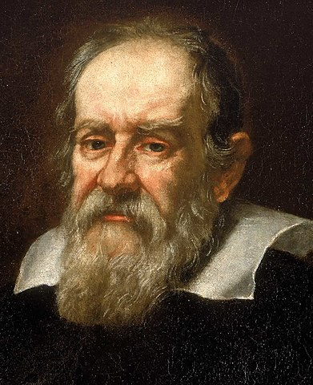

# 伽利略：地球在轉動

伽利略（1564 – 1642），意大利物理學家，因積極宣傳哥白尼的日心說而受到教廷迫害，1633年被宗教裁判所判處終生監禁，並被迫作「認罪」聲明。直至1992年10月31日，伽利略蒙冤整整360年後，梵蒂岡教廷終於承認錯誤，教宗約望保綠二世 (Pope John Paul II) 宣布當年對伽利略及其理論的指摘是錯誤的。

1632年的《地球在轉動》是伽利略的代表作《關於托勒密和哥白尼兩大世界體系的對話》中的一部分。這一著作紀錄了他的日心說與地球中心說之間的激烈論辯，從某種意義上說，這完全可以稱作一種特殊形式的講演。伽利略運用科學事實，有條不紊地作分析，論證十分嚴密，得出的結論無可辯駁。

***

昨天我們決定在今天碰頭，把那些自然規律的性質和功用談談清楚，並且盡量地談得詳細一點。關於自然規律，到目前為止，一方面有擁護亞里土多德和托勒密立場的人提出的那些，另一方面還有哥白尼體系的信徒提出的那些。由於哥白尼把地球放在運動的天體中間，說地球是像行星一樣的一個球，所以我們的討論不妨從考察逍遙學派攻擊哥白尼這個假設不能成立的理由開始，看看他們提出些什麼論證，論證的效力究竟多大。

在我們的時代，的確有些新的事情和新觀察到的現象，如果亞里士多德現在還活著的話，我敢說他一定會改變自己的看法。這一點我們從他自己的哲學論述方式上，也會很容易地推論出來，因為他在書上說天不變等等，是由於沒有人看見天上產生過新東西，也沒有看見什麼舊東西消失，言下之意，他好像在告訴我們，如果他看見了這類事情，他就會作出相反的結論；他這樣把感覺經驗放在自然理性之上是很對的。如果他不重視感覺經驗，他就不會根據沒有人看見過天有變化而推斷天不變了。

如果我們是在討論法律上或者古典文學上的一個論點，其中不存在什麼正確和錯誤的問題，那麼也許可以把我們的信心寄托在作者的信心、辯才和豐富經驗上，並且指望他在這方面的卓越成就能使他把他的立論講得娓娓動聽，而且人們不妨認為這是最好的陳述。但是自然科學的結論必須是正確的、必然的，不以人們的意志為轉移的，我們討論時就得小心，不要使自己為錯誤辯護；因為在這裡、任何一個平凡的人，只要他碰巧找到了真理，那麼一千個狄摩西尼和一千個亞里士多德都要陷於困境。所以，辛普利邱，如果你還存在著一種想法或者希望，以為會有什麼比我們有學問得多、淵博得多、博覽得多的人，能夠不理會自然界的實況，把錯誤說成真理，那你還是斷了念頭吧。

亞里士多德承認，由於距離太遠很難看見天體上的情形，而且承認，哪一個人的眼睛能更清楚地描繪它們，就能更有把握地從哲學上論述它們。現在多謝有了望遠鏡，我已經能夠使天體離我們比離亞里十多德近三四十倍，因此能夠辨別出天體上的許多事情，都是亞里士多德所沒有看見的；別的不談，單是這些太陽黑子就是他絕對看不到的。所以我們要比亞里士多德更有把握地對待天體和太陽。

某些現在還健在的先生們，有一次去聽某博士在一所有名的大學裡演講，這位博士聽見有人把望遠鏡形容一番，可是自己還沒有見過，就說這個發明是從亞里士多德那裡學來的。他叫人把一本課本拿來，在書中某處找到關於天上的星星為什麼白天可以在一口深井裡看得見的理由。這時候那位博士說：「你們看，這裡的井就代表管子；這裡的濃厚氣體就是發明玻璃鏡片的根據。」最後他還談到光線穿過比較濃厚和黑暗的透明液體使視力加強的道理。

實際的情形並不完全如此。你說說，如果亞里士多德當時在場，聽見那位博士把他說成是望遠鏡的發明者，他是不是會比那些嘲笑那位博士和他那些解釋的人，感到更加氣憤呢？你難道會懷疑，如果亞里士多德能看到天上的那些新發現，他將改變自己的意見，並修正自己的著作，使之能包括那些最合理的學說嗎？那些淺薄到非要堅持他曾經說過的一切話的鄙陋的人，難道他不會拋棄他們嗎？怎麼說呢？如果亞里士多德是他們所想像的那種人，他將是頑固不化、頭腦固執、不可理喻的人，一個專橫的人，把一切別的人都當作笨牛，把他自己的意志當作命令，而凌駕於感覺、經驗和自然界本身之上。給亞里士多德戴上權威和王冠的，是他的那些信徒，他自己並沒有竊取這種權威地位，或者據為已有。由於披著別人的外衣藏起來比公開出頭露面方便得多，他們變得非常怯懦，不敢越出亞里士多德一步；他們寧可隨便地否定他們親眼看見的天上那些變化，而不肯動亞里士多德的天界一根毫毛。
