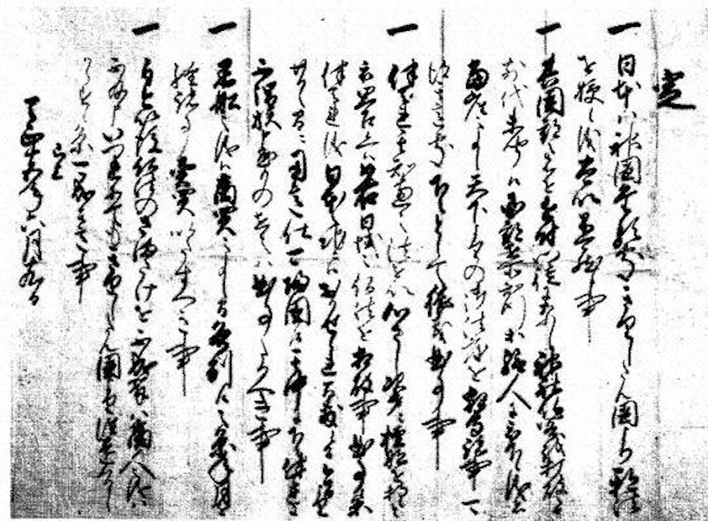

# 豐臣秀吉：吉利支丹伴天連追放令

這項法令於1587年7月24日由日本戰國時代統治者豐臣秀吉下達，驅逐外國傳教士出境並且將傳教與南蠻貿易嚴厲區分開來，對信仰基督教的大名（即封臣）進行限制，希望他們放棄基督教信仰。「伴天連」是「Padre」的日文舊譯，在葡萄牙語中是神父、傳教士的意思，「追放」是放逐的意思，「吉利支丹」是日本基督教徒的意思。

豐臣秀吉發佈這個法令的原因是部分傳教士大肆擄掠日本男女逼迫其成為奴隸，再經由奴隸買賣將大約五萬人左右的日本年輕男女販賣世界各地牟利。另一方面，基督教勢力正不斷擴大，他擔心吉利支丹發動叛亂，同時基督教教義與神道、佛教的衝突，也促使了豐臣秀吉發佈這個法令。自此奠定了日本禁教的基礎。豐臣秀吉於1596年再次頒令禁教，其後德川幕府於1612年發佈禁教令，又於1633年至1639年連發5道鎖國令，禁止傳教，禁止除長崎外的其他地方與外國人進行貿易活動，完成了日本的鎖國過程。

伴天連追放令的原本出自《松浦家文書》，現藏於長崎縣平戶市的松浦史料博物館。

***

定

- 日本ハ神國たる處、きりしたん國より邪法を授候儀、太以不可然候事。
- 其國郡之者を近附、門徒になし、神社佛閣を打破らせ、前代未聞候。國郡在所知行等給人に被下候儀者、當座之事候。天下よりの御法度を相守諸事可得其意處、下々として猥義曲事事。
- 伴天連其智恵之法を以、心さし次第二檀那を持候と被思召候ヘバ、如右日域之佛法を相破事前事候條、伴天連儀日本之地ニハおかせられ間敷候間、今日より廿日之間二用意仕可歸國候。其中に下々伴天連儀に不謂族申懸もの在之ハ、曲事たるへき事。
- 黑船之儀ハ商買之事候間、各別に候之條、年月を經諸事賣買いたすへき事。
- 自今以後佛法のさまたけを不成輩ハ、商人之儀ハ不及申、いつれにてもきりしたん國より往還くるしからす候條、可成其意事。

已上

天正十五年六月十九日

***

**驅逐傳教士令**

- 日本神國也，西國傳來之基督邪法，萬萬不可接受。
- 傳教士令諸國郡之民歸附，搗毀神社佛閣，實乃前所未聞之事，諸國郡知行，亦得遵天下之法，故需對其嚴加約束，不可任其妄為。
- 傳教士皆以其知識博取信徒，乃至破壞日本之佛法，誠不當矣。故其不可留於日本，當自今日起二十日內歸國。
- 黑船之儀，係貿易之事，應予區別，今後亦可進行長期貿易。
- 不妨害佛法之商人，縱來於基督之國，亦予准許。

以上

1587年7月24日
