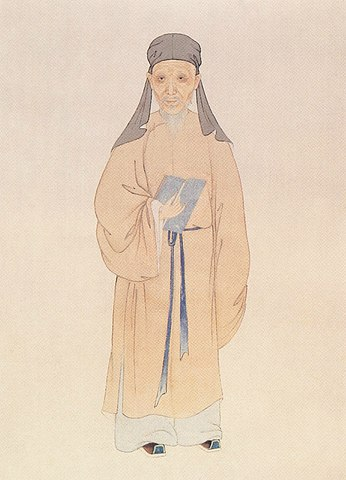

# 黃宗羲：《破邪論》

黃宗羲（1610 – 1695），字太沖，號梨洲，世稱南雷先生或梨洲先生，浙江餘姚縣（今浙江省寧波餘姚市）人，明末清初經學家、史學家、思想家、地理學家、天文曆算學家、教育家，學識淵博，與顧炎武、王夫之並稱明末清初三大思想家（或明末清初三大儒），著有《明儒學案》《宋元學案》《明夷待訪錄》《孟子師說》《葬制或問》《破邪論》《思舊錄》《易學象數論》《明文海》《行朝錄》《今水經》《大統歷推法》《四明山志》等，有「中國思想啟蒙之父」之譽。

《破邪論》是黃宗羲八十多歲時最後的作品，針對當時許多不良的社會風俗觀念，提出許多辯駁糾正。在《破邪論．上帝》中，黃宗羲先用昊天上帝的唯一性批判了《周禮》、緯書的五帝說、鄭康成的五天說以及佛家的諸天說，然後他提到了天主教，對於天主教「抑佛而崇天」並無意見，他所批判的是天主教將「天主」人格化或神化，甚至立其像而記其事，這樣的「天主」與黃宗羲所理解的「天之主宰」大相逕庭。在傳統儒家思想中，人格化或神鬼化的「天」已經是對「天」的降格，即使這一「天主」是萬神之神，也只是個被降格了的神，這樣的「天主」已經不是原來意義上的至高無上之存在。所以黃宗羲譏諷這個「天主」不過是人鬼而已，真正的「上帝」或「天」已經被抹殺了。

以下節錄《破邪論》中三篇有關宗教的篇章：上帝、魂魄、地獄。

***

## 《破邪論》

### 上帝

邪說之亂，未有不以漸而至者。夫莫尊於天，故有天下者得而祭之，諸侯以下皆不敢也。詩曰「畏天之威，於時保之」，又曰「上帝臨汝，無貳爾心」。其凜凜於天如此。天一而已，四時之寒暑溫涼，總一氣之升降為之。其主宰是氣者，即昊天上帝也。周禮因祀之異時，遂稱為五帝，已失之矣；而緯書創為五帝名號，蒼帝曰靈威仰，赤帝曰赤熛怒，黃帝曰含樞紐，白帝曰白招矩，黑帝曰汁光紀。鄭康成援之以入註疏，直若有五天矣；釋氏益肆其無忌憚，緣「天上地下，唯我獨尊」之言，因創為諸天之說，佛坐其中，使諸天侍立於側，以至尊者處之於至卑，効奔走之役。顧天下之人習於見聞，入彼塔廟，恬不知怪，豈非大惑哉！為天主之教者，抑佛而崇天是已，乃立天主之像記其事，實則以人鬼當之，並上帝而抹殺之矣。此等邪說，雖止於君子，然其所由來者，未嘗非儒者開其端也。今夫儒者之言天，以為理而已矣。易言「天生人物」，詩言「天降喪亂」，蓋冥冥之中，實有以主之者。不然，四時將顛倒錯亂，人民禽獸草木，亦渾淆而不可分擘矣。古者設為郊祀之禮，豈真徒為故事而來格來享、聽其不可知乎？是必有真實不虛者存乎其間，惡得以理之一字虛言之也！佛氏之言，則以天實有神，是囿於形氣之物，而我以真空駕於其上，則不得不為我之役使矣。故其敬畏之心蕩然。儒者亦無說以正之，皆所謂「獲罪於天」者也。

### 魂魄

或問：醫家言心藏神、脾藏意、府藏魂、肺藏魄、腎藏精與志，信乎？曰：非也，此以五行相配，多為名目，其實人身止有魂魄二者而已。禮記曰：「魂也者，陽之盛也；魄也者，陰之盛也。」延陵季子之葬，曰骨肉復歸於土，命也，若魂氣無不之也。不言魄者，已葬，故不及魄。易曰「精氣為物，遊魂為變」，所謂精氣即魄也。神與意與志皆魂之所為也。魂魄如何分別？曰：昭昭靈靈者是魂，運動作為者是魄。魄依形而立，魂無形可見。故虎死眼光入地，掘之有物如石，謂之「虎威」；自縊之人，其下亦有如石者，猶星隕為石，皆魄也。凡戰場之燐火、陰雨之哭聲，一切為厲者，皆魄之為也，魂無與焉。譬之於燭，其炷是形，其焰是魄，其光明是魂。子產曰「人生始化曰魄，既生魄，陽曰魂」。是人之生，先有魄而後有魂也。及其死也，有魂先去而魄尚存者，今筮祝家死後避衰之說是也。有魄已落而魂尚未去者，如楚穆王弒成王，諡之曰「靈」，不瞑，曰「成」，乃瞑。中行獻子死而視不可含是也。然則釋氏投胎託生之說有之乎？曰：有之，而不盡然也。史傳如羊叔子識環之事甚多，故不可謂之無。或者稟得氣厚，或者培養功深，或專心致志，透過生死，凶暴之徒性與人殊，投入異類，亦或有之。此在億兆分之中有此一分，其餘皆隨氣而散，散有遲速，總之不能留也。釋氏執其一端以概萬理，以為無始以來，此魂常聚，輪迴六道，展轉無已。若是則盛衰消息聚散有無成虧之理，一切可以抹卻矣。試觀天下之人，屍居餘氣，精神矇懂，即其生時魂已欲散，焉能死後而復聚乎？且六合之內種類不同，似人非人，地氣隔絕，禽蟲之中，牛象蟣虱，大小懸殊，有魄無魂，何所憑以為輪迴乎？然則儒者謂聖賢愚凡，無有不散之氣，同歸於盡者，然乎否耶？曰：亦非也。吾謂有聚必散者，為愚凡而言也。聖賢之精神，長留天地，寧有散理？先儒言「何曾見堯舜做鬼來」，決其必散。堯舜之鬼，網維天地，豈待其現形人世而後謂之鬼乎？「文王陟降，在帝左右」，豈無是事，而詩人億度言之耶？周公之金縢、傅說之箕尾，明以告人，凡後世之志士仁人，其過化之地，必有所存之神，猶能以仁風篤烈，拔下民之塌茸，固非依草附木之精魂可以誣也。死而不亡，豈不信乎！或疑普天之下，無有不祭其祖先者，而謂凡愚之魂盡散，則祭乃虛拘乎？曰：凡愚之魂散矣，而有子孫者，便是他未盡之氣。儒者謂子孫盡其誠意，感他魂之來格，亦非也。他何曾有魂在天地間？其魂即在子孫思慕之中。此以後天追合先天，然亦甚難。故必三日齋、七日戒，陽厭陰厭，又立屍以生氣迎之。庶幾其一線之氣，若非孝子慈孫，則亦同一散盡也。

### 地獄

地獄之說，儒者所不道。然廣記、夷堅諸書載之甚煩，疑若有其事者。蓋幽明一理，無所統屬，則依草附木之魂，將散於天地。冥吏不可無也，然當其任者，亦必好生如皋陶，使陽世不得其平者，於此無不平焉。陽世之吏，因乎天下之治亂，亂日常多，治日常少，故不肖之吏常多，亦其勢然也。冥吏為上帝所命，吾知其必無不肖者矣。乃吾觀為地獄之說者，其置刑有碓磨鋸鑿、銅柱鐵牀、刀山雪窖、蛇虎糞穢，慘毒萬狀，目所不忍見，耳所不忍聞。是必索元禮、來俊臣之徒，性與人殊者，始能勝其任。吾不意天帝所任治獄之吏，乃如唐之武后也！且陽世之刑，止有笞杖徒流絞斬，已不勝其紛紜上下，若地獄言而信，則故鬼新鬼，大亂於冥冥之中矣。陽世之愛惡攻取方謝，而冥地之機械變詐復生，夫子所謂鬲如睪如而願息者，殆有甚焉。或曰：「地獄之慘形，所以禁陽世之為非者也。上帝設此末命，使亂臣賊子知：得容於陽世者，終不容於陰府。以補名教之所不及，不亦可乎？」余曰：不然。大奸大惡，非可以刑懼者也。地獄之說相傳已久，而亂臣賊子未嘗不接跡於世，徒使虔婆頂老凜其纖介之惡，而又以奉佛消之，於世又何益乎？夫人之為惡，陰也，刑獄之事亦陰也，以陰止陰，則沍結而不可解，唯陽和之氣足以化之。天上地下，無一非生氣之充滿。使有陰慘之象滯於一隅，則天地不能合德矣。故知地獄為佛氏之私言，非大道之通論也。然則大奸大惡，將何所懲創乎？曰：苟其人之行事載之於史、傳之於後，使千載而下，人人慾加刃其頸，賤之為禽獸，是亦足矣。孟氏所謂「亂臣賊子懼」，不須以地獄蛇足於其後也。
