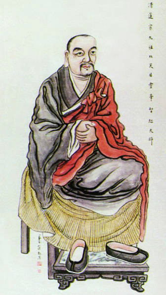

# （明）蕅益智旭：《辟邪集》

蕅益智旭（1599 – 1655），明末四大高僧之一。他以儒生鍾始聲的名義撰寫了《辟邪集》，包括《天學初征》、《天學再征》兩篇正文，幾篇書信和序、跋。文中的智旭以一個正統儒生的面目出現．先作《初征》指出天主教矛盾，再作《再征》列舉評破。《初征》和《再征》體現了智旭基於中國傳統文化．對天主教的全面批判。智旭採用邏輯分析和學理闡述的方法，對天主教內部邏輯矛盾進行了揭露，主要援引儒家理淪，澄清了古儒之天的概念，批判了天主創世、賦性、獨尊、救贖等觀念，力圖說明天主教教義的荒謬及天主概念的虛妄，指出了天主教對中華道統的威脅。

## 刻辟邪集

法無邪正。邪正在人。迦葉佛滅度後。正法像法俱盡。而常樂我淨之語變為九十五種外道。釋迦出世。遂以無常苦無我不淨破之。情汁既蕩。聖諦現前。逮雙林示寂。重唱真常。所謂但除其病。不除法也。流至今日。佛法又幾成外道矣。

於是有利馬竇艾儒略等。託言從大西來。借儒術為名。攻釋教為妄。自稱為天主教。亦稱天學。諸釋子群起而詬之。然適足以致其謗耳。獨聖朝佐辟一書。頗足令邪黨結舌。惜乎流通不廣。邇來利艾實繁有徒。邪風益熾。

鍾振之居士於是乎懼。著初征再征以致際明禪師。禪師笑曰。釋迦如來。得外道六師之毀而教道大行。肇公物不遷論。得空印之駁。而舉世方知討究。吾安知利艾二人非不思議菩薩乘大願力特來激揚佛法者耶。是故釋子不必忿忿。亦不必辯也。唯居士主張理學。綱維世道。則其辟之也甚宜。近可閒孔孟之道。遠亦可助明佛法。乃屬夢士評付梓人。

而問序於杲庵和尚。杲庵讀竟。兼讀居士禪師往來二札為之評曰。善夫。利艾二公能佯作不通之說。以扣擊真乘。善夫。振之居士能以佛理作儒理辯。善夫。際明禪師能以不辯辯。而寄辯於夢士之評也。利艾不可思議。振之不可思議。夢士不可思議。際明尤不可思議。不思議邪。不思議正。不思議語。不思議默。公案具在。以邪相入正相。以正相入邪相。知語即默。知默即語。是在具眼者矣。

癸未秋日越溪天姆峰杲庵釋大朗書

## 天學初征

金閶逸史鍾始聲振之甫著  
新安夢士程智用用九甫評

鍾子讀易於震澤之濱。有客扣廬而問曰。吾聞子年十二三時。便以千古學脈為己任。辟釋老。閒聖道。今三十餘載矣。足不窺戶外。不與名公大人交。亦不思致身以事君。將安補於世道哉。且子不聞近世有天主教乎。其人從大西來。一見我中國之書。悉能通達。彼亦闢佛而尊儒。與予意甚相符也。曷一共討究焉。鍾子欣而作曰。有是哉。彼既從大西來。乃不袒釋而袒儒。意者吾聖道晦而復明之機乎。願聞其旨。客乃出聖像略說一冊以示之。

鍾子讀甫竟。遂詬曰。嘻。此妖胡耳。陽排佛而陰竊其秕糠。偽尊儒而實亂其道脈。請即以彼說攻之。

彼雲。天主。即當初生天生地生神生人生物的一大主宰。且問彼大主宰。有形質耶。無形質耶。若有形質。復從何生。且未有天地時。住止何處。若無形質。則吾儒所謂太極也。太極本無極。雲何有愛惡。雲何要人奉事聽候使令。雲何能為福罰。其不通者一也。

且太極只是本具陰陽之理。是故動而為陽。靜而為陰。陰陽各有善惡之致。故裁成輔相之任獨歸於人。孔子曰。人能弘道。又曰。為人由己。子思曰。致中和天地位焉。萬物育焉。易曰。先天而天弗違。若如彼說。則造作之權。全歸天主。天主既能造作神人。何不單造善神善人。而又兼造惡神惡人以貽累於萬世乎。其不通者二也。

且天主所造露際弗爾。何故獨賜之以大力量大才能。若不知其要起驕傲而賜之。是不智也。若知其要起驕傲而賜之。是不仁也。不仁不智。猶稱天主。其不通者三也。

又露際弗爾。既罰下地獄矣。天主又容他在此世界陰誘世人。曾不如舜之誅四也。封傲象也。其不通者四也。

且天地 萬物。既皆天主所造。即應擇其有益者而造之。擇其有損者而弗造。或雖造而即除之。何故造此肉身。造此風俗。造此魔鬼。以為三仇。而不能除耶。世間良工造器必美。或偶不美。必棄之。以至大至尊至靈至聖之真主。曾良工之不如。其不通者五也。

孔子曰。天何言哉。孟子曰。天不言。以行與事示之而已矣。今言古時天主降下十戒。則與漢宋之封禪天書何異。惑世誣民莫此為甚。其不通者六也。

又天主降生為人。傳受大道。未降生前。居在何處。若在天堂。則是天主依天堂住。如何可說天主造成天堂。若言既造天堂。依天堂住。如人造屋。還即住屋。則未造天堂時又依何住。若無所依。則同太極。不應太極依天堂住。福罰人間。亦不應太極降生為人。其不通者七也。

又天主既降生後。彼天堂上。為有本身。為無本身。若無本身。則天上無主。若有本身。則濫佛氏真應二身之說。而又不及千百億化身之奇幻。其不通者八也。

又謂天主以自身贖天下萬世罪過。尤為不通。夫天主既其至尊無比。慈威無量。何不直赦人罪而須以身贖罪。未審向誰贖之。其不通者九也。

又既能以身贖人罪過。何以不能使勿造罪。其不通者十也。

又既雲贖天下 萬世人罪。而今猶有造罪墮地獄者仍贖不盡。其不通者十一也。

吾儒謂堯舜之聖。不能掩其子之惡。孝子慈孫。不能改幽厲之過。所以自天子至於庶人。壹是皆以修身為本。而今天主既可贖人罪過。則人便可恣意為惡。總待天主慈悲贖之。其不通者十二也。

遺下教規。謂只有一造物真主。至大至尊。要人奉事拜祭。而盡抹殺天地日月諸星。則與佛氏所稱唯吾獨尊何異。陰仿其說而陽排之。其不通者十三也。

佛氏雖曰。唯吾獨尊。尚謂天地日月諸星覆照世間。有大功德。護世鬼神。保佑人間。宜思報效。今乃曰不當拜祭。則專擅名利之惡。甚於佛氏。其不通者十四也。

既不許輪迴之說。又雲人之靈魂嘗在不滅。有始無終。則轉積轉多。安置何所。其不通者十五也。

若謂天堂地獄皆大。可以並容。何異佛氏之說。其不通者十六也。

又彼謂佛氏所稱三千大千華藏世界。人所不見。便是荒唐。今彼所稱天堂地獄。又誰見之。其不通者十七也。

又謂天堂地獄。雖然未見。卻是實理。則安知三千華藏非實理乎。而苦破之。其不通者十八也。

又謂臨終一刻聽從天主教法。也還翻悔得轉。則與佛氏臨終十念相濫。汝說要真。佛氏亦說要真。汝說 要依十戒。佛氏亦說要依十戒。汝說從自己身心上實實做出來。佛氏亦說從自己身心上實實做出來。汝說要真心實意痛悔力除。後來不敢再犯。佛氏亦說要真心實意痛悔力除。後來不敢再犯。全偷佛氏之說。而又非之。其不通者十九也。

又佛氏專明萬法惟心。故凡事只靠一心。汝既專明萬法惟天主。則凡事只靠一天主足矣。又何用從自己身心做出耶。若仍要從身心做出。則權不獨在天主明矣。而妄立天主。其不通者二十也。

汝既要攻釋道兩家。須搜其病根。彼方心服。若謂要人施捨些錢財。備辦些齋飯。燒化些紙張。便是功果。恐彼二氏亦未必心服。而汝又仍教人奉事拜禮天主聖像。與彼何異。其不通者二十一也。

吾儒謂物物一太極。天命之謂性。故人人可以成位於中。至於尊卑名位。則森然不亂。故天子事上帝。諸侯祭山川社稷。大夫五祀。士祭其先。今既謂天主至大至尊。又令家事而戶奉之。與佛老二像何異。而妄自表彰以為不同。其不通者二十二也。

吾故曰。陽闢佛而陰竊之。偽尊儒而實壞之者也。逐其人。毀其書。禁天下不得存其像。庶不為中國之賊耳。聞彼妖徒聰明能辯。必有以解吾征者。吾將再征之。

## 天學再征

金閶逸史鍾始聲振之甫著  
新安夢士程智用用九甫評

鍾子作天學初征。客閱而笑曰。甚矣。子之鹵莽也。乍聞天說。曾未深究。遽謂不通而征之。子且再閱西來意。三山論學記。及聖教約言。則不通者。乃在子而不在彼矣。鍾子取而細讀之。復為之征如左。

其言曰。上天自東運行。而日月星辰之天。自西循逆之。度數各依其則。次捨各安其位。倘無尊主斡旋主宰其間。寧免無悖。譬如舟渡江海。上下風濤而無傾蕩之虞。雖未見人。亦知一舟之中。必有掌舵智工等。征曰。舟之渡江海也。舟必各一舵工。未聞一舵工而遍操眾舟之上下者也。又操舟者。必非造舟人也。謂天惟一主。並造之。並運行之。可乎。

其言曰。凡物不能自成。必須外為者以成之。樓台房屋不能自成。成於工匠之手。天地不能自成。成於天主等。征曰。工匠之成房屋也。必有命之成者。天主之成天地。孰命之耶。工匠成房屋。不能為房屋主。彼成天地者。又烏能為天地主乎。

其言曰。天下之物極多極盛。苟無一尊維持調護。不免散壞。是故一家止有一長。一國止有一君。一人止有一身。一身止有一首等。征曰。謂一身無二首。可也。謂一身一首之外別無他身他首。不可也。謂一家無二長。可也。謂一家一長之外別無他家他長。不可也。謂一國無二君。可也。謂一國一君之外更無他國他君。不可也。謂一天無二主。亦可也。謂一天一主之外獨無他天他主。可乎。又一身雖惟一首。首必與四肢百骸俱生。非首生四肢百骸也。一家雖惟一長。長必與眷屬僮僕並生。非長生眷屬僮僕也。一國雖惟一君。君必與臣佐吏民俱生。非君生臣佐吏民也。則一天雖惟一主。主亦必與神鬼人物並生。謂主生神鬼人物可乎。

其言曰。天主非天也。非地也。而高明博厚。較天地尤甚。非鬼神也。而神靈鬼神不啻。非人也。而遐邁聖睿。乃至無始無終。無處可以容載。而無所不盈充等。征曰。既無所不盈充。則不但在天堂。亦遍在地獄也。不但遍天地。亦遍在神鬼人獸草木雜穢等處也。若謂高居天堂。至尊無上。則盈充之義不成。若謂遍一切處。則至尊之體不立。或救之曰。天主之尊。如日在天。光遍一切。雖遍而不失其尊。雖尊而光原自遍。今再征曰。是仍有處所。有方隅。有形像也。日有形像。彼謂天主造之。天主亦有形像。又誰之所造耶。

其言曰。吾天主。乃經所謂上帝也。遂引頌曰易傳中庸等以證成之。征曰。甚矣。其不知儒理也。吾儒所謂天者。有三焉。一者望而蒼蒼之天。所謂昭昭之多。及其無窮者是也。二者統御世間主善罰惡之天。即詩易中庸所稱上帝是也。彼惟知此而已。此之天帝但治世而非生世。譬如帝王但治民而非生民也。乃謬計為生人生物之主。則大謬矣。三者。本有靈明之性。無始無終。不生不滅。名之為天。此乃天地萬物本原。 名之為命。故中庸雲。天命之謂性。天非蒼蒼之天。亦非上帝之天也。命非諄諄之命。亦非賦畀之解也。孔子曰。五十而知天命。正深證此本性耳。亦謂之中。故曰。喜怒哀樂之未發謂之中。中也者。天下之大本也。亦謂之易。故曰。易無思也。無為也。寂然不動。感而遂通天下之故。亦謂之良知。故曰。知致而後意誠。亦謂之不睹不聞。亦謂之獨。故曰。戒慎乎。其所不睹。恐懼乎。其所不聞。君子必慎其獨。即孔子所言畏天命也。亦謂之心。故曰。學問之道無他。求其放心而已矣。亦謂之己。故曰。君子求諸己。為人由己而由人乎哉。亦謂之我。故曰。萬物皆備於我矣。亦謂之誠。故曰。自誠明謂之性。誠者天之道也。此真天地萬物本原。而實無喜怒。無造作。無賞罰。無聲臭。但此天然性德之中。法爾具足。理氣體用。故曰。易有太極。是生兩儀等。然雖雲易有太極。而太極即全是易。如濕性為水。水全是濕。雖雲太極生兩儀。而兩儀即全太極。雖雲兩儀生四象。四象亦即全是兩儀。雖雲四象生八卦。八卦亦即全是四象。乃至八相蕩而為六十四。六十四互變而為四千九十六。於彼四千九十六卦之中。隨舉一卦。隨舉一爻。亦無不全是八卦。全是四象。全是兩儀。全是太極。全是易理者。譬如觸大海一波。無不全體是水。全是濕性者。又如撒水銀珠。顆顆皆圓。故凡天神鬼人。苟能於一事一物之中。克見太極易理之全者。在天則為上帝。在鬼神則為靈明。在人則為聖人。而統治化導之權歸焉。倘天地未分之先。先有一最靈最聖者為天主。則便可有治而無亂。有善而無惡。又何俟後之神靈聖哲為之裁成輔相。而人亦更無與天地合德。先天而天弗違者矣。彼烏知吾儒繼天立極之真學脈哉。

其言曰。魂有三品。下名生魂。草木之魂是也。中名覺魂。禽獸之魂是也。此二皆滅。亦云有始有終。上名靈魂。即人魂也。此魂不滅。亦云有始無終。征曰。靈與覺異。則有始而無終。覺與生異。何皆有始而有終也。且謂禽獸有覺而無靈。惟人為有靈者。現見世之愚人。但念飲食淫慾。他無所知。與禽獸何異。現見世有義犬義猴。捨身殉主。訴官理究。與人何異。故孟子亦云。人之所以異於禽獸者幾希。庶民去之。君子存之。豈可妄分一有終一無終耶。

其言曰。周公仲尼之論孰有狎後帝而與之一者。設匹夫自稱與天子同尊。其能免乎。地上民。不可妄比 肩地上君。而可同天上帝乎。征曰。庶民不敢擬帝王者。名位也。不敢讓帝王者。德性也。故曰。朝廷莫如爵。輔世長民莫如德。又曰。當仁不讓於師。又曰。自天子以至於庶人。壹是皆以修身為本。故文王人君也。而純亦不已。可以配天。仲尼匹夫也。而祖述憲章。不名僭竊。且父之生子也。誰不欲子之克肖者。天主既為大父。實生於人。乃不欲人之肖之。何哉。

其言曰。智者之心。含天地。具萬物。非真天地萬物之體也。若止水明鏡。影諸萬物。乃謂明鏡止水均有天地。即能造作之。豈可乎。天主。萬物之原。能生萬物。若人即與之同。當亦能生之。征曰。止水明鏡之影萬物也。鏡水在此。萬物在彼。有分劑。有方隅。故知是影而非體也。心之含天地具萬物也。汝可指心之方隅分劑。猶如彼鏡與水乎。若心無形朕。不能生萬物者。天主亦無形朕。胡能生萬物也。若天主無形而能形形。心獨不可無形而形形乎。

其言曰。有在物之內分。如陰陽是也。有在物之外分。如作者之類是也。天主作物。則在物之外分矣。征曰。天上作天地萬物。必在天地萬物之外。如匠作器皿。必在器皿之外。是固然矣。然則天主有方隅也。有分 劑也。原非遍一切也。則必有分段也。有變遷也。何以無始無終。能為萬世主乎。

其言曰。形者在所。故能充乎所。神無形。則何以滿其所乎。一粒之大。萬神宅焉。豈惟往者。將來靈魂並容。不礙也。征曰。神之無形。善乎其言之矣。然無形則無往來。亦無數目。亦無生滅。而曰靈魂天主所生。其可乎哉。

其言曰。化生天地萬物。乃大公之父也。又時主宰而安養之。乃無上共君也。世人弗仰弗奉。則無父無君。至無孝至無忠也。征曰。夫世間之法。決無全能。故天地能覆載而不能照明。日月能照明而不能生育。父母能生育而不能教誨。師友能教誨而不能賞罰。君主能賞罰而不能無漏網。鬼神賞罰無漏網而又不能覆載照明等。若天主果有全能也。則直以天主覆載照臨生育教誨賞罰之而可矣。又何用天地日月君親鬼神為。若猶待天覆地載乃至親生君治之也。則天主全能安在。今現見人之生也。天覆之。地載之。日月照臨之。父生之。母育之。國君統治之。鬼神昭鑒保護之。顧不知感其恩德。獨推恩於漠無見聞之天主。謂之大父大君。既謂之大父大君。則必以吾父吾君為小父小君矣。豈不至無孝至無忠哉。又設謂天主全能。即寄於天地日月君親鬼神。如國主寄全用於公卿牧長。則庶民有善官宰賞之可矣。庶民有罪。官宰罰之可矣。豈事事必經國主哉。又庶民之所承事。亦但承事官宰無違。即為承事國主矣。豈必獨事一主。而禁其承事官宰哉。今謂仙佛僭竊禁不承事。猶之可也。天地日月鬼神。固天主所造以覆載照護人者。而亦禁其拜祭。不亦異乎。

其言曰。人心性命。原天主所賦也。征曰。天命之謂性。紫陽之解甚謬。吾已釋大意於前矣。夫可賦者。必其有形者也。心性有何形像而可賦乎。若無形像而仍可賦。則天主靈明。亦必有賦之者矣。又可賦則可奪。 雲何有始而無終乎。

其言曰。必先有物而後有理。引詩雲。有物有則。征曰。夫理者。貫於物之終始而能成物者也。故曰誠者物之終始。不誠無物。詩所謂有物有則。正由從理成物。故即物是理。如金作器。器全是金也。若言先有物而後有理。則未有物時。便無理耶。既無物即無理。則無天地時尤必無理。而天主在天地先。乃無理之尤甚者也。

其言曰。必有無始而後有有始。有無形而後能形形。吾身之先。必有父母生我。必有天主降衷於我。征曰。無始無形快哉論也。若天主無始。則父母亦無始乎。天主無形。則父母亦無形乎。或解之曰。父母有形。故有始。天主無形。故無始也。征曰。吾身有形故有始。吾心性無形。何為不無始乎。

其言曰。天地猶一宮室也。宮室樓台。必待有主製造而後成。曾是天地之大。無有主之者。竟能自造自成乎。征曰。宮室未成時。主及工匠。依地依廠。天地未成時。天主何依耶。又宮室則用土木瓦石成之。天地用何物成之耶。又未有天地先有成天地之料耶。此料為本有之。為天主生之耶。且安置何所耶。為在天主身內。為在外耶。若在身外。則天主不遍一切。若在身內。不幾戕賊其身而以為天地萬物耶。

其言曰。太極之說。不過理氣二字。未嘗言其有靈知覺明也。既無靈覺。何以主宰萬化。征曰。孔子不言易有太極。是生兩儀乎。夫易即靈明知覺之本性也。故無思無為。寂然不動。感而遂通。然正不必以此主宰萬化。若萬化定有主宰。則但化善而不化惡。但化樂而不化苦。聖人修道之教。反為無用矣。

其言曰。儒雲物物各具一太極。則太極與物同體。囿於物而不得為天地主。征曰。太極妙理。無分劑。無方隅。故物物各得其全。全體在物。而不囿於物也。孔子曰。範圍天地之化而不過。曲成萬物而不遺。通乎晝夜之道而知。此之謂也。汝謂獨一天主。不與物同體。則必高居物表。有分劑。有方隅矣。何謂無所不在。

其言曰。人為天主所生。悉啟翼於善。或乃為惡。則固人所自造。征曰。天主既有全能。何以好善而人不善。惡惡而人反惡。或救之曰。如父母生子。但欲其善。不欲其惡。子偏作惡。父母何辜。征曰。父母生子身。不生子心性。故不得自在也。天主既生其心性。何不但生善心性耶。

其言曰。天主生物。欲以養人。生人。欲以事主。征曰。天主既無始。無始何人事之。而忽起生人事己之想。又父母生子。為防老死。天主既無終。生人何用。

其言曰。人之生從何來。死從何去。征曰。此佛氏嘗談也。亦吾儒秘旨也。而用之則大異矣。孔子曰。原始反終。故知死生之說。精氣為物。遊魂為變。是故知鬼神之情狀。逮季路問事鬼神。則曰。未能事人。焉能事鬼。敢問死。則曰。未知生。焉知死。由此觀之。生死無二理。人鬼無二致。明矣。朝聞道而夕死可者。謂其死而有不死者存也。既死而不死。則生必不生。而謂天主賦之始生。可乎。

其言曰。天主降生之時。第以本性之原體。結合於吾人之性體。譬之以梨接桃。梨藉桃以生。桃何嘗損其本體。征曰。彼謂人之性靈。皆天主造。而今以桃梨譬之。將謂世間之梨。皆桃所生乎。梨本桃生。何須待接。待接方生。則桃本不能生梨矣。

其言曰。天主未降生千百年前。已豫示必降之兆。及其將降。又有天神來報。乃至種種奇功異瑞。其書充棟。特未傳譯等。征曰。此與釋氏所述佛生瑞應何異也。若謂釋迦為摩耶所生。不過是人。則天主為聖女所生。獨非人乎。若謂耶穌定是天主降生。則安知釋迦非天主降生乎。若謂佛氏經書荒偽。則汝書安知不荒偽乎。若謂汝書歷歷有據。則佛經不亦自謂歷歷有據乎。若謂佛出西域。此間無人見聞。便稱為謬。則汝出大西。此間尤無人見。不尤謬乎。佛書從天竺來。汝則以為誤取。汝謂九萬里來。誰知其非說謊乎。汝既孤身至此。去家已遠。歷年已久。何由與汝交者。猶有本國異物贈之。豈汝膂力甚大。當日所攜之物 如此其多耶。抑有神通。朝取而夕至耶。抑有奇術。隨意能變造耶。吾亦聞汝之根底矣。生於近香山嶴之小國。聰明奸宄。意在覬覦中原神器。故泛海潛至嶺南。先學此方聲字。然後竊讀三教群書。牽佛附儒。杜撰扭捏。創此邪教。以為惑世誑民。蠹壞國運之本。自謂絕淫不娶。而以領聖水之妄說。誘彼愚夫愚婦私行穢鄙。然閩粵民庶。每年必與呂宋等國商賈往來。汝之羽翼。每年附舟賚送寶物。以相資給。是故與汝交者。汝不希彼一毫供養。更以異物而贈惠之。人遂謂汝廉潔無求。勝彼釋老之勸人佈施。乃至縉紳達士。亦被汝惑。以為恭愨廉退。儼然大儒風格。嗚呼。安知王莽謙恭。乃漢室之賊。介甫新學。實宋世之蠹哉。汝之心術。亦太惡矣。

其言曰。物或有始終。如草木鳥獸。或有始而無終。如天地神鬼及人之靈魂。惟天主無始無終。而能始終萬物。無天主則無物矣。征曰。吾儒謂誠者物之終始。不誠無物。其次致曲。曲能有誠。誠則形。乃至惟天下至誠為能化。至誠之道。可以前知。至誠如神。至誠能盡其性。能盡人物之性。贊化育而參天地。故先以二語定其宗趣。所謂自誠明謂之性。自明誠謂之教。而又結示性修不二。天人合一之旨。故曰。誠則明矣。明則誠矣。此真物化根源。非所謂天主也。若必立一天主。至靈至聖。無所不能。威權不二。則化育決無勞贊。而天地決不可參。豈理也哉。又彼所立有始有終。有始無終。無始無終三句。尤為不通。易曰。形而上者謂之道。形而下者謂之器。器則有始必有終。道則無終必無始。既許有始無終一句。何不並立無始有終一句耶。且草木與鳥獸。其不同甚矣。猶皆有始有終。人之所以異於禽獸者幾希耳。獨有始而無終。何耶。又世間之法。父子必相類。因果必相同。現見人決生人。鳥決生鳥。瓜不生豆。豆不生瓜。天主既生人也。人有始無終。天主亦必有始而無終矣。若天主靈妙故無始。則人心亦靈妙。何謂獨有始乎。若人心靈妙。天主賦之。則天主靈妙。安知不亦有賦之者乎。又天主生人。則謂人之大父也。生鳥獸。不為鳥獸父乎。生草木。不為草木父乎。鳥獸草木之父。亦何足為尊主乎。

其言曰。譬如樹之花果枝葉及干。皆由根生。無根則皆無。乃樹之根固無他根所由生也。天主是萬物根底。何所由生。征曰。樹根必依地者也。天主獨能無所依乎。

其言曰。天主當初欲生萬物以為人用。先開闢天地。化生萬物之諸宗。然後化生一男一女等。征曰。天地未辟。尚未有人。雲何欲生萬物以為人用乎。

其言曰。生前為善為惡。其魂各以死後赴天主審判。征曰。若天主無形聲處所。則死者將何所赴。若可赴聽審判。殆如世間士師。亦如釋氏所稱閻羅。然設如士師。則士師亦父母所生。不免老死者也。設如閻羅。則閻羅亦眾生數目。不免輪迴者也。猶可稱無始無終。造物之真宰耶。

其言曰。天堂地獄之報決不可免。所以定有後世。無有一人能憶前世事者。所以定無前世。征曰。執途之人而問以初生時事。亦無一人能憶之者。可謂並無初生事乎。初生雖不憶。不可謂無初生。前世雖不憶。又安知無前世也。

其言曰。仙佛菩薩。令人奉敬自己。而抗天主之權。征曰。仙佛菩薩。雖非吾儒所宗。然必說有諸仙諸佛諸菩薩等。以為世人所敬。又說天地日月星辰鬼神皆應奉事。則非專奉自己也。耶穌乃令人專奉一主。不得拜祭天地日月等。其專利嫉妒不尤甚乎。

## 附

### 鍾振之居士寄初征與際明禪師柬

憶吾兩人。生同一日。學同一師。幼同一志。不謂尊者至廿四歲。逃儒入禪。二十年來。所趨各別。音問遂疏。茲者病臥湖濱。忽聞天主邪說。借彼矛。攻彼盾。略為初征。知尊者。久事禪學。必有破敵余才。且彼既專攻佛教。尊者似亦不容默默。拙稿呈政。惟進而教之。

### 際明禪師復柬

方外雲蹤。久失聞問。而髫年千古之志。則未敢或忘也。接手教。兼讀初征。快甚。居士擔當聖學。正應出此 手眼。山衲既棄世法。不必更為辯論。若謂彼攻佛教。佛教實非彼所能破。且今時釋子。有名無義者多。藉此外難以警悚之。未必非佛法之幸也。刀不磨不利。鍾不擊不鳴。三武滅僧而佛法益盛。山衲且拭目俟之矣。草復不既。

### 鍾振之寄再征柬

曩寄天學初征呈政。意尊者必出手眼。共閒聖道。而竟袖手旁觀。豈髫年千古之志。與世法俱棄耶。何謂未敢或忘也。邇來邪說益熾。不得已。再為之征。必祈為我斟酌。毋曰。爾既不歸投佛法。吾亦不預聞儒宗也。

### 際明禪師復柬

儒釋二家。同而復異。異而復同。惟智人能深究之。非邪說可混淆也。惟真儒方能知佛。亦惟學佛始能知儒。讀居士再征。其揭理處。如日輪中天。其破邪處。如基箭射柳。孔顏一脈。可謂不墜地矣。山衲豈能更贊一辭。惟冀居士以此慧性。更復深究西竺心傳。則世出世道。均為有賴。形跡雖疏。神交匪隔。當不以我為狂言也。

### 辟邪集跋語

余嘗讀觀所緣緣論。先展轉縱奪以破外人。然後申立正義。倘外計未破。不應先立自宗。譬如良將用兵。先以威伏。後以慈撫也。近日天主之教。淺陋殆不足言。彼翕然信向者。達士不過為利所惑。庸人不過望風趨影。皆無足怪。獨怪夫破之者。不能借矛攻盾。往往先自立宗。反未免繼盜糧而藉寇兵耳。惟茲二征。絕不自執一法。惟乘其釁而攻之。大似尉遲敬德裸身赤手入陣。而奪矛取勝。其得臨濟白拈賊之作略者耶。是集一出。可以破邪。可以匡世。可以閒聖道。可以護　國運。利亦偉矣。爰不揣庸劣。評而梓之。

新安夢士程智用謹跋
