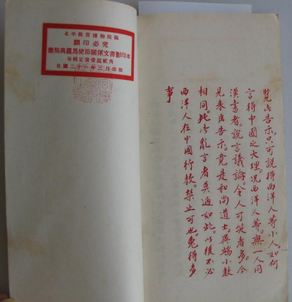

# 禮儀之爭相關主要文獻

早於明朝，天主教耶穌會士利瑪竇1582年來華傳教時，允許中國教友繼續傳統的祭天、祭祖、祭孔，這種傳教策略和方式，一直為之後來華傳教的耶穌會士所遵從，被稱為「利瑪竇規矩」。

## 兩派修會的爭論

最初的「禮儀之爭」由天主教不同修會意見分歧開始。道明會和方濟會於1632年起開始在福建傳教，他們對祭孔祭祖的看法與耶穌會的不同，因而產生衝突。1643年道明會士黎玉範返回歐洲，向聖座傳信部控告耶穌會士，提出「十七問」（*Quaesta xvii a Fr. J.B. de Moralez, missionum sinarum procuratore, proposita Romae 1643 S. Congreg. de Prop. Fide* (Rome, 1645)），概括如下：

> 一、中國信徒是否應與其他天主教徒同例，每年舉行認罪及聖餐一次？  
> 二、教士對婦女行洗禮時，可否不用口津及鹽，以及免除過量之塗油？  
> 三、中國信徒如放債時，是否允許其徵收百分之三十的利息？如系以放債為生，在其皈信天主之後，是否讓其繼續經營此種營業？  
> 四、是否允許中國信徒向社會祭神典禮捐獻財物？  
> 五、中國信徒是否可以參加政府舉行之祭典？  
> 六、中國信徒是否可以參加祭孔典禮及喪葬祭拜之儀？  
> 七、中國信徒是否可以參加祭拜祖先牌位之典禮及舉行其他祀祖儀式？  
> 八、在對中國人舉行洗禮之先，應否告其天主教之教義絕對禁止敬拜偶像及舉行其他祭典？  
> 九、中國信徒尊敬孔子，可否用「聖」字？  
> 十、中國信徒在其會堂中所懸匾額，對於皇帝應否用「萬歲」字樣？  
> 十一、對於中國非信教徒，可否舉行彌撒典禮？

隨後便是兩派修會和教廷對「利瑪竇規矩」的一連串爭論和不同措施：

- 1645年（順治二年），教宗英諾森十世通過傳信部發出通諭，禁止一切教徒參與祭祖祀孔之禮。
- 1650年（順治七年），耶穌會士衛匡國赴羅馬呈相反意見書。
- 1656年（順治十三年），教宗亞歷山七世批准「祭祖敬孔」。
- 1674年（康熙十三年），道明會士閔明我上書羅馬反對祭祖。

## 康熙禁教、容教、再禁教

到了康熙朝代，禮儀之爭演變成中國朝廷與羅馬教廷之間的爭論。康熙（1654-1722）是歷朝皇帝中與天主教會接觸最頻繁的一位。他重視知識分子，十分禮待具備豐富西方知識的傳教士，包括於1669年（康熙八年）八月頒旨平反了在「康熙曆獄」中因曆法之爭而被害的湯若望、南懷仁等，但同時實施禁教，被稱為康熙八年禁教令。《康熙朝實錄》記載：

> 和碩康親王傑書等議覆、南懷仁、李光宏等、呈告楊光先依附鼇拜、捏詞陷人，將歷代所用之洪範五行、稱為《滅蠻經》、致李祖白等各官正法。且推曆候氣、茫然不知。解送儀器虛縻錢糧。輕改神名。將吉凶顛倒。妄生事端。殃及無辜。援引吳明烜謊奏授官。捏造無影之事，誣告湯若望謀叛。情罪重大。應擬斬。妻子流徙甯古塔。至供奉天主、系沿伊國舊習。並無為惡實跡。湯若望復通微教師之名。照伊原品賜恤。還給建堂基地。許纘曾等復職。伊等聚會、散給《天學傳概》及銅像等物仍行禁止。西洋人栗安黨等，該督撫驛送來京。李祖白等照原官思恤。流徙子弟取回。有職者復職。李光宏、黃昌、司爾圭、潘盡孝、原降革之職、仍行給還。**得㫖、楊光先、理應論死。念其年老、姑從寬免。妻子亦免流徙。栗安黨等二十五人、不必取來京城。其天主教、除南懷仁等、照常自行外。恐直隸各省復立堂入教。仍著嚴行曉諭禁止。餘依議。**

*（南懷仁於1670年［康熙九年］著有《善惡報略說》中，所記實際與禁教令相反，準確性存疑：「康熙八年八月內。諸王貝勒大臣。九卿科道。屢次會議天主教事情。屢次具疏云。該臣等會同再議得惡人楊光先。捏詞控告天主教係邪教。今看得供奉天主教。並無為惡亂行之事。相應將天主教。仍令伊等照舊供奉等語。具奏在案。」)*

康熙一直積極向南懷仁、張誠、白晉等在京外國傳教士學習外國科技，關係良好。直至1692年（康熙卅一年）正式下旨解禁天主教，被稱為「寬容諭旨」：

> 禮部等衙門尚書降一級臣顧八代謹題為欽奉上諭事：該臣等會議得，查得西洋人仰慕聖化，由萬里航海而來，現今治理曆法，用兵之際，力造兵器火炮，差往阿羅素誠心效力，克成其事，勞績甚多。各省居住西洋人並無為惡亂行之處，又並非左道惑眾，異端生事。喇嘛僧道等寺廟，尚容人燒香行走，西洋人並無違法之事，反行禁止，似屬不宜。相應將各處天主堂俱照舊存留。凡進香供奉之人，仍許照常行走，不必禁止。使命下之日，通行直隸各省可也。**康熙批示：依議。**

自此教會在中國得到蓬勃發展，教徒人數在1701年（康熙四十年）更一度增至二十萬人。

1693年（康熙三十二年），福建代牧顏璫下達七項禁令，禁止中國禮儀，不准祭祖敬孔，其後遭康熙驅逐出境：

> 一、禁用「天」和「上帝」以替代「天主」；  
> 二、禁懸刻有「敬天」字樣的牌匾（此為康熙皇帝御匾上所題之字）；  
> 三、不得以1656年教宗亞歷山大七世的敕諭為藉口祭祖祭孔，因當時所依據的材料有問題；  
> 四、不得從事或參與祭祖、祭孔之行為；  
> 五、禁止在祖先牌位上書寫「神主」、「神位」和「靈位」字樣；  
> 六、嚴禁傳播那些能誤導眾人、促進迷信的言論，如稱中國哲學原不違背天主教思想、「太極」即萬物之原的真神、孔子敬鬼神之說的世俗性高於宗教性、《易經》乃集自然與道德教誨之大成的作品；  
> 七、不受古書中無神論和迷信內容的影響。

此時康熙對於祭祖祭孔的事，開始與教廷隔空辯論，並諭令凡教士非得朝廷准予傳教之印票，及許可服從中國之禮儀者（「利瑪竇規矩」），不得在中國傳教。當時在京耶穌會士均領票。

教宗克勉十一世（Pope Clement XI，1700－1721年在位）於1704年11月20日正式發出禁約，規定：

> 一、西洋地方稱呼天地萬物之主用「斗斯」（Deus [God]） 二字，此二字在中國用不成話，所以在中國之西洋人，併入天主教之人方用「天主」二字，已經日久。從今以後，總不許用「天」字，亦不許用「上帝」字眼，只稱呼天地萬物之主。如「敬天」二字之匾，若未懸掛，即不必懸掛，若已曾懸掛在天主堂內，即當取下，不許懸掛。  
> 二、春秋二季，祭孔子並祭祖宗之大禮，凡入教之人，不許作主祭、助祭之事，連入教之人，並不許在此處站立，因為此與異端相同。  
> 三、凡入天主教之官員或進士、舉人、生員等，於每月初一日、十五日，不許入孔子廟行禮。或有新上任之官，並新得進士，新得舉人生員者，亦俱不許入孔廟行禮。  
> 四、凡入天主教之人，不許入祠堂行一切之禮。  
> 五、凡入天主教之人，或在家裡，或在墳上，或逢弔喪之事，俱不許行禮。或本教與別教之人，若相會時，亦不許行此禮。因為還是異端之事。凡入天主教之人，或說我並不曾行異端之事，我不過要報本的意思，我不求福，亦不求免禍，雖有如此說話者亦不可。  
> 六、凡遇別教之人行此禮之時，入天主教之人，若要講究，恐生是非，只好在旁邊站立，還使得。  
> 七、凡入天主教之人，不許依中國規矩留牌位在家，因有「靈位神主」等字眼，又指牌位上有靈魂。要立牌位，只許寫亡人名字。再者，牌位作法，若無異端之事，如此留在家裏可也，但牌位旁邊應寫天主教孝敬父母之道理。
> 
> 以上我雖如此定奪，中國餘外還有別樣之理，毫無異端，或與異端亦毫不相似者，如齊家治國之道，俱可遵行。今有可行與不可行之禮，俱有教王之使臣定奪。有與天主教不相反者，許行，相反者，拒決斷不許行。

康熙在南巡期間，在揚州、鎮江、南京、蘇州、杭州等地只有部分傳教士來領票，對於不願具結的傳教士，採取嚴厲的措施，下令驅逐出境，並於1707年（康熙四十六年）頒下諭令：

> 諭眾西洋人，自今以後，若不遵利瑪竇規矩，斷不准在中國住，必逐回去。若教化王因此不准爾等傳教，爾等既是出家人，就在中國住著修道。教化王若再怪你們遵利瑪竇，不依教化王的話，教你們回西洋去，朕不教你們回去。倘教化王聽了多羅的話，說你們不遵教化王的話，得罪天主，必定教你們回去，那時朕自然有話說。說你們在中國年久，服朕水土，就如中國人一樣，必不肯打發回去。教化王若說你們有罪，必定教你們回去，朕帶信與他說，徐日昇等在中國服朕水土，山力年久，你必定教他們回去，朕斷不肯將他們活打發回去，將西洋人頭割回去。朕如此帶信去，爾教化王萬一再說，爾等得罪天主，殺了罷。朕就將中國所有西洋人等都查出來，盡行將頭帶回西洋去。設是如此，你們的教化王也就成個教化王了。你們領過票的就如中國人一樣，爾等放心，不要害怕。領票，俟朕回鑾時，在寶塔灣同江寧府方西滿等十一人同賜票。欽此。

1715年，教宗克勉十一世又頒布《自登基之日》（*Ex Illa Die*）的通諭，重申必須絕對遵守1704年的禁令，所有傳教士必須宣誓服從，否則將被驅逐出教。

康熙五十九年（1721年）康熙閱取羅馬教廷特使嘉樂所帶來的《自登基之日》禁約後加以硃批，正式決定禁教：

> 覽此告示，只可說得西洋人等小人，如何言得中國之大理？況西洋人等，無一人通漢書者。說言議論，令人可笑者多。今見來臣告示，竟是和尚道士，異端小教相同。比此亂言者，莫過如此，以後不必西洋人在中國行教，禁止可也，免得多事。

曾一度生氣勃發的傳教事業，自此消沉。康熙亦於頒下禁教令後翌年（1722年）駕崩。

## 雍正即位後厲行禁教

1723年雍正即位後，在雍正元年，閩浙總督滿保、福建撫巡黃國材就禁教問題聯合用滿文上奏：

> 為奏聞禁止愚民加入天主教，伏乞聖主明鑒事。
> 
> 福寧州之福安縣乃山中小縣，靠近大海，據聞有二名西洋人在彼傳教。遂即核查得，入天主教之監生、生員有十餘人，城鄉男女入此教者數百人，城內大鄉建男女天主堂十五處。二名西洋人隱居生員家中，不為人見，不懼知縣禁令。旦為誦經禮拜之日，便聚數百之眾傳教，男女混雜一處，習俗甚惡。故臣等即交付文武官員查出二名西洋人，照例解往廣東之澳門，十五處天主堂或改為書院，或為義學之所，或者各為民祠堂所，依靠該十數名生員監生，曉諭入教愚昧男女，改信邪教，若再有行西洋教者，則將該十數名監生、生員全部黜免治罪，張貼告示嚴加禁止。查得西洋人在各省大府縣內俱建天主堂居住，該西洋人留在京城尚可編製黃曆，（治病及製造東西）（用於雜事）。今其恣意於各省之大府縣內建天主堂或大房宅所居住，不僅於地方百姓無益，且頗頗傳教，蠱惑於人，經年已久，（招至地方之患亦未可料）。（於地方絲毫無益）。伏乞皇上明鑒。西洋人除常住京城外，外省不准西洋人私自居住，或俱送京城或遣返廣東澳門。各省所設天主堂皆予改用，不得再建。此乃關係地方人心之事，臣等謹具奏陳，應否之處，伏乞皇上明裁。為此叩奏。」**雍正批示：卿此奏甚是，多為可嘉，著遵照辦理。如此繕本具奏。**

《清世宗實錄》記載了雍正元年正式嚴厲執行禁教措施：

> 「禮部議復浙閩總督覺羅滿保疏奏，西洋人在各省起蓋天主堂，潛住行教，人心漸被煽惑，毫無裨益。請將各省西洋人，除送京效力外，余俱安插澳門。應如所請。天主堂改為公所，誤入其教者嚴行禁飭。」十二月十七日得旨：「西洋人乃外國之人，各省居住年久，今該督奏請搬移，恐地方之人，妄行擾累，著行文各省督撫，伊等搬移時，或給與半年數月之限，令其搬移。其來京與安插澳門者，委官沿途照看送到，毋使勞苦。」

雍正五年（1727年）4月，葡萄牙使節麥德樂抵達北京，他向雍正提出歸還當時被改為公所（少部分改為廟宇）的天主教堂，以及要求准許傳教士自由傳教。雍正當即發了一道上諭，堅持禁教：

> 中國有中國之教，西洋有西洋之教。西洋之教不必行於中國，亦如中國之教豈能行於西洋？如蘇努之子烏爾陳等愚昧不法，背祖宗，違朝廷，甘蹈刑戮而不恤，豈不怪乎？

## 禮儀之爭的終結

1742年（乾隆七年），教宗本篤十四世頒布《自上主聖意》（*Ex quo singulari*），重申《自登基之日》禁約，同時禁止在華傳教士再討論「禮儀」問題。

清朝歷經康熙、雍正、乾隆、嘉慶、道光年代多次下令禁教，直至1842年（道光廿二年）鴉片戰爭後簽訂了《南京條約》，傳教士在洋槍炮的伴隨下再次叩開中國大門。

1932年，日本耶穌會所辦的上智大學部分學生參拜靖國神社時不行禮，史稱「上智大學事件」，引起日本軍部強烈反應。廣島主教Johnnes Ross為了解決這個問題，便翻查教廷歷史，結果發現教廷早於1258年曾頒發一道諭告，允許信徒參加非天主教的儀式，這諭告還較禮儀之爭更早。對非常重視傳統的天主教來說，他們不能漠視通諭。因此經過討論之後，羅馬教廷發佈通告，允許日本教徒在神社參拜行禮，以表示對祖國的熱愛。

這件事成了解決中國禮儀之爭的伏筆。1934年，溥儀出任滿洲國皇帝，將祭孔定為強制的文化政策。梵帝罔亦不顧中華民國的反對，承認滿洲國政權。

1939年，教宗庇護十二世（Pius XII）經傳信部頒佈《眾所周知》諭令 *(Plane compertum est / It is surely found)*：

> 允許教徒參加祭孔儀式；可以在教會學校中放置孔子之肖像或牌位，並容許鞠躬致敬；如果教徒必須出席帶有迷信色彩的公共儀式時，必須抱持消極的態度；在死者或其遺像、牌位之前鞠躬，是被允許且是適當的。

庇護十二世並不承認先前相關的通諭是錯誤的，而是認為過去宗教性的祭祖、祭孔觀念，歷經數百年後已變成了世俗性活動，故可以被酌情允許。

至今，除了一些中國新教徒沒有遵守教宗諭令，依然零星出現打破自己祖先牌位的事件之外，禮儀之爭基本正式結束。
