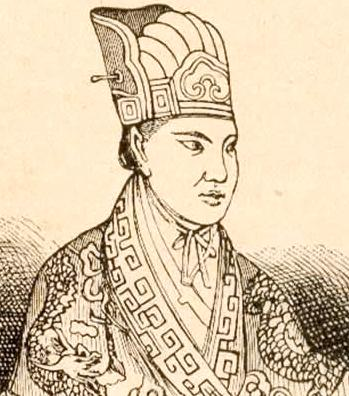

# 洪秀全：太平天國（拜上帝會）早期文獻

洪秀全（1814－1864），廣東省花縣人，其基督教思想啟蒙自由梁發所編的《勸世良言》一書。洪秀全聲稱自己是耶和華的次子、耶穌的弟弟，四處傳教，招立信徒。1843年（道光二十三年）6月，洪秀全在廣東廣州府花縣蓮花塘（今廣州市花都區）創立拜上帝會。當時廣西地瘠民貧，連年災荒，飢民處處，少年時代的同學馮雲山潛入桂平縣紫荊山一帶傳教，創立「拜上帝會」。後來洪秀全自廣東回廣西，與馮雲山會合，繼續傳教。1850年7月（道光三十年六月），「拜上帝會」在廣西桂平縣金田村發動反清起事，後建號「太平天國」，參與的信徒約一萬人。

洪秀全於1845至1846年間在花縣先後寫出了《原道救世歌》、《原道醒世訓》，稍後又寫了《原道覺世訓》，這即是著名的「三原」。在《原道救世歌》中，他嚴厲抨擊邪淫、忤逆、殺害、盜賊、賭博等不正當行為，認為「天人一氣理無二，何得君王私自專」；在《原道醒世訓》中，他指出「世道乖離，人心澆薄」的現象是「一出於私」，只有變革「陵奪鬥殺之世」，才能做到「天下一家，共享太平 」；在《原道覺世訓》中他號召「天下凡間我們兄弟姐妹所共當擊滅」那「閻羅妖和妖徒鬼卒」。由此可見，對社會充滿嚴重不滿的洪秀全，已決心廢除弊端，立志改造社會。

《天條書》於1847年（道光二十七年）在廣西桂平縣紫荊山制定而成，包括宗教儀式和十款天條兩部分內容，主要用來約束拜上帝教會員。宗教儀式部分系洪秀全、馮雲山仿照基督教儀式，吸取中國傳統宗教某些儀式，並照顧到入會者的現世利益。要求凡會員入會受洗、朝起夜睡、食飯、七日禮拜等均有宗教儀式，其他如災病、生日、滿月、嫁娶、喪葬、作灶、做屋、堆石、動土等事，也均有祭告上帝奏章。禱文大致為「祝福有衣有食，無災無難，今世見平安，升天見永福」，「妖魔誅滅」、「萬事勝意」等類。本書所載十大天條，都是十惡不赦的大罪。初僅鈔寫傳習，1852年（咸豐二年）大量刊行，人手一冊，朝夕誦讀。還規定會員入會後逾21日猶不能熟記者治罪，不識字者由識字者負責口授，成為太平天國軍民必讀課本。

其後1848年洪秀全撰寫《太平天日》小冊子，思想開始超越講天情說道理、勸人改邪歸正的層面，轉而否定孔孟儒學、否定封建君主專制思想。書中洪秀全暗指當朝皇帝是魔頭閻羅妖，又把批判的矛頭對準孔孟儒學，「又勘妖魔作怪之由，總追究孔教人之書多錯」 ，並自封為真命天子式的「天王大道君主全」。洪秀全不僅公然直呼儒家先師孔子的名諱，而且還借上帝之名侮辱性地予以追捕和鞭撻，不僅指認當朝皇帝是魔頭閻羅妖，而且還要立志取而代之。這種蔑視權威、打倒當朝君王的鬥志，已由改良說理階段上升到了「斬邪留正」、開創新朝的水平，由此揭開了太平天國武裝反清、反對傳統文化的鬥爭序幕。「三原」及《太平天日》成為拜上帝會及太平天國早期的重要文獻。

## 《原道救世歌》
*（後改稱《原道救世詔》）*

道之大原出於天，謹將天道覺群賢。  
天道禍淫惟福善，及早回頭著祖鞭。  
道統根源惟一正，歷代同揆無後先。  
享天福，脫俗緣，  
莫將一切俗情牽，須將一切妄念捐。  
開闢真神惟上帝，無分貴賤拜宜虔。  
天父上帝人人共，天下一家自古傳。  
盤古以下至三代，君民一體敬皇天。  
其時狂者崇上帝，諸侯士庶亦皆然。  
試辟人間子事父，賢否俱循內則篇。  
天人一氣理無二，何得君王私自傳！  
上帝當拜，人人所同，  
何分西北，何分南東。  
一絲一縷荷上帝，一飲一食賴天公；  
分應朝朝而夕拜，理應頌德而歌功。  
人而捨此而他拜，拜盡萬般總是空。  
非爲無益且有損，本心瞞昧罪何窮。  
人苟本心還不失，自知呼吸賴蒼穹。  
五行萬物天造化，豈有別神宰其中！  
即謂上帝須輔助，斷非菩薩贊化工，  
如果化工賴菩薩，從前未立理難通。  
暄以日兮潤以雨，動以雷兮散以風，  
此皆上帝之靈妙，天恩能報得光榮。  
勿拜邪神，須作正人；  
不正天所惡，能正天所親。

第一不正淫爲首，人變爲妖天最瞋；  
淫人自淫同是怪，盍歌麟趾詠振振。  
歪俗移人誰挺立，但須改過急自新。  
顔回好學不貳過，非禮四勿勵精神。  
過而能改方無過，古人所以誨諄諄。  
自古君師無異任，只將正道覺斯民。  
自古善正無異德，只將正道淑其身。  
凡有血氣心知者，何可亂常而敗倫。  
凡屬頂天立地者，急宜返璞而歸真。  
鬼心既革，孝經當明。

第二不正忤父母，大犯天條急自更。  
羊有跪乳鴉反哺，人不如物忝所生。  
曆山號泣天爲動，鳥爲耘織象爲耕；  
尊爲天子富四海，孝德感天夫豈輕。  
父兮生我母鞠我，長育劬勞無能名；  
恩極昊天難答報，如何孝養竭忠誠。  
大孝終身慕父母，視於無形聽無聲。  
孝親即是孝天帝，培植本根適自榮。  
逆親即是逆天帝，戕伐本根適自傾。  
蓼莪詩可讀，胞與量宜恢。

第三不正行殺害，自戕同類罪之魁。  
普天之下皆兄弟，靈魂同是自天來。  
上帝視之皆赤子，人自相殘甚惻哀。  
是以先代不嗜殺，德合天心天眼開。  
寵綏四方惟剋相，故能一統受天培。  
夏禹泣罪文獻洛，天應人歸無可猜。  
嗜殺人民爲草寇，到底豈能免禍災。  
白起項羽終自刎，黃巢李闖安在哉！  
自古殺人殺自己，誰雲天眼不恢恢？  
自古救人救自己，靈魂超拔在天臺。  
自古利人利自己，福自己求易爲推；  
自古害人害自己，孽自己作難挽回。  
無言不仇德有報，終身可行恕字該。  
忠厚可師，廉恥須知。

第四不正爲盜賊，不義不仁非所宜，  
聚黨橫行天不佑，罪惡貫盈禍自隨。  
君子臨財無苟得，楊震昏夜尚難欺。  
管寧割席因歆顧，山谷孤蹤志不移。  
夷齊讓國甘餓死，首陽山下姓名垂。  
古來善正修天爵，富貴浮雲未足奇。  
殺一不辜行不義，即得天下亦不爲。  
人能翼翼畏上帝，樂夫天命複奚疑。  
豈認殺越人於貨，竟非其有而取之！  
營謀珍道義，學習慎規模。

第五不正爲巫覡，邪術惑衆犯天誅。  
死生災病皆天定，何故誣民妄造符？  
作福許妖兼送鬼，修齋建醮尚虛無。  
自古死生難自保，豈能代禱保無辜？  
自古師巫邪術輩，累世貧窮天不扶。  
鬼人送鬼終惹鬼，地獄門開待逆徒，  
欲肥己囊增己孽，何不回頭早自圖！  
術藝固須正，品概更宜方。

第六不正爲賭博，暗刀殺人心不良。  
戒，戒，戒！理不當。  
求之有道得有命，勿以詐騙壞心腸，  
命果有兮何待賭，命無即賭願難償。  
總之富貴天排定，從吾所好自徜徉。  
孔顔疏水簞瓢樂，知命安貧意氣揚。  
人生在世三更夢，何思何慮復何望！  
小富由勤大富命，自古爲人當自強。  
嗟爾有衆，勿謂無妨。  
無所不爲因賭起，英雄何苦陷迷鄉；  
不義之財鴆止渴，士農工商耐久長；  
千個賭錢千個賤，請爾宜慮細思量！  
他若自驅陷阱者，煉食洋菸最顛狂；  
如今多少英雄漢，多被煙槍自打傷。  
即如好酒亦非正，成家宜戒敗家湯；  
請觀桀紂君天下，鐵統江山爲酒亡。  
更有堪輿相命輩，欺瞞上帝罪無強；  
富貴在天生死命，何爲惑世顧肥囊。  
其餘不正難枚舉，在人鑒別於微茫。  
細行不矜終累德，堅冰未至慎履霜。  
禹稷勤勞憂饑溺，當身而顯及後狂。  
周文孔丘身能正，陟降靈魂在帝旁。

真言語，不鋪張，  
予魂曾獲升天堂，所言確據無荒唐，  
婆心固結不能忘，言之不足故言長。  
積善之家有餘慶，積惡之家有餘殃，  
順天者存逆天亡，尊崇上帝得榮光。

## 《原道醒世訓》

*（後改稱《原道醒世詔》）*

從來福大則量大，量大則為大人；福小則量小，量小則為小人。是以泰山不辭土壤，故能成其高；河海不擇細流，故能就其深；王者不卻眾庶，故能成其德。凡此皆量為之也。

無如時至今日，亦難言矣！世道乖漓，人心澆薄，所愛所憎，一出於私。故以此國而憎彼國，以彼國而憎此國者有之。甚至同國以此省此府此縣而憎彼省彼府彼縣，以彼省彼府彼縣而憎此省此府此縣者有之。更甚至同省府縣以此鄉此裡此姓而憎彼鄉彼裡彼姓，以彼鄉彼裡彼姓而憎此鄉此裡此姓者有之。世道人心至此，安得不相陵相奪相鬥相殺而淪胥以亡乎！無他，其見小，故其量小也。其以此國而憎彼國，以彼國而憎此國者，其見在國，國以外則不知，故同國則愛之，異國則憎之。其以此省此府此縣而憎彼省彼府彼縣，以彼省彼府彼縣而憎此省此府此縣者，其見在省府縣，省府縣以外則不知，故同省同府同縣則愛之，異省異府異縣則憎之。其以此鄉此裡此姓而憎彼鄉彼裡彼姓，以彼鄉彼裡彼姓而憎此鄉此裡此姓者，其見在鄉里姓，鄉里姓以外則不知，故同鄉同里同姓則愛之，異鄉異裡異姓則憎之。天下愛憎如此，何其見未大而量之不廣也。

遐想唐、虞、三代之世，天下有無相卹，患難相救，門不閉戶，道不拾遺，男女別塗，舉選尚德。堯、舜病博施，何分此土彼土；禹、稷憂溺飢，何分此民彼民；湯、武伐暴除殘，何分此國彼國；孔、孟殆車煩馬，何分此邦彼邦。蓋實見夫天下凡間，分言之，則有萬國，統言之，則實一家。皇上帝天下凡間大共之父也，近而中國是皇上帝主宰化理，遠而番國亦然；遠而番國是皇上帝生養保佑，近而中國亦然。天下多男人，盡是兄弟之輩，天下多女子，盡是姊妹之群，何得存此疆彼界之私，何可起爾吞我並之念。

是故孔丘曰：「大道之行也，天下為公，選賢與能，講信修睦。故人不獨親其親，不獨子其子，使老有所終，壯有所用，幼有所長，鰥寡孤獨廢疾者皆有所養。男有分，女有歸。貨惡其棄於地也，不必藏於己；力惡其不出於身也，不必為己。是故奸邪謀閉而不興，盜竊亂賊而不作，故外戶而不閉，是謂大同。」而今尚可望哉！然而亂極則治，暗極則光，天之道也。

於今夜退而日昇矣，惟願天下凡間我們兄弟姊妹跳出邪魔之鬼門，循行上帝之真道，時凜天威，力遵天誡，相與淑身淑世，相與正己正人，相與作中流之砥柱，相與挽已倒之狂瀾。行見天下一家，共享太平，幾何乖離澆薄之世，其不一旦變而為公平正直之世也！幾何陵奪鬥殺之世，其不一旦變而為強不犯弱，眾不暴寡，智不詐愚，勇不苦怯之世也！在《易》，同人於野則亨，量大之謂也；同人於宗則吝，量小之謂也。況量大則福大，而人亦與之俱大；量小則福小，而人亦與之俱小。凡有血氣者，安可傷天地之和，而貽井底蛙之誚哉！

詩云：「上帝原來是老親，水源木本急尋真； 量寬異國皆同國，心好天人亦世人。 獸畜相殘還不義，鄉鄰互殺斷非仁； 天生天養和為貴，各自相安享太平。」

## 《原道覺世訓》

*（後改稱《原道覺世詔》）*

天下總一家，凡間皆兄弟。何也？自人肉身論，各有父母姓氏，似有此疆彼界之分，而萬姓同出一姓，一姓同出一祖，其原亦未始不同。若自人靈魂論，其各靈魂從何以生？

從何以出？皆稟皇上帝一元之氣以生以出，所謂一本散為萬殊，萬殊總歸一本。

孔僅曰：「天命之謂性。」《詩》曰：「天生蒸民。」《書》日：「天降下民。」

昭昭簡編，洵不爽也。此聖人所以天下一家，時勤民吾同胞之懷，而不忍一日忘天下。而近代則有閻羅妖註生死邪說，閻羅妖乃是老蛇、妖鬼也，最作怪多變，迷惑纏捉凡間人靈魂。

天下凡間我們兄弟姊妹所當共擊滅之，惟恐不速者也。而世人偏伸頸於他，何其自失天堂之樂，而自求地獄之苦哉！

論道有真諦，大凡可通於今不可通於古，可通於近不可通於遠者，偽道也，邪道也，小道也。據怪人妄說閻羅妖註生死，且問中國經史論及此乎？曰：無有。

番國聖經載及此乎？曰：無有。無有，則何以起？怪人佛老之徒出，自陷迷途，貪圖射利，誑人以不可知之事，以售己詐，誘人作福建醮，以肥己囊，兼之魔鬼人心，遂造出無數怪誕邪說，迷惑害累世人。如秦政時，怪人誑言東海有三神山，秦政遂遣人海求之，此後代神仙邪說所由起也。究其始，不過一秦政受其惑，所謂差之毫釐，而後代則疊效尤於後，至於固結不可解，所謂失之千里者也。又如漢武時，怪人誑言祠灶丹砂可化黃金，漢武遂信而祠之，於是燕、齊怪誕怪人，多來言神仙怪事矣。又如近代有怪人，誑言東海龍妖發雨。

東海龍妖即是閻羅妖變身。雨從天降，眾目所視者也。孟軻云：「天油然作雲，沛然下雨，則苗勃然興之矣。」

周詩云：「天上同雲，雨雪霧霧，益之以霢霂，既優既渥，既沾既足，生我百穀。」又考番國舊遺詔書，當挪亞時，皇上帝因世人背逆罪大，連降四十日四十夜大雨，洪水橫流，沉沒世人。此皆鑿鑿可據，且眾目所視，實降於天者也。

而世人亦多信怪誕不經之怪說。即一雨論，而世人既多良心死盡，大瞞天恩矣，又遑論其他哉！又如近代有怪和尚誑言閻羅妖怪事，且有玉歷記怪書，訛傳於世，而世之讀死書者亦多惑其說。

獨不思註生死一事，豈是等閒。既不是等閒，宜為中國、番國各前聖所論及，且筆於書以傳後世。而於今歷考中國、番國各前聖所論及，且筆於書以傳後世者，只說天生天降，皇上帝生養保佑人，未嘗說及閻羅妖也；只說死生有命，亦是命於皇上帝己耳，毫無關於閻羅妖也；只說皇上帝審判世人，陰騭下民，臨下有赫，又毫無關於閻羅妖也。

而世人之讀死書者，不信古今遠近通行各經典，而信怪人無端突起之怪書，不亦惑哉！

此無他，好生惡死，慕福懼禍，恆情也。以恆情而中人心，則其入之也必易，是以邪說一倡，而天下多靡然信之從之。信從久，則見聞熟；見聞熟，則膠固深；膠固深，則難尋其罅漏；難尋其罅漏，則難出其範圍。皇上帝縱歷生聰明聖智於其間，亦莫不隨風而靡矣。此近代所以多惘然不識皇上帝、悍然不畏皇上帝、盡中蛇魔閻羅妖詭計，陷入地獄沉淪而不自知者也。

噫！後之人雖欲諳天地人之道，其孰從而求之？甚矣，人之好怪也！

不求其端，不訊其末，惟怪之欲聞。予想夫天下凡間，人民雖眾，總為皇上帝所化所生，生於皇上帝，長亦皇上帝，一衣一食並賴皇上帝。

皇上帝天下凡間大共之父也，死生禍福由其主宰，服食器用皆其造成。仰觀夫天，一切日月星辰雷雨風雲莫非皇上帝之靈妙；俯察夫地，一切山原川澤飛潛動植莫非皇上帝之功能。昭然可見，灼然易知。

如是乃謂真神，如是乃為天下凡間所當朝朝夕拜。

有執拗者說曰：「皇上帝當拜矣，必然有幫皇上帝保佑人者，譬如君王主治國中，豈無官府輔治也？」不知君王之官府，是其親手設立調用，故能輔君主以治事也。至若凡人所立一切木石、泥團、紙畫各偶像，且問爾，是皇上帝旨意設立否乎？非也。

類皆凡人被魔鬼迷濛靈心，據愚意愚見，人手造出各等奇奇怪怪也。況皇上帝當初六日造成天地、山海、人物，已設有其神使千千萬萬在天上，任其差遣，何用得凡人所造各等奇奇怪怪者乎？且叛逆皇上帝實甚。

考舊遺詔書，皇上帝當初下降西奈山，親手繕寫十款天條在石碑上，付畀摩西。皇上帝親口吩咐摩西曰：「我乃上主皇上帝，爾凡人切不好設立天上地下各偶像來跪拜也。」今爾凡人設立各偶像來跪拜，正是違逆皇上帝旨意。爾凡人反說各偶像是幫皇上帝保佑人，何其被魔鬼迷濛靈心。蒙懂之極乎！

爾不想皇上帝當初六日造成天地、山海、人物，尚不要人幫助，豈今日保佑人又要誰幫助？且問爾，設使皇上帝當初造天不造地，爾足猶有所企立、且猶有田畝開墾否乎？日：無也。且又問爾，今荷皇上帝之恩，既造天地矣。

嗚呼！天地之中人為貴，萬物之中人為靈。人何貴，人何靈，皇上帝子女也。貴乎不貴，靈乎不靈。木石泥團紙畫各偶像，物也。

人貴於物，靈於物者也，何不自貴而貴於物乎？何不自靈而靈於物乎？近千百年間能不惑神仙怪事者非無其人，究之知其一，莫知其他，明於此轉暗於彼，卒無有高出眼孔徹始徹終而洞悉乎魑魅魍魎之詭秘也。北朝周武廢佛道，毀淫祠，唐狄仁傑奏焚淫柯一千七百餘所，韓愈諫迎佛骨，宋胡迪焚毀無數淫祠，明海瑞諫建醮，之數人者不可謂無特識矣。

第其所毀所焚所諫僅日淫祠、日佛、日建蘸，則其所不毀不焚不諫者仍在，不知彼所毀所焚所諫者固當毀當焚當諫，即彼所不毀不焚不諫者又何獨非當毀當焚當諫乎？

何也？皇上帝之外無神也，世間所立一切木石泥團紙畫各偶像皆後起也，人為也，被魔鬼迷濛靈心，顛顛倒倒，自惹蛇魔閻羅妖纏捉者也。

故今瀝膽披肝實情諭爾等，爾凡人何能識得神乎？皇上帝乃是真神也。爾凡人跪拜各偶像正是惹鬼。何也？爾凡人所立各偶像其或有道德者既升天堂久矣，何曾在人間受享；其一切無名腫毒者類皆四方頭紅眼睛蛇魔閻羅妖之妖徒鬼卒，自秦、漢至今一二千年，幾多凡人靈魂被這閻羅妖纏捉磨害。俗語云：「豆腐是水，閻羅是鬼。」爾等還不醒哉！及今不醒，恐怕遲矣。

實情諭爾等，爾凡人何能識得帝乎？皇上帝乃是帝也。

雖世間之主稱王足矣。豈容一毫僭越於其間哉！救世主耶穌，皇上帝太子也，亦只稱主己耳，天上地下人間有誰大過耶穌者乎？耶穌尚不得稱帝，他是何人，敢靦然稱帝者乎！只見其妄自尊大，自干永遠地獄之災也。

噫，吁！敬拜皇上帝，則為皇上帝子女，生前皇上帝看顧，死後魂升天堂，永遠在天上享福，何等快活威風。溺信各邪神，則變成妖徒鬼卒，生前惹鬼纏，死後被鬼捉，永遠在地獄受苦，何等羞辱愁煩。孰得孰失，請自思之。天下凡間我們兄弟姊妹，可不醒哉！若終不醒，則真生賤矣，真鬼迷矣，真有福不知享矣！明明千年萬萬載在天上，永遠快活威風，如此大福都不願享，情願大犯天條，與魔鬼同犯反天之罪，至惹皇上帝義怒，罰落十八重地獄受永苦，深可憫哉！良足慨已。

## 《天條書》

[:arrow_double_down: 《天條書》PDF下載](天條書.pdf)

## 《太平天日》

[:arrow_double_down: 《太平天日》PDF下載](太平天日.pdf)

此書　詔明于戊申年冬，今於天父天兄天王太平天國壬戌十二年欽遵旨准刷印銅板頒行。

詔書一。當初天父上主皇上帝六日造成天地山海人物，第七日完工。上古之時，普天下皆知感謝皇上帝恩典。當挪亞時，世人被邪魔誘惑，淫穢世間，皇上帝大怒，連降四十日四十夜大雨，洪水橫流，沉沒世人殆盡。至後天下皆敬畏皇上帝，惟以色列為最，麥西侯獨苦害之。

皇上帝大怒，降救以色列出麥西邦，過紅海，顯大神跡，誅滅妖侯。到西柰山，皇上帝親設十款天條。柰後世多中魔計，屢犯天條，皇上帝大怒，欲盡滅世人。斯時幸有救世主天兄基督，是皇上帝太子，情願降凡捐軀，替世人贖罪。皇上帝割離恩愛，因遣天兄基督降生猶大邦，顯無數神跡，年三十三，被

*（按原書此缺第二頁）*

太平真主，此又是天父、天兄莫大之恩愛，憐恤世人，故特賜真光照凡間。主年二十五歲，在天酉三月初一日子刻，見無數天使自天降下，說接升天。又見穿黃袍小孩子至面前，見有像似雄雞，高數尺，立於其前。君王父、君王母李，王長、次兄仁發、仁達，嫂黃、信，王娘賴又正月宮等咸在。對父尤悲曰：「有負父兄功勞矣！」又命其妻賴又正月宮云：「爾為朕妻，爾不可嫁。爾身懷妊，未知男女。男歟，與依兄勿嫁；女歟，亦然。」舉家之悲，妻尤悲甚。

俄而天使扶真主坐轎，迤邐從東方大路而升。主在轎甚不過意。到天門，兩旁無數嬌娥美女迎接，主目不邪視。到天堂，光彩射人，迥異塵凡，見無數穿龍袍角帽者咸來見主。繼傳旨剖主腹，出舊換新，又將文字排列，旋繞主前，一一讀過。後有天母迎而謂曰：「我子！爾下凡身穢，待為母潔爾於河，然後可去見爾爺爺。」

朕身潔淨，天母乃引見天父上主皇上帝，頭戴高邊帽，身穿黑龍袍，滿口金鬚拖在腹上，像貌最魁梧，身體最高大，坐裝最嚴肅，衣袍最端正，兩手覆在膝上。主到前跪拜畢，立於旁。

天父上主皇上帝悲詔曰：「爾升來麼？朕說爾知，甚矣凡間人多無本心也。凡間人誰非朕所生所養？誰非食朕食，衣朕衣？誰非享朕福？天地萬物皆朕造成，一切衣食皆朕賜降，如何凡間人享朕福，多瞞昧本心，竟無半點心敬畏朕？甚為妖魔迷惑，耗費朕所賜之物，以之敬妖魔，好似妖魔生他養他。殊不知妖魔害死他，纏捉他，他反不知，朕甚恨焉，憫焉！」

主聞此詔，心甚不平，欲即去勸醒他們，使各人識得妖魔詭計，回心敬轉天父上主皇上帝。天父上主皇上帝曰：「難！難！」

天父上主皇上帝常教主坐裝衣袍要齊整，頭要軒昂，身要挺直，兩手要覆在膝，兩腳要八字排開。天父上主皇上帝又攜主在高天，指點凡間妖魔迷害人情狀，一一指主看明；又將其手降賜，凡間妖魔即冒功勞，亦一一指主看明。指畢，主見皇上帝回頭不看，有時天父上主皇上帝見妖魔十分作怪，怒甚，立差天使下凡，誅滅妖魔，修上來矣。

斯時天父上主皇上帝所指看一切妖魔，總無非冒天父上主皇上帝功勞，迷壞世人行邪事，犯天條，不必敬畏天父上主皇上帝，而敬畏他之意。間有不敬畏他者，他則擾害之，若磨之。

主怒甚，因請天父上主皇上帝曰：「爺爺，他們如此作怪，如何不誅滅他？」天父上主皇上帝詔主曰：「不但凡間有妖魔，即高天三十三天亦闖有妖魔矣。」主曰：「爺爺有這樣大權能，要他生即生，要他死即死，緣何容他們闖來？」天父上主皇上帝曰：「暫容他們作怪一陣，然後收他，難道他們還走得朕手段！」主曰：「但容他一陣，既難為我兄弟姊妹受氣矣。」天父上主皇上帝曰：「爾且看他們如何，若果容不得，便一概驅逐矣。」天父上主皇上帝又指主看出這四方頭紅眼之妖魔，主時時關顧他，看見他總是古古怪怪迷惑人，纏捉人。主因請天父上主皇上帝逐他。

天父上主皇上帝曰：「他們果如此作怪，爾奉朕命斥逐他走。」主奉天父上主皇上帝命，斥逐妖魔頭曰：「朕天父上主皇上帝吩咐朕來諭爾：『速速好走矣！』」這妖魔頭，凡間人所稱閻羅妖，又稱東海龍妖者，想走又不想走。主迫他走曰：「爾速走！此處所在甚好，但爾無福氣，又爾腥腥臭臭身，何得居此處住！」妖魔頭無奈何，乃走。天堂間有被迷壞心腸者亦欲跟隨他走。斯時，救世主天兄基督統眾天使咸集，天父上主皇上帝大發聖旨：「凡高天人有跟隨妖魔頭走者，個個要捉回；凡有奸心幫妖者，及一切偷闖之妖魔仔，個個要驅逐下去。」

又推勘妖魔作怪之由，總追究孔丘教人之書多錯。天父上主皇上帝命擺列三等書，指主看曰：「此一等書是朕當前下凡顯跡設誡所遺傳之書，此書是真，無有差錯。又此一等書是朕當前差爾兄基督下凡顯神跡捐命贖罪及行為所遺傳之書，此書亦是真，無有差錯。彼一等書，這是孔丘所遺傳之書，即是爾在凡間所讀之書，此書甚多差謬，連爾讀之，亦被其書教壞了。」

天父上主皇上帝因責孔丘曰：「爾因何這樣教人糊塗了事，致凡人不識朕，爾聲名反大過於朕乎？」孔丘始則強辯，終則默想無辭。天兄基督亦責備孔丘曰：「爾造出這樣書教人，連朕胞弟讀爾書亦被爾書教壞了！」眾天使亦盡歸咎他。主亦斥孔丘曰：「爾作出這樣書教人，爾這樣會作書乎？」孔丘見高天人人歸咎他，他便私逃下天，欲與妖魔頭偕走。天父上主皇上帝即差主同天使追孔丘，將孔丘捆綁解見天父上主皇上帝。天父上主皇上帝怒甚，命天使鞭撻他。孔丘跪在天兄基督前，再三討饒，鞭撻甚多，孔丘哀求不已，天父上主皇上帝乃念他功可補過，准他在天享福，永不准他下凡。

當時天父上主皇上帝命主戰逐妖魔，賜金璽一，雲中雪一，命同眾天使逐妖魔，三十三天逐層戰下。其跟隨妖魔頭走之兄弟姊妹逐一捉回高天，其有奸心幫妖魔頭及偷闖之妖魔仔逐一驅趕。驅趕甚，妖魔頭同這妖魔仔回頭同主戰，但勢不能抗主。

那時，有天父上主皇上帝作主，妖魔雖詭計百出，總一一被主破盡。主與妖魔戰時，天父上主皇上帝在其後，天兄基督亦在其後執金璽照妖。妖不能害主，且妖不敢見金璽，見金璽即走。其妖頭甚作怪多變，有時打倒地，倏變為大蛇矣；又將大蛇打倒，倏又變為別樣矣，能變得十七八變，雖狗虱之小亦能變焉。

主戰到憤怒時欲遽收他，天父上主皇上帝大呼曰：「不可，不可！只斷服他就罷。」主不解其故，天父上主皇上帝諭曰：「這妖是老蛇，能迷人食人靈魂，若即收他，許多被他食之靈魂無救矣，況污穢聖所，故暫容他命。」即這妖魔仔，天父上主皇上帝亦吩咐主不可遽收他，待到凡間這一重天然後砍他也。

主有時戰困而睡，眾天使重重圍護，妖不能害，睡醒又戰。其三十三天所偷闖之妖魔仔，及有奸心幫妖魔頭者，俱一一逐下凡間。逐下凡間這重天時，主怒甚，大呼眾天使曰：「斬！斬！」眾天使乃奉天父上主皇上帝命，救世主天兄基督命，又奉主命，將天父上主皇上帝所賜主雲中雪砍了妖魔無數，而妖魔頭已先遁去矣。於是妖懾服，其遵命落十八重地獄不敢作怪者三分居二焉。

主有時戰餓，其天母及眾小妹摘高天甘果畀主食，其色甚黃，其味甚香。主與妖戰，其天母及眾小妹亦皆出力助主，故所戰無不勝矣。

戰勝回歸高天，天父上主皇上帝十分歡喜，乃封主為「太平天王大道君王」。天父上主皇上帝命主曰：「爾名為全矣，爾從前凡間名頭一字犯朕本名，當除去。爾下去凡間，時或稱洪秀，時或稱洪全，時或稱洪秀全，爾細弟之名與爾名有意義焉。」

其時主在高天，有殿在東郭，天父上主皇上帝常教他唱詩，或字眼不變，天父上主皇上帝教一字一字長聲而唱則變，天父上主皇上帝有時命其天兄基督教主，讀字不變，天兄基督發怒，其天嫂勸止其天兄。天嫂甚思量他，可稱長嫂當母焉。其天兄基督或有苦迫，其天母即勸止其天兄，其天母甚慈愛他，洵稱嬌貴之極焉。

主正月宮在高天事主甚恭謹，其時正生一子，未曾安名。其高天眾小妹亦時或陪主讀詩書，琴簫鼓樂，快活無窮。主此時不願下凡矣。但天父上主皇上帝常命主曰：「為爺教爾多讀些詩書，後作憑據，爾仍要下凡也。爾若不下凡，凡間人何能得醒，得升天堂乎？」主曰：「唯唯。」但主心不願下凡矣。

有時天父上主皇上帝催促甚，主不得已，既下幾重天，仍然退回。天父上主皇上帝烈怒，主乃吩咐其正月宮曰：「爾且帶子同爺爺媽媽哥哥嫂嫂及眾小姑同居住，待朕下凡理爺爺事畢，然後升天，同爾享安樂焉。」

於是天父上主皇上帝同其天兄基督及眾天使送主下凡，見凡人剃頭，天父上主皇上帝怒曰：「爾看凡人這樣貪威風！」見凡人好飲酒，天父上主皇上帝怒曰：「爾看凡人這樣變怪，其口好吃！」見凡人食煙，天父上主皇上帝怒曰：「爾看凡人這樣變怪，其口出煙！」見人淫邪，天父上主皇上帝怒曰：「爾看凡人這樣變怪，不成人類！」

天父上主皇上帝又命主曰：「爾今名為全，朕唱詩與爾聽，爾牢記在心，待後有對驗焉。」

天父上主皇上帝唱曰：

有個千字少一筆，在爾身上說話裝。  
有個介字頂上頂，財寶來裝就成王。  
一長一短爾名字，有刀無柄又無光。  
爺爺生爾是乜名，一橫一點不是謊。  
有個鬍鬚五寸長，彎彎一點在中央。

天父上主皇上帝又命主曰：「爾下去凡間，還有幾年不醒，但不醒亦不怕，後有一部書畀爾，對明此情。既對明此情，爾即照這一部書行，則無差矣。但爾照此書行，凡間人多譭謗爾，侮笑爾，看小爾。

朕唱詩與爾聽：

一個牛蹄有百五，人眼看見酒中壺。  
看爾面上八十丈，有等處所實在孤。

主別天父上主皇上帝及天兄基督，臨下凡時有難色，天父上主皇上帝曰：「爾勿懼，爾放膽為之，凡有煩難，有朕作主。左來左頂，右來右頂，隨便來，隨便頂，爾何懼焉！」天父上主皇上帝命寫「天王大道君王全」七字，差其兵權放在主管門首作憑據。

主自三月初一日昇天，至送下凡時約四十餘日。天父上主皇上帝雖吩咐甚悉，既在凡間時，則未能盡醒然於心也。後君王母李在宮門首覓見此七字，君王父持與主看，主曰：「天果是更朕名為全也！」主遂對其父兄曰：「朕是天差來真命天子，斬邪留正。」其族人或親戚來見，主手直放在胸前，比人要正，曰：「爾們要速速煉正，天話爾們變妖矣。今天差朕來收妖怪，朕下天時既落了天羅地網，網盡妖怪矣。」

其姊洪辛英來見，主曰：「姊，朕是太平天子。」以手畫寫太平天子四字與姊看，有時唱高天之聲與他們聽，人以為顛。又有不論男婦，其人好來見，主即施禮請坐，極好講話；其邪人來見，主則大聲叱曰：「爾速速走！朕是何人，爾敢大膽來見朕！朕乃真命天子，斬邪留正，爾識得朕麼？」其父兄及旁人俱不明其故，總以為顛。君王父且罵之，主曰：「朕不是爾之子，爾罵得朕麼？」人愈以為顛，不知此正是高天妙算，正天所以遮護主也。

主自是志度恢宏，與前迥不相同。年三十一，歲在癸榮，六月有一天將曉時，主聞有老人在床前呼喊曰：「爾還這樣好睡乎！爾還不醒乎！」主即起身自思曰：「奇矣！」

時主適看《勸世良言》一書，看見其書說有一位造天造地造萬物大主宰之上帝，人人皆當敬畏他，崇拜他。至於世間所立一切邪魔該殺，皆是凡間人中了蛇魔鬼蜮之計，至為其所捉，陷入地獄沉淪，世人切不可跪拜他，要回心敬轉上帝，方能脫魔鬼之手，得上天堂。

又說有一位救世主基督，是上帝太子，前一千八百餘年，上帝因世人信邪魔，行邪事，背逆罪大，欲盡滅世人則不忍於心，欲盡赦世人則有礙於義，因於無可如何中乃差太子基督降世，替人贖罪，代世人受苦難。臨降世時，天使讚揚空中曰：「今日有生救世主矣！天上榮歸上帝，地下太平，人間恩和矣！」

基督年三十，施教傳徒，勸世人要在上帝面前悔罪，丟棄一切邪魔，遵守天條，方得升天。年三十三，贖罪期至，被世人陷害，釘死十字架，完成上帝遣降旨意。死後三日復醒，仍與門徒講明天情四十日之久，然後升天。吩咐門徒曰：「天地之間，朕操萬權矣。爾們且往普天下萬國廣傳福音與眾人聽，信者則得救，不信者則被定罪矣。」又說「現今基督在高天為萬國救世主，天父上主皇上帝交權與他，統眾天使，救世人脫魔鬼之手」等語。

將此書所說反覆細勘，因想起天酉年升天及下天所見所為之情，一一與此書所說互相印證，若合符節。主乃悟當日臨下凡時，天父上主皇上帝曾吩咐曰：「爾下去凡間，還有幾年不醒，但不醒亦不怕，後有一部書畀爾，對明此情。既對明此情，爾即照這一部書行，則無差矣。」即此一部書也。

主此時如夢初覺，乃作感悟悔罪詩曰：

吾儕罪惡是滔天，幸賴基督代保全。  
克勝邪魔遵聖誡，欽崇上帝正心田。  
天堂榮顯人宜慕，地獄幽沉朕亦憐。  
及早回頭歸正果，敢將方寸俗情牽。

首與蓮花塘李敬芳在天父上主皇上帝面前悔罪。主勸其家人要在天父上主皇上帝面前悔罪，丟棄一切邪魔。主家人初不信，乃將升天時叱其父兄等語曉其家人曰：「朕升天時所話老亞公，即是天父上主皇上帝；所話有些食同別人飲了食了，就是敬邪魔；所話爾們無本心，丟卻老亞公同別人較好，就是不敬天父上主皇上帝，反敬邪魔。」歷歷互證一番，其家人方醒，舉家在天父上主皇上帝面前悔罪，丟卻一切邪魔，遵守天條。

主有族弟干王洪仁秈，頗有信德見識，主將此情對他說明，他即醒悟。主又將此情說知南王馮雲山，南王馮雲山亦有見識信德，一聞即醒悟，三人同在天父上主皇上帝面前悔罪，同往石角潭浸洗。七月十四日，主到五馬嶺，將此情對彭參平、彭昌秈、彭壽伯等詔明，他們亦在天父上主皇上帝面前悔罪。其初年頗有人信從之者。

年三十二，歲在甲辰，二月十五日，主同南王馮雲山、馮瑞嵩、馮瑞珍出遊天下，將此情教導世人。始由廣東省城，繼由順德復旋回，轉游南海、番禺、增城、從化、清遠、英德、函江、陽山、連山等處。三月十八日到白虎圩。

主此時意欲自己往游八排，分發馮雲山、馮瑞嵩、馮瑞珍三人回家。馮瑞嵩、馮瑞珍二人則願回，南王馮雲山則願與主遍游天下，艱苦甘心。主乃與南王雲山別馮瑞嵩、馮瑞珍往游八排，到南江排，將此情此道勸化猺人。

數日乃出山到蔡江，主曰：「現今不若到廣西也。」由蔡江到珊徑，由山徑到石田，到荔枝鋪，由荔枝鋪到金莊，由金莊到南豐，由南豐到魚撈，由魚撈（到）封川，由封川到容圩，由容圩到籐縣，由籐縣到大武，由大武到木落，由木落到蒙圩，一路俱托賴天父上主皇上帝庇護。

四月初五日，由蒙圩到廣西潯州貴縣賜谷村黃盛均表兄家下。主寓其家，時寫勸人拜天父上主皇上帝詔傳送人。主與南王常寓黃盛均家，其二表兄黃盛潮、三表兄黃盛乾、四表兄黃盛坤、五表兄黃盛爵等則接至家焉。

主聞土人說此處有六窠妖廟，一男一女，甚靈。主問曰：「是夫婦乎？」土人曰：「非也。當初二人在此山和歌，苟合而死，後人傳聞得道，故立像祭祀。」主曰：「有是哉，何凡間人愚且甚！他淫奔苟合，天所必誅，而得道，且問得何道乎？」乃悟廣西淫亂，男女和歌，禽獸不如，皆由此等妖倡焉。故作詩以斥云：

舉筆題詩斥六窠，該誅該滅兩妖魔！  
滿山人類歸禽類，到處男歌和女歌。  
壞道竟然傳得道，龜婆無怪作家婆。  
一朝霹靂遭雷打，天不容時可若何！

七月時候，主見表兄家苦，甚難過意，適與南王到田寮，語言有拂逆，主即回賜谷村，與南王雲山、洪仁球、恤王洪仁正等議回東。主欲連夜到林橋，待明早他三人趕來也。洪仁球曰：「爾連夜私走，人有猜疑焉。」乃明早詔表兄黃盛均曰：「朕欲回東矣。」黃盛均曰：「他三人回得，臣子黃維正現未放出，主回不得。不若他三人先回去罷，待臣子出來，然後送主回東未遲也。」

主決意要回，黃盛均泣曰：「若回主東，我亦不留命矣！」南王雲山三人並勸
主勿回。二十三日，主遣南王馮雲山、洪仁球、恤王洪仁正三人先回東，黃盛均送三人到潯州，三人留滯六七天，盤費用去些。南王此時見主未回，他是不願回東，兼有張永繡勸他同伴不回，故南王獨留潯州。

八月十五日，覲王黃為正出班房。其先，主勸表兄黃盛均拜天父上主皇上帝，使他朝晚求天父上主皇上帝救黃為正早早釋放。覲王黃為正既歸家後，主亦勸他拜天父上主皇上帝，遵守天條。此處兼有人信從真道。

十月初，主欲回東，乃聞南王還在潯州。初九日，黃盛均送主到潯州，主到南門掌塘張考水處跟問南王，張考水曰：「九月二十時候，南王同我侄張永繡商議回東也，近日二人未曾到此處，大約二人既回東矣。」

主乃不復尋南王，別表兄登舡而回，二十一日始到家。主自二月十五日出遊以後，該處人訛傳主與南王被人陷害，其父兄半信半疑，時時納悶，主妻賴又正月宮時時啼哭。所有洪仁球、恤王洪仁正二人帶回家信，其父兄方才放心。主到家跟問南王回來否，俱答未回，乃知南王還在潯州也。此時干王洪仁秈染病見天，啟奏主曰：「兄三十八歲方登天子位也。」

南王與張永繡留滯潯州月餘，後至古林張家。乙巳年，南王寓紫荊山高坑沖張家，南王時常將此情教導人，間有信從真道焉。丙午年，南王寓黃泥沖曾玉珍家，南王亦時常將此情教導人。曾玉珍子曾澐正頗有見識信德，一聞此情，即回心在天父上主皇上帝面前悔罪，遵守天條。他卻信得真，不獨不拜偶像，且時常侮弄偶像，人以為顛，他亦無猜疑焉。丁未年，南王仍寓張玉珍家。

主回東後，年三十三，歲在乙巳矣，作原道救世詔、原道救世訓。年三十五，歲在丁未，二月初，主與干王洪仁玕到廣東省城禮拜堂，後干王仁秈回歸，主獨留禮拜堂，與花旗番羅孝銓共處數月。

主歷將舊遺詔聖書、前遺詔聖書細覽，乃悟當前戰妖時，天父上主皇上帝所指「此一等書，是朕下凡顯跡設誡所遺傳之書，」即此舊遺詔聖書也；並悟天父上主皇上帝所指「此一等書，是朕差爾兄下凡顯神跡也，捐命贖罪及行為所遺詔之書，」即此前遺詔聖書也。

六月初十日，主再游廣西，即由省城到官窯，由官窯到西南，由西南到廣利，由廣利到肇慶，由肇慶到祿步，由祿步到梅子汛地。海邊灣有十餘強盜攔路，主拔劍，強盜跪賺曰：「我們是查私，老將不得動手。」主未開言，強盜既舉槍炮刀銃圍住，主此時身上所帶一劍盒上鑿有金字者亦被奪去，行李銀錢一空，止剩存些替換衣服。

是日到悅城，進退兩難。次日由悅城到九官，由九官搭舡到德慶州，時無盤費，心頗煩。時有三水陳某二人勸慰曰：「舡到灘頭水路開。」主亦以為然，凡事有高天作主，「朕今且去搭梧州渡，看天父如何救我也。」主坐舡愁煩無語，只暗求天父上主皇上帝憐救。因想當前升天臨送下凡時，天父上主皇上帝曾吩咐曰：「爾放膽為之，凡有煩難，有朕作主。」「今日當煩難，勢必有救，但不知天父上主皇上帝如何救我也。」

主每天只食一餐，托賴天父上主皇上帝化醒舟人，時有江西李相肇，廣東歐純、歐艮，高要陳正。主到舡尾食茶，其四人相談曰：「此先生如何這樣愁悶？又不食飯，他又不是病，必定別有事情，試問他如何？」主聽知四人論己，仍歸自己臥處。江西李相肇開口問：「先生有何愁悶？飯又不食。」

主見問，將根由對他詔明，四人齊聲曰：「主不早說明，今晚主同我四人食飯，飯錢臣們同主拆，渡錢臣們相勸渡仔，但不知主到何處，還要幾多盤費，方能得到也？」主曰：「朕到潯州貴縣，但約數百文足矣。」四人曰：「數百文既足，便易易矣。」主見四人如此大義，較放心些，暗謝天父上主皇上帝。

舡到梧州，四人支拆飯錢外，主於是由梧州搭舡到容圩，由容圩到山寮，由山寮到籐縣，由籐縣到山村，由山村到大烏，由大烏到馬皮，由馬皮到蒙圩，由蒙圩到貴縣賜谷村。舊歲八月，南王同曾澐正由紫荊山來探黃盛均，故黃盛均等知南王在紫荊山也。

主甫到數日，便欲到紫荊山。七月十五日，主同覲王黃為正由賜谷到勒馬。由勒馬到東鄉。十七日由東鄉路過，逢九妖廟，主入廟，命覲王黃維正捧硯，主舉筆題詩在壁云：

朕在高天作天王，爾等在地為妖怪。  
迷惑上帝子女心，靦然敢受人崇拜。  
上帝差朕降凡間，妖魔詭計今何在？  
朕統天軍不容情，爾等妖魔須走快！

是日到紫荊山，南王喜出望外。越二日，主命覲王黃維正轉回貴縣。主每天同南王寫書送人，時將此情教導世人，多有信從真道焉。幸得曾澐正四處代傳此情，大有功力，故人多明醒也。主居月餘，主與南王馮雲山、曾澐正、曾玉景、曾觀瀾等寫奏章，求天父上主皇上帝選擇險固所在棲身焉。

九月初，主由黃泥沖轉寓高坑沖嘏王盧六家，聞土人說象州有一甘妖廟，甚靈。主問有何靈，土人曰：「像州州官朱某驗屍，經過其廟，他敢拖州官朱某下轎，要這州官朱某送龍袍才放他；即廟祝燒香點燈要打鑼，恐或撞見；該處不敢亂講他，若有人亂講他，他便作古怪，害此人家中不安，要此人將豬牛祭他，然後無事。」

主又問其當初如何出身，土人奏說當初打死母親。主歎曰：「此正是妖魔也！　朕先救此一方民。」九月十六日，主率南王馮雲正、曾澐正嘏王盧六、陳利往象州破此妖廟。十七日始到，十八日主親到其廟，以大竹搞此妖魔，罵曰：「朕是真命天子，爾識得朕麼？天酉年朕升高天，朕天父上主皇上帝命朕同眾天使戰逐你們一切妖魔，那個妖魔不被朕戰到服處？爾今還認得朕麼？若認得朕，爾今好速速落地獄矣！

打死母親，爾大罪一；敢冒天父上主皇上帝功勞，爾大罪二；天地萬物天父上主皇上帝造成，人人是天父上主皇上帝生養，故人人該跪拜天父上主皇上帝。爾有何功德？人不是爾生，又不是爾養，不關爾事，爾有何面目敢冒天父上主皇上帝功勞，竟靦然受人拜跪，爾大罪為何如乎？迷惑天父上主皇上帝子女心腸，爾大罪三；誘賺天父上主皇上帝子女肉食，爾大罪四；纏捉天父上主皇上帝子女靈魂，爾大罪五；爾細妹與同年坐，爾大罪六；歡悅婦人唱邪歌，爾大罪七；纏捉天父上主皇上帝子女行淫樂，爾大罪七；誘惑天父上主皇上帝子女行邪事，爾大罪九；種種作怪作妖，迷壞害累世人，爾大罪十。犯了十款大罪，天理難容，爾速下地獄，永不准爾在世迷惑害累世人。」命其四人將妖眼挖出，須割去，帽踏爛，龍袍扯碎，身放倒，手放斷。

主題詩在壁云：

題詩行檄斥甘妖，該滅該誅罪不饒。  
打死母親干國法，欺瞞上帝犯天條，  
迷纏男婦雷當劈，害累世人火定燒。  
作速潛藏歸地獄，腥身豈得掛龍袍？

後寫「太平天王題」，又寫天條及王詔貼壁，詔諭該處人民。其詔云：

「奉天父上主皇上帝真命，太平天王大道君王全詔諭該處人民，爾等知此甘妖怪既犯了天條大罪乎？　打死母親，大罪一；敢犯冒天父上主皇上帝功勞，大罪二；迷惑天父上主皇上帝子女心腸，大罪三；誘賺天父上主皇上帝子女肉食，大罪四；纏捉天父上主皇上帝子女靈魂，大罪五；細妹與同年共坐，大罪六；歡悅婦女唱邪歌，大罪七；纏捉天父上主皇上帝子女行淫樂，大罪八；誘壞天父上主皇上帝子女行邪事，大罪九；種種作妖作怪，迷惑害累世人，大罪十。犯了十款大罪，天理難容，朕奉天父上主皇上帝命親身到此，毀破此妖。繼自今，其令此妖永不准在世作妖作怪，迷惑害累世人；並令該處人等永不准復立此妖廟，仍拜此邪魔。倘敢抗命，定與此妖一同治罪。欽此。」

南王馮雲山亦題詩在壁云：

奉天討伐此甘妖，惡孽昭彰罪莫逃！  
迫我弟妹誠敬拜，誘吾弟妹樂歌謠。  
生身父母誰人打，敝首邪屍自我拋。  
該處人民如害怕，請從土壁讀天條。

十九日回歸紫荊山。自打破此妖，傳聞甚遠，信從愈眾。

十一月初旬，主又別南王，同曾玉璟由紫荊山到貴縣賜谷村。越數日，曾玉璟回紫荊山，主題詩誡他云：

迷途既返速加鞭，振起雄心趕向前；  
盡把凡情丟卻去，方能直上九重天。

前此主與曾玉璟來貴縣時路經武平，十一因風雨甚，主投宿黃四家，主將此情教導該人，間有人信從真道者焉。
