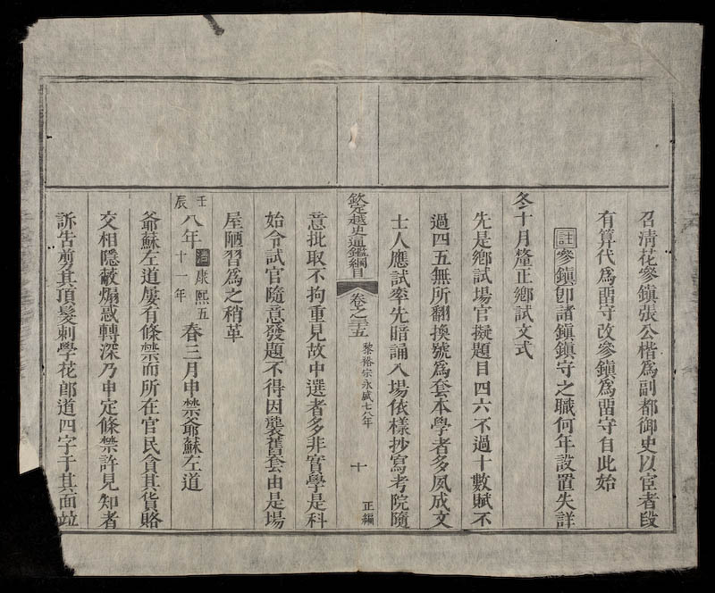
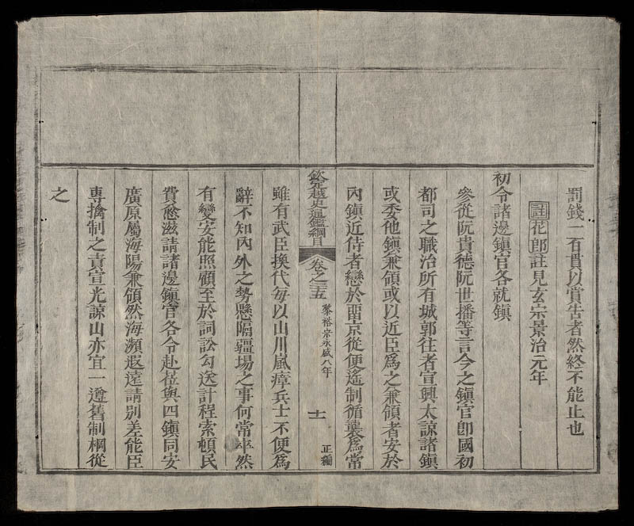

# 越南禁教敕令

自16世紀初，天主教開始傳入越南，到17世紀初，傳教開始發展迅速，當中包括著名的法籍耶穌會傳教士亞歷山大得路（Alexandre de Rhodes），他於1626年3月抵達安南，晉見鄭主，其後開始傳教。

傳教士企圖改變當地婚姻制度，立即遭到鄭主口喻禁教，這是有記載的越南第一次禁教：

> 你們在我的國家裡傳播什麼的道義？你們教我的人民只能娶一個老婆，但是我要他們有多妻多妾才能生出很多盡忠於我的民眾。從今天起，你們不得再繼續傳播那個教道，如果不順從這個命令，我會禁止你們作我不喜歡的事情，以及砍掉你們的頭。

1628年，安南鄭主正式下令禁教，是為安南王朝第一次正式禁教敕令：

> 我們，安南王之主，知道相當地清楚西洋道士們來我們國境，至今仍未傳播那些敗壞的邪道。但是無人可保證未來他們會傳播什麼教義或存有什麼的陰謀。因此，從今天起，我們禁止我國的全體民眾，不得再跟他們有任何的來往或聽他們說教，否則你們一定被處死。

（Alexandre de Rhodes, *Historie du royaume de Tunquin, et des grands progrez que la prédication de lÉvangile y a faitsen la conversion des infidelles  .Depuisl'année 1627 jusques à l'année 1646.* Composée en latin par le R. P. Alexandre de Rhodes, ... et traduite en français par le R. P. Henry Albi,... pp.192, 211）[PDF, source gallica.bnf.fr / Bibliothèque nationale de France]（見：<http://www.rsd.fju.edu.tw/images/uploads/FJRS/32-08.pdf>）

傳教士持續無視當地禁教法令，領導者亦持續下令禁教。

北越統治者鄭柞於黎玄宗景治元年（1663）下令禁止基督教：

> 冬十月，禁天下學花郎道。
> 
> 初，有花郎國人入居國中，立為異道，誑惑愚民，鄙夫鄙婦，多信慕之，聽講之場，群居混雜，男女無別，曩已驅去其人，而書居猶存，弊習未改。至是，復嚴禁之。

  
載《大越史記》*([圖片來源](http://nomfoundation.org/nom-project/history-of-greater-vietnam/Fulltext/85-search?uiLang=en) Page: 4a & 4b)*

（「花郎」即《明史》所說的「佛郎機」（葡萄牙人或西班牙人）；「道」即「爺穌左道」）

另一版本：

> 冬十月，申禁爺蘇左道。
> 
> 先是有西洋人，號花郎夷，入居國中，以爺蘇異道，誑誘愚民，鄙夫鄙婦，多信慕之，設場聽講，惑溺寖廣，前已驅去其人，而小人習染未改，於是復嚴禁之。」
> 
> 註：
> 
> 西洋：《清一統志》：（西洋）明萬曆九年，有利瑪竇，始泛海抵廣州、香山、澳，二十九年，遂入燕京，其徒來者益眾，皆尚天主教善製造。
> 
> 花郎：《明史》：外國傳謂之「和蘭」，亦在西洋者，俗訛為花郎。清褚學稼《堅瓠秘錄》：明嘉靖末，瑪竇結伴航海，漫游歷諸國，凡六年抵安南，入廣東界。
> 
> 爺蘇：野錄黎莊宗元和元年三月日，洋人名衣泥樞，潛來南真之寧彊．群英膠水之茶縷．陰以爺蘇左道傳教。

  
  
載《欽定越史通鑑綱目正編》*([圖片來源](https://lib.nomfoundation.org/collection/1/volume/269/page/5))*

正和十七年（1696），黎朝下達禁教敕令。

> 秋七月，申禁爺蘇左道。爺蘇左道，景治初屢禁之弗止，至是嚴加體察按治，道堂、道書，一切消毀，以絕異端。

  
載《欽定越史通鑑綱目正編》*([圖片來源](https://lib.nomfoundation.org/collection/1/volume/269/page/76))*

永盛八年（1712），黎朝再下達禁令。

> 春三月，申禁爺蘇左道。爺蘇左道，屢有條禁，而所在官民，貪其貨賂，交相隱蔽，煽惑轉深，乃申定條禁，許見知者，訴告剪其頂髮，刺「學花郎道」四字于其面，並罰錢一百貫，以賞告者，然終不能止也。

  
  
載《欽定越史通鑑綱目正編》*([圖片來源](https://lib.nomfoundation.org/collection/1/volume/269/page/103))*

景興十六年（1755），黎朝顯宗亦頒布了禁教令。

> 秋九月，申禁和蘭左道。
> 
> 初莊宗元和年間（1533），西洋人衣泥樞，始以其道，入沿海膠水南真，陰行傳教，謂之天主道，亦謂之十字教。其言以天堂地獄，分善惡之報，與浮屠氏略似，加以稱罪免罪之說，日夜誑誘愚俗，一為惑溺，雖有條禁，死亦不避。景治正和之間，屢有申禁，而蔽錮已深，終不能革至，是議復加嚴禁，亦不能止也。
> 
> 註：和蘭左道：即花郎左道，註見玄宗景治元年。

  
  
載《欽定越史通鑑綱目正編》*([圖片來源](https://lib.nomfoundation.org/collection/1/volume/270/page/169))*
