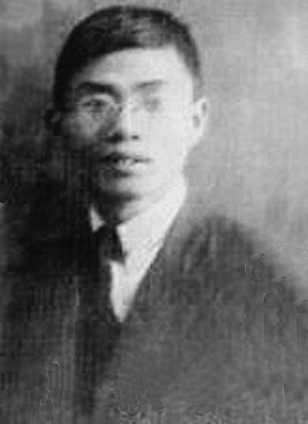

# 余家菊：《教會教育問題》

余家菊是中國近代著名教育家，對兒童教育及兒童心理、義務教育、民族教育及國家主義教育等，均有自己獨到的見解並形成了相應的理論或主張。從1922年起，余家菊開始研究國家主義教育，並撰寫文章宣傳國家主義教育，成為國家主義學說的代表人物。

1920年代，「非基督教運動」波瀾壯闊，知識分子如蔡元培、胡適開始意識到，中國教育受制於外國教會勢力，國民被奴化洗腦灌輸基督教，中國有必要教育與宗教分離，這亦成為近代先進教育家的共同思想主張。

少年中國學會是批判教會教育的先鋒。1923年10月，少年中國學會在蘇州開會，在制定新綱領時明確提出「提倡民族性的教育，以培養愛國家、保種族的精神。反對喪失民族性的教會教育及近於侵略的文化政策。」學會評議員余家菊在《少年中國學會月刊》第4卷第7期撰寫了著名的《教會教育問題》一文。他對教會教育進行了空前猛烈的攻擊。他在開篇寫道：「於中華民族之前途至大的危險的，當首推教會教育。教會在中國取得了傳教權與教育權，實為中國歷史上之千古痛心事。」文章揭露教會教育的三大危害：1. 教會教育是侵略的；2. 基督教制造宗教階級；3. 教會教育妨礙中國教育之統一。 余家菊在文章中明確提出「收回教育權」的問題，這是國內學者第一次明確表示要收回教育權，隨後演變成1925年第二波非基督教運動時，要求收回教育權呼聲的前奏。

[PDF下載文章](教會教育問題.pdf)
