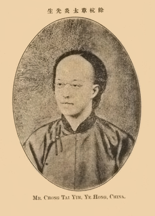

# （民）章炳麟（章太炎）：《無神論》

章炳麟（1869 – 1936），字枚叔，號太炎，又名章太炎，浙江餘杭人。近代民主革命家、古文經學家、思想家。他富於民族思想，先後擔任《時務》、《昌言》等報編輯，並創愛國學社，鼓吹革命。後因發表《駁康有為論革命書》和《革命軍序》，坐《蘇報》案被捕入獄。1905年出獄後，東渡日本，參加同盟會，主持《民報》。辛亥革命後，參加孫中山的軍政府，旋因反對袁世凱稱帝而被幽禁。他曾「七被追捕，三入牢獄，而革命之志終不屈撓」。辛亥革命後，日漸脫離政治，專意治學。在經學、史學、文字音韻和文學諸方面都有深湛造詣。章炳麟一生著述甚豐，被尊為經學大師，著作版本繁多，後輯為《章太炎全集》。

在對待宗教有神論的問題上，章炳麟既表現出積極批判基督教神學的近代無神論思想，又主張利用宗教為民主革命服務，提倡建立所謂無神教。他運用近代自然科學知識，從理論上批駁基督教的上帝創世說，他說：「萬物皆出於幾，皆入於幾。夫上帝何為哉？」「非有上帝造之，而物則自造之」。認為世間萬物皆由基本粒子「幾」構成，不是上帝創造。他還從邏輯上揭露了基督教的種種矛盾，而對於佛教和佛經則深信不疑。他往往還運用佛教教義去批駁基督教教義。章炳麟雖然批判基督教有神論，卻並不反對宗教本身。他認為要成就革命事業，必須「用宗教發起信心，增進國民的道德」。在他看來，「所以維持道德者，純在依自不依他」。因此，他提倡建立一種不崇拜偶像的、發揮依自不依他精神的所謂無神教。在他的心目中，這種理想的無神教就是佛教唯識宗。他說：「今之立教，惟以自識為宗」。

## 《無神論》導讀

章太炎這篇《無神論》，據知是第一次在中文中使用「無神論」這個名稱，這名稱一直沿用至今。文章當中一些名詞，宜在此處先解釋一下：

吠檀多（Vedanta）、鞞世師（Vaisheshika，又名衛世師）、僧佉（Samkhya），是印度教六個宗派中的主要三個，分別作為唯神、唯物、唯我的代表。章太炎以這些宗派與一些哲學家作類比，包括吠息特（Fichte，即費希特，18世紀法國哲學家）、索賓霍爾（Schopenhauer，即叔本華，18-19世紀德國哲學家）等，與及類比印度佛教的分化部派，包括經部、正量、薩婆多派（即說一切有部）、瑜伽論師（即唯識宗）。章太炎認為，為使眾生平等，先要破除唯神論。

首先，章太炎論及無始無終的耶和華，與在創世之前及末日之後他「起滅無常」出現矛盾；第二，以耶和華全知全能，與人類善惡、魔鬼的存在之間互相矛盾；絕對無二則與世界原本是否存在物質有矛盾；而無所不備又為何要創世？繼而再論及其父性的問題、創造者如何被造問題。

最後，章太炎簡述吠檀多派，並指出其比基督教優勝之處，再論述赫爾圖門（Hartmann，20世紀德國哲學家，即哈特曼）和康德對「有神」見解的不足之處，從而建立支持其無神論見解。

## 《無神論》

世之立宗教、談哲學者，其始不出三端，曰：惟神、惟物、惟我而已。吠檀多之說，建立大梵，此所謂惟神論也；鞞世師（譯曰勝論）之說，建立實性，名為地、水、火、風、空、時、方、我、意，九者皆有極微。我、意雖虛，亦在極微之列，此所謂惟物論也；僧佉（譯曰數論）之說，建立神我，以神我為自性三德所纏縛而生二十三諦，此所謂惟我論也（近人以數論為心、物二元，其實非是。彼所謂自性者，分為三德，名憂德、喜德、闇德，則非物質明矣。其所生二十三諦，雖有心、物之分，此如佛教亦分心、色，非謂三德之生物質者，即是物質。尋其實際，神我近於佛教之識陰，憂德、喜德近於佛教之受陰，闇德近於佛教之根本無明，非於我外更有一物）。漸轉漸明，主惟神者，以為有高等梵天；主惟物者，以為地、水、火、風，皆有極微，而空、時、方、我、意，一切非有；主惟我者，以為智識意欲，互相依住，不立神我之名，似吠檀多派而退者，則基督、天方諸教是也；似鞞世師派而進者，則殑德歌生諸哲是也；似僧佉派而或進或退者，則前有吠息特，後有索賓霍爾是也（近人又謂笛加爾說近於數論，其實不然。笛氏所說，惟「我思我在」一語與數論相同耳。心、物二元，實不相似）。惟我之說，與佛家惟識相近，惟神、惟物則遠之。佛家既言惟識，而又力言無我。是故惟物之說，有時亦為佛家所採。小乘對立心物，則經部正量、薩婆多派，無不建立極微；大乘專立一心，有時亦假立極微，以為方便。瑜伽論師以假想慧除析粗色，至不可析，則說此為極微，亦說此為諸色邊際，能悟此者，我見亦自解脫。雖然，其以物為方便，而不以神為方便者，何也？惟物之說，猶近平等。惟神之說，崇奉一尊，則與平等絕遠也。欲使眾生平等，不得不先破神教，故就基督、吠檀多輩論其得失，而泛神諸論附焉。

基督教之立耶和瓦也，以為無始無終，全知全能，絕對無二，無所不備，故為眾生之父。就彼所說，其矛盾自陷者多，略舉其義如左。

無始無終者，超絕時間之謂也。既已超絕時間，則創造之七日，以何時為第一日？若果有第一日，則不得云無始矣。若云創造以前，固是無始，惟創造則以第一日為始。夫耶和瓦既無始矣，用不離體，則創造亦當無始。假令本無創造，而忽於一日間有此創造，此則又類僧佉之說。未創造時，所謂「未成為冥性」者；正創造時，所謂「將成為勝性」者。彼耶和瓦之心，何其起滅無常也？其心既起滅無常，則此耶和瓦者，亦必起滅無常，而何無始之云？既已超絕時間，則所謂末日審判者，以何時為末日？果有末日，則亦不得云無終矣。若云此末日者，惟是世界之終，而非耶和瓦之終，則耶和瓦之成此世界，壞此世界，又何其起滅無常也？其心既起滅無常，則此耶和瓦者，亦必起滅無常，而何無終之云？是故無始無終之說，即彼教所以自破者也。

全知全能者，猶佛家所謂薩婆若也。今試問彼教曰：耶和瓦者，果欲人之為善乎？抑欲人之為不善乎？則必曰：欲人為善矣。人類由耶和瓦創造而成，耶和瓦既全能矣，必能造一純善無缺之人，而惡性亦無自起；惡性既起，故不得不歸咎於天魔。雖然，是特為耶和瓦委過地耳。彼天魔者，是耶和瓦所造，抑非耶和瓦所造耶？若云耶和瓦所造，則造此天魔時，已留一不善之根，以為誘惑世人之用。是則與欲人為善之心相刺謬也。若云非耶和華所造，則此天魔本與耶和瓦對立，而耶和瓦亦不得云絕對無二矣。若云此天魔者，違背命令，陷於不善，耶和瓦既已全能，何不造一不能違背命令之人，而必造此能違背命令之人？此塞倫哥自由之說，所以受人駁斥也。若云耶和瓦特造天魔，以偵探人心之善惡者，耶和瓦既已全知，則亦無庸偵探。是故全知全能之說，又彼教所以自破者也。

絕對無二者，謂其獨立於萬有之上也。則問此耶和瓦之創造萬有也，為於耶和瓦外無質料乎？為於耶和瓦外有質料乎？若云耶和瓦外本無質料，此質料者，皆具足於耶和瓦中，則一切萬有，亦具足於耶和瓦中，必如莊子之說，自然流出而後可，亦無庸創造矣。且既具足於耶和瓦中，則無時而無質料，亦無時而無流出。此萬有者必不須其相續而生，而可以遍一切時，悉由耶和瓦生，何以今時萬有不見有獨化而生者？若云偶爾樂欲，自造萬有，樂欲既停，便爾休息，此則耶和瓦之樂欲無異於小兒遊戲，又所謂起滅無常者也。若云耶和瓦外本有質料，如鞞世師所謂陀羅驃者，則此質料固與耶和瓦對立。質料猶銅，而耶和瓦為其良冶，必如希臘舊說，雙立質料工宰而後可，適自害其絕對矣。是故絕對無二之說，又彼教所以自破者也。

無所不備者，謂其無待於外也。則問此耶和瓦之創造萬有也，為有需求乎？為無需求乎？若無需求，則亦無庸創造；若有需求，則此需求者當為何物何事？則必曰：善耳，善耳。夫所以求善者，本有不善，故欲以善對治之也。今耶和瓦既無所不備，則萬善具足矣，而又奚必造此人類以增其善為？人類有善，於耶和瓦不增一發；人類不善，於耶和瓦無損秋毫。若其可以增損，則不得云無所不備也。且世界之有善惡，本由人類而生。若不創造人類，則惡性亦無自起。若云善有不足，而必待人類之善以彌縫其缺，又安得云無所不備乎？是故無所不備之說，又彼教所以自破者也。

基督教人以此四因，成立耶和瓦為眾生之父。夫其四因，本不足以成立，則父性亦不極成。雖然，姑就父性質之，則問此耶和瓦者，為有人格乎？為無人格乎？若無人格，則不異於佛家所謂藏識。藏識雖為萬物之本原，而不得以藏識為父。所以者何？父者，有人格之名，非無人格之名。人之生也，亦有賴於空氣、地球。非空氣、地球，則不能生。然不聞以空氣、地球為父，此父天母地之說，所以徒為戲論也。若云有人格者，則耶和瓦與生人各有自性。譬如人間父子，肢體既殊，志行亦異，不得以父並包其子，亦不得以子歸納於父。若是，則非無所不備也，非絕對無二也。若謂人之聖靈，皆自耶和瓦出，故無害為無所不備，亦無害為絕對無二者。然則人之生命，亦悉自父母出，父母於子女又可融合為一耶？且所以稱為父者，為真有父之資格乎？抑不得已而命之乎？若其真有父之資格者，則亦害其為絕對無二。所以者何？未見獨父而能生子者，要必有母與之對待。若是，則耶和瓦者，必有牝牡之合矣。若云不待牝牡，可以獨父而生，此則單性生殖，為動物最下之階，恐彼耶和瓦者，乃不異於單性動物。而夜光、浸滴諸蟲，最能肖父，若人則不肖亦甚矣。若云不得已而命之者，此則無異父天母地之說，存為戲論，無不可也。

如上所說，則能摘其宗教之過，而尚不能以神為絕無。嘗試論之曰：若萬物必有作者，則作者亦更有作者，推而極之，至於無窮。然則神造萬物，亦必被造於他，他又被造於他。此因明所謂犯無窮過者。以此斷之，則無神可知已。雖然，亦不得如向郭自然之說。夫所謂自然者，謂其由自性而然也。而萬有未生之初，本無自性；即無其自，何有其然？然既無依，自亦假立。若云由補特伽羅而生，而此補特伽羅者，亦復無其自性。是故人我之見，必不能立。若云法則固然，而此法則由誰規定？佛家之言「法爾」，與言「自然」者稍殊，要亦隨宜假說，非謂法有自性也。本無自性，所以生迷，迷故有法，法故有自，以妄為真，以幻為實，此則誠諦之說已。

若夫吠檀多教，亦立有神，而其說有遠勝於基督教者。彼所建立：一曰高等梵天；二曰劣等梵天。高等梵天者，無屬性，無差別，無自相；劣等梵天者，有屬性，有差別，有自相。而此三者，由於無明而起。既有無明，則劣等梵亦成於迷妄，而一切萬物之心相，皆自梵出，猶火之生火花。是故梵天為幻師，而世間為幻象。人之分別自他，亦悉由梵天使其迷妄。若夫高等梵天者，離言說相，離名字相，離心緣相，謂之實在而不可得，謂之圓滿而不可得，謂之清淨而不可得，所以者何實在、圓滿、清淨之見，皆由虛妄分別而成，非高等梵天之自性也。人之所思想者，皆為劣等梵天，唯正智所證者，乃為高等梵天。既以正智證得，則此體亦還入於高等梵天，非高等梵天之可入，本即高等梵天而不自知也。若其不爾，則必墮入輪迴，而輪迴亦屬幻象，惟既不離虛妄分別，則對此幻象而以為真。此則吠檀多教之略說已。

今夫基督教以耶和瓦為有意創造，則創造之咎，要有所歸，種種補苴，不能使其完善。吠檀多教立高等、劣等之分，劣等者既自無明而起，則雖有創造，其咎不歸於高等梵天。基督教以世界為真，而又欲使人解脫。世界果真，則何解脫之有？吠檀多教以世界為幻，幻則必應解脫，其義乃無可駁。雖然，彼其根本誤謬，有可道者。若高等梵天有士夫用，則不得不有自性；既有自性，則無任運轉變，無明何自而生？劣等梵天依何而起？若高等梵天無士夫用者，則無異於佛家之真如。真如無自性，故即此真如之中，得起無明，而劣等梵天者，乃無明之異語。真如、無明，不一不異，故高等梵天與劣等梵天，亦自不一不異。若是，則當削去梵天之名，直云真如、無明可也。若謂此實在云，此圓滿云，此清淨云，惟是虛妄分別；真如之名，亦是虛妄分別，故不得舉此為號。然則梵天云者，寧非虛妄分別之名邪？又凡云幻有者，固與絕無有別。若意識為幻有，五大亦屬幻有，則有情之意識，得以解脫，而無情之五大，以何術使其解脫？是則虛妄世界，終無滅盡之期也。若意識是幻有，而五大是絕無者，無則比於龜毛兔角，亦不得謂是梵天幻師所作之幻象矣。是何也？幻象者是幻有，而此乃絕無也。且劣等梵天既是無明，必斷無明而後解脫，則將先斷劣等梵天。人能斷無明，高等梵天亦能斷無明耶？否耶？若高等梵天能斷無明者，則劣等梵天固有永盡之日，若高等梵天常與劣等梵天互相依住，有如束蘆，則必不能斷無明。人能斷無明，而高等梵天乃不能斷無明，是則高之與劣，復有何異？故由吠檀多教之說，若變為抽象語，而曰真如、無明，則種種皆可通；若執此具體語，而曰高等梵天、劣等梵天，種種皆不可通。此非有神教之自為障礙邪？近世斯比諾莎所立泛神之說，以為萬物皆有本質，本質即神。其發見於外者，一為思想，一為面積。凡有思想者，無不具有面積，凡有面積者，無不具有思想。是故世界流轉，非神之使為流轉，實神之自體流轉。離於世界，更無他神；若離於神，亦無世界。此世界中，一事一物，雖有生滅，而本體則不生滅，萬物相支，喻如帝網，互相牽制，動不自由。乃至三千大千世界，一粒飛沙，頭數悉皆前定，故世必無真自由者。觀其為說，以為萬物皆空，似不如吠檀多教之離執著。若其不立一神，而以神為寓於萬物，發蒙叫旦，如雞後鳴，瞻顧東方，漸有精色矣。萬物相支之說，不立一元，而以萬物互為其元，亦近《華嚴》無盡緣起之義。雖然，神之稱號，遮非神而為言；既曰泛神，則神名亦不必立，此又待於刊落者也。

赫爾圖門之說，以為神即精神，精神者，包有心物，能生心物。此則介於一神、泛神二論之間。夫所謂包有者，比於囊橐邪？且比於種子耶？若云比於囊橐，囊橐中物，本是先有，非是囊橐所生，不應道理。若云比於種子，幹莖華實悉為種子所包，故能生此幹莖華實。然種子本是幹莖華實所成，先業所引，復生幹莖華實；若種子非幹莖華實所成者，必不能生幹莖華實。此則神亦心物所成，先業所引，復生心物，是心物當在神先矣。若謂自有種子能生幹莖華實，而非幹莖華實所成，如藕根之相續者，為問此藕自何處來？必曰藕自藕生。復問此藕何處去？必曰藕復生藕，及生蓮之幹莖華實。然則以藕喻神，則今神為先神所生，當有過去之神矣；今神復生後神，及生一切心物，當有未來之神矣。過去之神，精神已滅；現在之神，精神暫住；未來之神，精神未生。達摩波羅氏云：「若法能生，必非常故；諸非常者，必不遍故；諸不遍者，非真實故。」若是，則神亦曷足重耶？雖然，赫氏則既有其說矣，彼固以為世界自盲動而成。此則竊取十二緣生之說。盲即無明，動即是行，在一切名色六入之先，是以為世界所由生也。神既盲動，則仍與吠檀多教相近。而有無之辨，猶鸛雀蚊虻之相過乎前矣。

夫有神之說，其無根據如此，而精如康德，猶曰：「神之有無，超越認識範圍之外，故不得執神為有，亦不得撥神為無」，可謂千慮一失矣。物者，五官所感覺；我者，自內所證知。此其根底堅牢，固難驟破。而神者，非由現量，亦非自證，直由比量而知。若物若我，皆俱生執，而神則為分別執。既以分別而成，則亦可以分別而破。使神之感覺於五官者，果如物質，其證知於意根者，果如自我，則不能遽撥為無，亦其勢也。今觀嬰兒墮地，眙視火光，目不少瞬，是無不知有物質者也。少有識知，偶爾蹉跌，頭足發痛，便自捶打。若曰此頭此足，令我感痛，故以此報之耳。是不執色身為我，而亦知有內我也。若神則非兒童所知，其知之者，多由父兄妄教；不則思慮既通，妄生分別耳。然則，人之念神，與念木魅山精何異？若謂超越認識範圍之外，則木魅山精亦超越認識範圍之外，寧不可直撥為無耶？凡見量、自證之所無，而比量又不可合於論理者，虛撰其名，是謂無質獨影。今有一人，自謂未生以前，本是山中白石。夫未生以前，非其見量、自證之所知，即他人亦無由為之佐證，此所謂超越認識範圍之外者也。而山中白石之言，若以比量推之，又必不合，則可以直撥為無。惟神亦然，不可執之為有，而不妨撥之為無，非如本體實在等名，雖非感覺所知，而無想滅定之時，可以親證其名，則又非比量所能摧破也。更以認識分位言之，則人之感物者，以為得其相矣。而此相者，非自能安立為相，要待有名，然後安立為相。吾心所想之相，惟是其名，於相猶不相涉，故一切名種分別，悉屬非真，況於神之為言，惟有其名，本無其相，而不可竟撥為無乎？難者曰：「若是，則真如、法性等名，亦皆無相，何以不撥為無？」答曰：「真如、法心亦是假施設名。」遮非真如、法性，則不得不假立真如、法性之名，令其隨順，亦如算術之有代數，骨牌之列天人，豈如言神者之指為實事耶？且真如可以親證，而神則不能親證，其名之假相同，其事則不相同，故不可引以為例。若夫佛家之說，亦云忉利天宮，上有天帝，名曰釋提桓因，自此而上，復有夜摩、兜率諸天，乃至四禪、四空，有多名號。此則所謂諸天者，特較人類為高，非能生人，亦非能統治人。徵以生物進化之說，或有其徵要，非佛家之所重也。至云劫初生人，由光音天人降世，此則印度舊說，順古為言，與亞當、厄襪等同其悠謬。說一切有部以為世尊亦有不如義言，明不得隨文執著矣。

*（原載於1906年10月8日《民報》第8號）*
