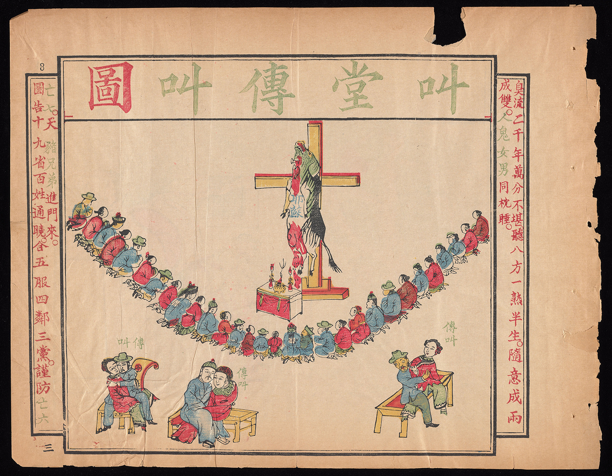
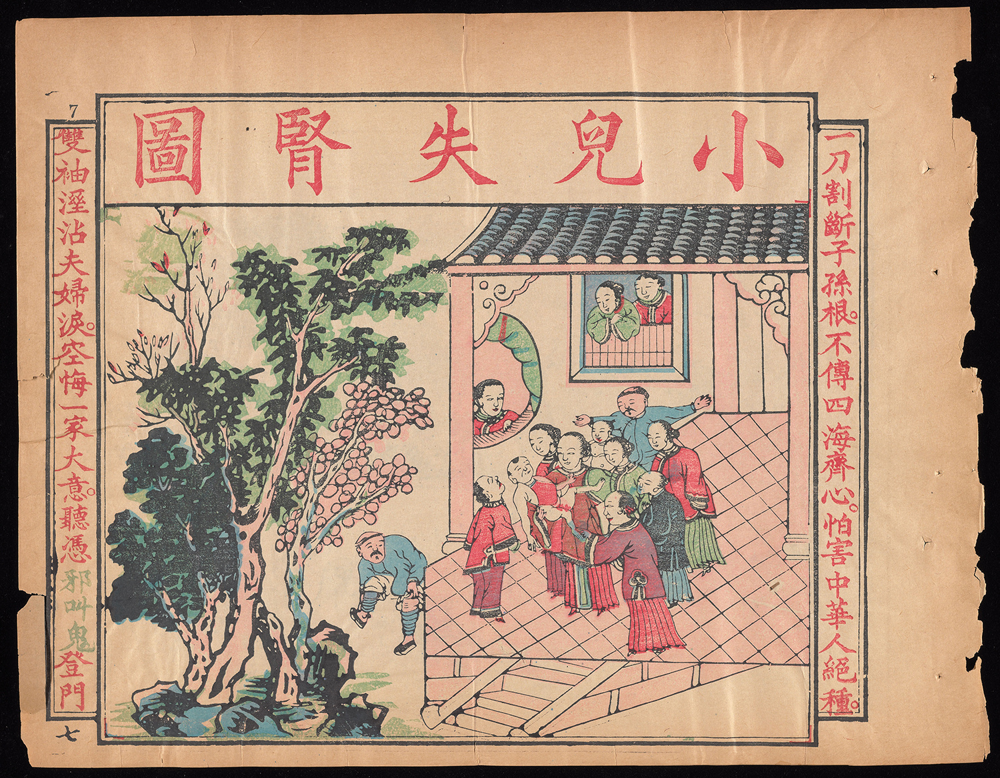
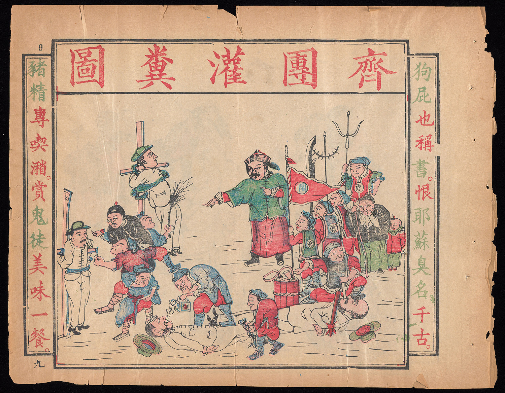
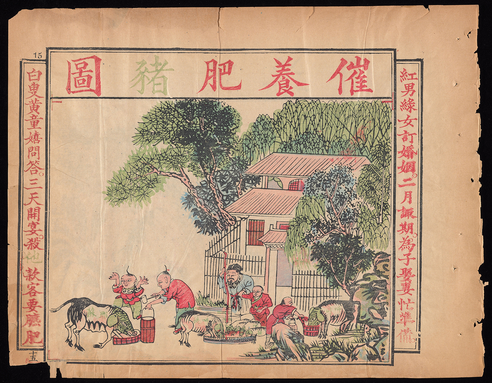

# 周漢：《謹遵聖諭辟邪全圖》

《謹遵聖諭辟邪全圖》圖集共32幅，於1891年在長江沿岸各城市廣為流播，現存原件藏大英博物館。

作者周漢（周振漢），字鐵真，筆名「周孔徒」，湖南寧鄉縣人。青壯年時期，曾在新疆湘軍中佐劉錦棠幫辦營務，後升任陝甘候補台。

光緒十年（1884），周振漢告病假回湘，看到外國傳教士的罪惡活動十分憤慨，遂於光緒十七年（1891）春，刊刻朱墨套印的通俗圖畫《天豬教》（天主教諧音）。書中將洋人（傳教士）寫成「羊人」，將「甘心充當內奸」的本國教士寫作「豬羊鬼之子孫」。圖畫上繪有一惡形豬精，又一壯漢手持大刀作屠豬精形狀，另一壯漢將《新約》、《舊約》投入火爐中焚燒，觀者無不歡欣鼓舞。圖畫旁有對聯云：「甚麼天主教，妄稱天父天兄，傷天理，滅天倫，何時遭天遣天誅，天才有眼；這般地方官，都是地棍地痞，拉地丁，抽地稅，他日看地崩地裂，地也無皮。」此後的兩三年間，周振漢還陸續刊印了《齊心拚命》、《謹遵聖諭辟邪》、外附全圖《鬼教該死》、《棘手文章》、《擎天柱》、《滅鬼歌》、《稟天主邪教》等宣傳品，其中僅《鬼教該死》在湖南便印了80萬冊，利用善堂作為發行機構，遍及全國，產生了巨大影響。

外國傳教士害怕宣傳品流傳會激起群眾公憤，一面全力收購周振漢刊印的宣傳品，送交各國領事，並寄往各自國家通報情況，一面在報上肆意誣蔑中國為「半教化之國」。

光緒十七年（1891）九月，美國駐華公使首先聯合其他列強「警告」清廷總理衙門說：「中國朝廷士大夫階級中的反洋人和反基督教分子，正在系統地煽動仇恨，這些分子的大本營和中心是湖南，但他的宣傳品傳播到整個帝國之內。」德國駐北京公使曾親自持周振漢的宣傳品要挾總理衙門，要求懲處周振漢。迫於帝國主義列強的威脅，清政府總理衙門一再函電責成湖廣總督張之洞處理周振漢並將結果上報。張之洞對參辦周振漢有所顧忌，故建議總理衙門將周振漢調赴總理衙門差委，然後仍舊發往新疆軍營，這樣便「自無教堂可鬧」。然而總理衙門不允，張乃派湖北督糧道惲祖翼來湖南提訊周振漢。

次年，惲祖翼到長沙，周振漢早經迴避，便將長沙3戶替周振漢刊印書冊的刻字店永行封禁。其中除一戶主因早置身政外，其他2人各杖80枷號3個月。惲隨後赴寧鄉傳來周振漢親屬鄰保，出縣保結；寧鄉知縣出具印結，務將周漢「查傳到籍管束，不准再來省城」。又飭令長沙府、縣派差長途追繳周振漢各種宣傳品的版本。陸續繳到各種木刻31面、25塊，一併攜回漢口，由張之洞委令銷毀。

光緒二十三年（1897）底，德國派兵侵佔膠州灣，周振漢聽到消息處，立刻從寧鄉來到長沙，又刊印大量揭貼、歌謠，勸人速將「耶穌妖巢」（指教堂）焚燒。次年初，英國領事就此照會湘撫陳寶箴，要求「刻即趕緊將造貼之人周漢拿押究辦，免生意外之虞」。陳寶箴命寧鄉知縣將周振漢查傳來省，當寧鄉知縣朱國華等到達他家中時，他從揭貼堆中選取教紙對朱說：「此皆我自撰自刻，不累他人。」周振漢被拘離寧鄉後，寧鄉縣試生罷考，要求朱國華上書巡撫立即開釋周漢。

周振漢在長沙候審時，將陳設器物打毀一空，又將候審委員扭住關閉一室，不許外出，以示反抗。面對各方輿論聲援，陳寶箴深感不易應付。適值張之洞來電，陳順勢請求將周漢移往湖北處理，張不答應，陳再度以湖南民情激昂，不便處理為由，把包袱推給張之洞。張急復電表示：「若周振漢解鄂，斷無人敢審」，「務望速在湘省了之」。陳寶箴勢成騎虎，只得借張之洞之詞，以「瘋癲成性，煽惑人心」為由，將周漢發給司獄加以監禁。

周振漢在獄中書有供詞3件，自獄中寄出，群眾即為刊印。題名「天柱地維」，註明系「湖南七十六廳、州、縣紳士庶民公刊」。

周漢入獄兩年後，義和團運動爆發。翰林科道左紹佐等在北京議將他釋放，稱他為湖南義師，但未被採納。光緒三十三年（1907），同盟會員寧調元被捕入獄，和周振漢同羈一室。周漢為寧作書云：「餘年六十，一生為蝦戲達欺，不絕滅外來侵凌，余死不甘心。」次年，湖南巡撫岑春蓂允將周漢釋放，他拒不出獄。宣統二年（1910）重病獄中，為親屬強行接回家中，不久逝世。

[PDF書籍下載](https://drive.google.com/file/d/0B4z8kZ82llqaa1h3Yi1EaGhlN00/view?usp=sharing&resourcekey=0-mYo5zw4k7pQkUeQaRy5r3w)

***

### 1. 鬼拜豬精圖

這畜牲乃洋鬼所皈皮毛未脫；  
倘人類以天豬為主顏面何存？

耶穌太子，天豬精也，性極淫，凡德亞國大臣妻女，無不被其淫者。後以遍淫國君妃嬪，謀篡位。大臣奏發其罪，縛置十字架，燒紅釘釘之，大叫數聲，現豬形而死。常入臣民之家，作怪行淫，婦女一聞豬叫，則衣裳自解，聽其淫畢，乃醒。豬徒因勸人禮拜，借以漁利漁色焉。惟於門?階石上鑿十字架，則豬精豬徒畏而不至，特此遍告天下知之、防之。

 
### 2. 豬羊雜種圖

豬首羊身，羊首豬身，辨不真誰是鬼男鬼女。  
狼心狗肺，狗心狼肺，唸甚麼胡說天父天兄。

### 3. 叫堂傳叫圖

臭流二千年，萬分不堪。聽八方一熟半生，隨意成兩成雙，人鬼女男同枕睡。  
圖告十九省，百姓通曉。合五服四鄰三黨，謹防亡六亡七，天豬兄弟進門來。

### 4. 豬叫取胎圖

人人愁不孝有三，多積善求神，保佑麟兒下地。  
個個恨無良亡八，快掃邪滅鬼，隄防豬叫欺天。

### 5. 豬叫切嬭圖

黑地忽飛刀，可憐母嬭切傷，兒腸哭斷。  
蒼天誰漏網，枉把人心喪絕，鬼手操精。

### 6. 豬叫剜眼圖

欺神自有神知，你剜人人又剜你。  
死鬼纔從鬼叫，光求瞎瞎莫求光。

### 7. 小兒失腎圖

一刀割斷子孫根，不傳四海齊心，怕害中華人絕種。  
雙袖溼沾夫婦淚，空悔一家大意，聽憑邪叫鬼登門。

### 8. 謹防鬼計圖

豬精暗地伏黃巾，勸官紳士庶齊心，預備一刀橫枕畔。  
鬼黨滿船裝綠帽，告城市鄉村協力，快將十字鑿階前。

### 9. 齊團灌糞圖

狗屁也稱書，恨耶蘇臭名千古。  
豬精專喫潲，賞鬼徒美味一餐。

 
### 10. 打鬼燒書圖

豬精邪叫自洋傳，欺天地，滅祖宗，萬箭千刀難抵罪。  
狗屁妖書如糞臭，謗聖賢，毀仙佛，九洲四海切同仇。

### 11. 族規治鬼圖

一家私拜豬精，一族公當王八蛋。  
四海合除鬼黨，四民各免臭千秋。

### 12. 釋道治鬼圖

道人和尚縱無妻，亦有俗家，怕寺觀分消綠帽。  
太上釋迦誰所祖，合除洋鬼，免妖魔毀滅金身。

### 13. 射豬斬羊圖

萬箭射豬身，看妖精再敢叫不。  
一刀斬羊頸，問畜牲還想來麼。

 
### 14. 鐵斧劈邪圖

聽何妖鐵角鐵爪鐵牙，難當鐵斧。  
看這漢真義真忠真勇，果助真仙。

### 15. 催養肥豬圖

紅男綠女訂婚姻，二月諏期，為子娶妻忙準備。  
白叟黃童嬉問答，三天開宴，殺他款客要臕肥。

### 16. 催養肥羊圖

明知之子于歸，要備喜筵陪款壻。  
為甚牧人乃夢，快尋深草養肥他。

### 17. 生殺豬羊圖

但生下三朝，便須殺你。  
待長成周歲，還要喫他。

### 18. 廚斬豬羊圖

龜鶴慶遐齡，預囑廚丁，膾奉雙親須切細。  
豬羊來異域，別無海錯，筵供眾客莫嫌臊。

### 19. 死殺豬羊圖

家祭慎毋忘，子傳孫，孫又傳孫，族族年年，總要殺畜牲獻祖。  
國恩期永報，人恨鬼，鬼還恨鬼，生生處處，都莫把刀斧饒他。

### 20. 屠滅豬羊圖

宰天下以均平，陳孺子慎毋忘此。  
恐市中不精潔，孔聖人豈肯食他。

### 21. 舟扇齊心圖

舟從天上飛來，水賊紛紛遭火死。  
扇自隆中搖出，東風陣陣向西燒。

### 22. 眾虎滅羊圖

獨虎已難當，虎虎奮威誰敢近。  
群羊從此盡，羊羊得意爾何為。

### 23. 守筍滅豬圖

種竹成林，四處除豬潛盜筍。  
護籬擊柝，一宵獵犬淨除根。

### 24. 羊貨歸豚圖

大清皇帝朝中，豈用爾曹羊貨。  
至聖先師廚下，不蒸這等豬精。

### 25. 寢皮嘗膽圖

夏則資皮，肉食誰長文種略。  
居常咽膽，心堅終復越王仇。

 
### 26. 滅怪獻俘圖

聖人有金城，安內攘外。  
盛朝無闕事，赫聲濯靈。

### 27. 雷殛豬羊圖

一聲怒氣發天庭，二月蟄驚，三春運轉。  
群醜遊魂收地獄，兩時命盡，四海妖除。

### 28. 壺籃滅怪圖

甲仗肅天兵，虎豹張牙誰敢犯。  
壺籃轟楚寶，豬羊碎骨永無聲。

### 29. 鐵筆掃邪圖

道人真有神通，請看雲端，輕灑筆尖硃一點。  
漢子獨除鬼怪，遍傳天下，大開筵宴肉千盤。

### 30. 獅殛豬羊圖

師旅奮神威，斯道昌明，斯民樂利。  
車書歸大統，諸洋滅絕，諸怪逃藏。

### 31. 豬精惡報圖

看黑獄十八層，鋸解碓舂鍋煮磨推，陽鬼纔知陰鬼苦。  
問紅塵千萬惡，賢閹胎取眼剜嬭切，神心可許毒心欺。

### 32. 豬羊歸化圖

明王慎德，四夷咸賓。  
庶尹允諧，百獸率舞。

